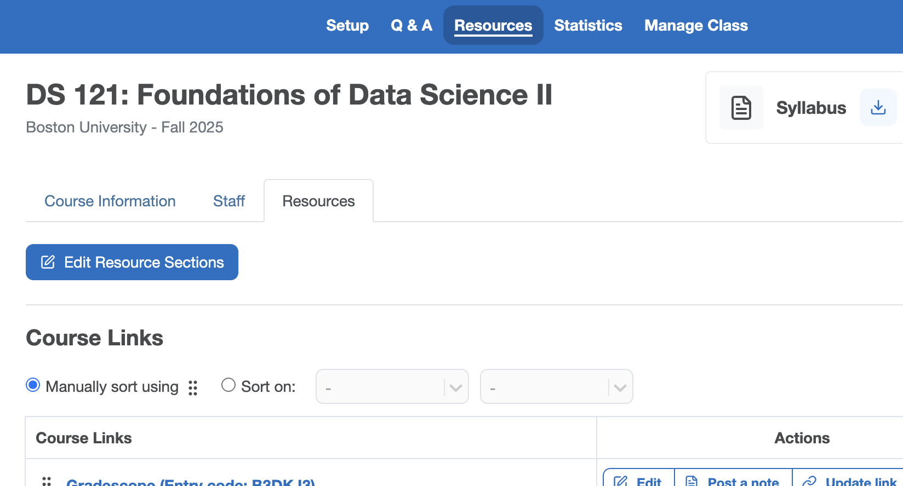
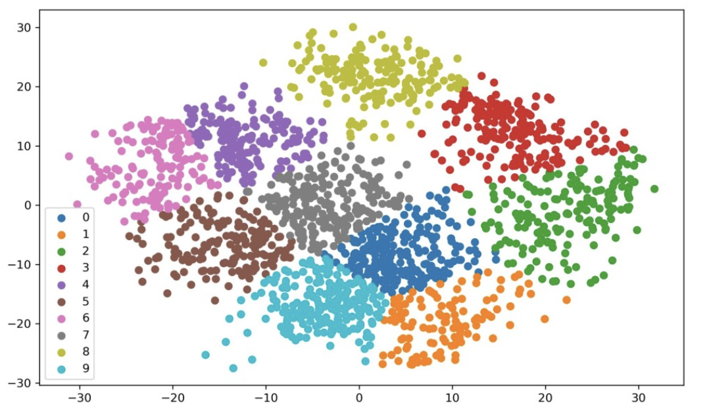
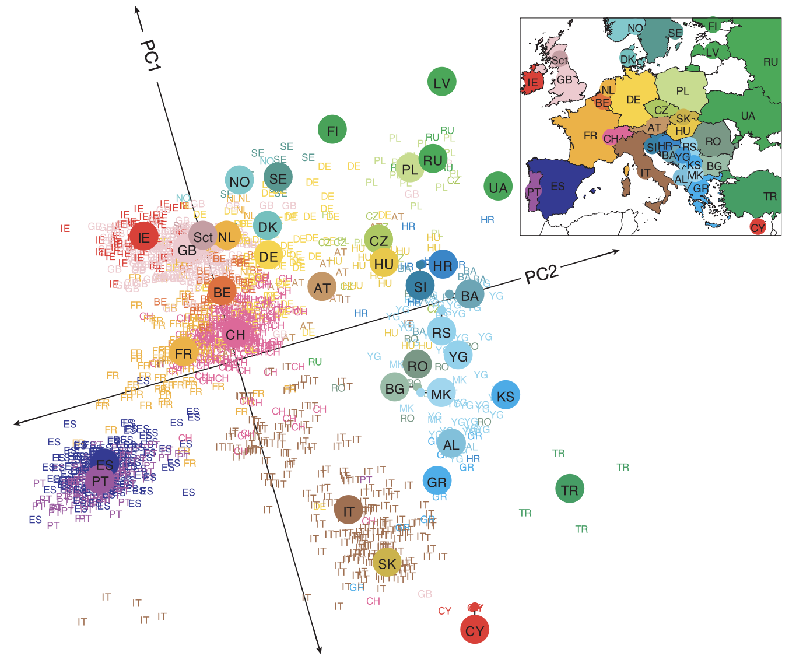
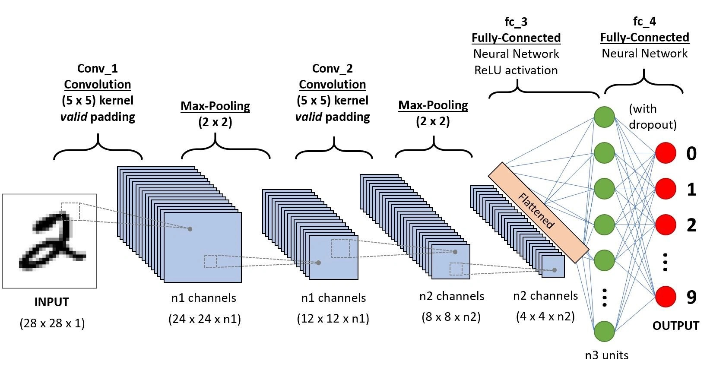
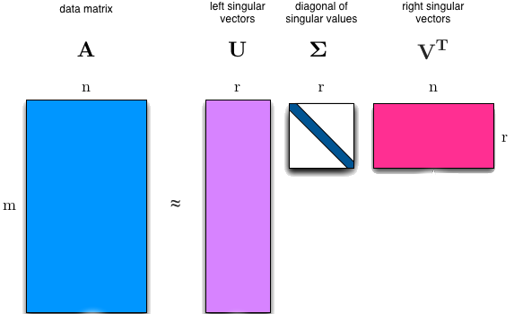
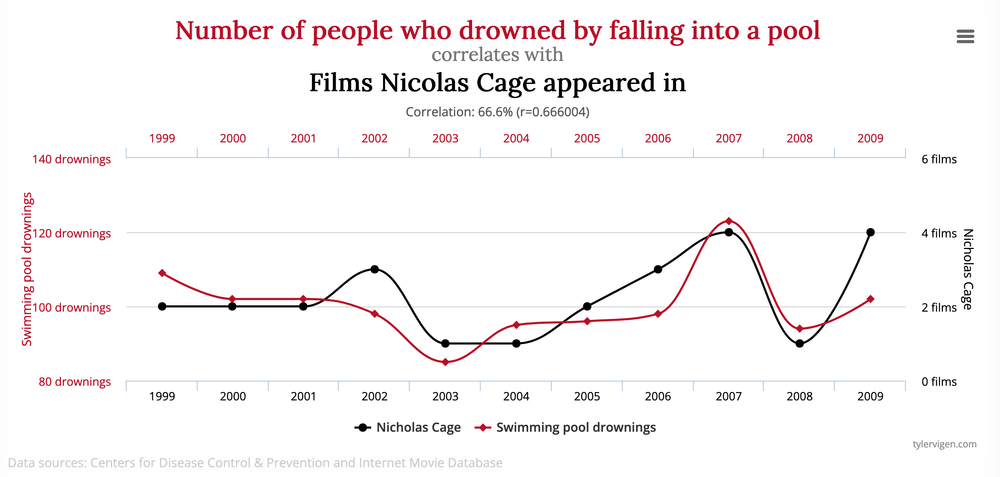

## Logistics
:::{style="font-size: .7em"}

_Lectures_

- Section A: MWF 9:05 AM -- 9:55 AM in 685-725 Comm Ave CAS 313
- Section B: MWF 10:10 AM - 11:00 AM in 2 Silber Way WED 130

_Discussions - all on Mondays_

 - A2: 808 Commonwealth Ave FLR 122, M 1:25 PM -- 2:15 PM
 - A3: 871 Commonwealth Ave CGS 113, M 2:30 PM -- 3:20 PM
 - B2: 771 Commonwealth Ave MUG 203, M 8:00 PM -- 8:50 PM
 - B3: 808 Commonwealth Ave FLR 122, M 9:05 AM -- 9:55 AM
 - B5: 871 3 Cummington Mall PRB 146, M 11:15 AM -- 12:05 PM

 **Note that A4, A5, and B4 were cancelled - if you are still registered for A4 and A5 please change your registration, we will not be holding A4 and A5 discussions**

:::

## Logistics
:::{style="font-size: .8em"}

_Teaching Staff_

 - Instructors: **Prof. Lauren Wheelock** and **Prof. Lisa Wobbes**  <br>
 - TAs: **Daniel** Greiner, **Clare** Oudard and **Aastha** Gidwani  <br>
 - CAs: Yutong (**Chris**) Wu, **Alyssa** Tay, **Charles** Carpenter, and **Tanisha** Krishnaraj

:::

## Office Hours
:::{style="font-size: .8em"}

_Office Hours_

- Schedule is on Piazza under Resources/Staff
- Any changes will be announced on Piazza

<div style="font-size: 0.65em;">

| Mon | Tue | Wed | Thu | Fri |
|-----|-----|-----|-----|-----|
| Aastha 12-1 |  | Prof. Wheelock 11-12 |  | Clare 11-12 |
| Charlie 2-3 | Chris 2:30-3:30 | Tanisha 12:30-1:10 |Daniel 2-3 | Alyssa 12-1 |
| Daniel 4-5 |  Tanisha 3:45-4:45 | Clare 2-3 | Tanisha 3:45-4:45  | Prof. Wobbes 3-4 |
| Alyssa 5-6 | Charlie 5-6  | Aastha 6:15-7:15 | Chris 5-6 | Charlie 4-5 |

</div> 

:::


## Getting Set Up
:::{style="font-size: .75em"}

_Platforms_

- __Piazza__: https://piazza.com/bu/spring2026/ds121/home <br>
Check it weekly!
Please use private messages on Piazza for all email needs!
- __Gradescope__: https://www.gradescope.com<br>

- __Grasple__: https://app.grasple.com/#/courses/14069

_Resources_

- __Lecture slides and notes__: Linked on Piazza<br>
- __Lecture recordings__: Linked on Piazza<br>

_Programming environment_ 

 - __Python__: Setup instructions are on Piazza

:::


## Homework and Homework Quizzes
:::{style="font-size: .75em"}

**New structure this semester**

- Two sources of **ungraded** practice problems: 
  - Written problems (resembling traditional homework assignments)
  - Grasple problems (online tool with responsive feedback)

**Discussion quizzes replace graded homeworks**

- 8 of the discussion sections will begin with a short (~10 min) quiz consisting of 1-2 of the homework problems
- Your top 5 quiz scores will be averaged - the bottom 3 (eg if up to 3 were missed) will be dropped

:::

## About Grasple
:::{style="font-size: .75em"}


- Immediate digital feedback
- Layered structure: two sub-questions that both lead back to the main question
- 5 main questions per homework assignment
- Only the quiz performance is graded; the practice score on the platform is not
- Report bugs directly to Yutong (Chris) Wu 

:::{.center-text}

:::


:::

## Course Grade
:::{style="font-size: .8em"}
_Computation_

- 5% Participation (from discussions)
  - 1% for Quiz 0 (covering the syllabus)
  - 1% for the Grasple survey
  - 3% for discussion attendance (attend at least 9 of 13)
- 15% Homework quizzes (during discussion) 
- 15% Midterm 1
- 15% Midterm 2 
- 15% Midterm 3 
- 35% Final exam

:::


## Course Grade
:::{style="font-size: .8em"}
_Exams_

All exams are cumulative, with emphasis on material covered since the previous exam. Content may include lectures, discussion labs, homework, and required readings.

- Midterm 1: __February 28, during class__ <br>
In-person exam
- Midterm 2: __March 20, during class__ <br>
In-person exam
- Midterm 3: __April 8, during class__ <br>
In-person exam
- Final exam: __A: W 5/6 9-11, B: F 5/8 9-11__ <br>
In-person exam, usual classrooms
:::

Exam review sessions will be held during discussions, not in class.

## Course Policies
:::{style="font-size: .8em"}
_Regrade requests_

- Up to one week after the grade is posted 
- Submission via Gradescope only

_Collaboration Policy_

- No copying (or allowing to copy)
- No searching for answers
- Disclose collaboration and sources

:::


## Course Policies (cont'd)
:::{style="font-size: .8em"}

_Learning Environment_

- Inclusive environment for individuals of all genders, races, cultures, abilities, and sexual orientations

_Accommodations_

- Exclusively through Office for Disability Services (ODS) 

:::


## General Information
:::{style="font-size: .8em"}

__More details, including the weekly schedule, can be found in the syllabus.__

:::{.center-text}

:::

:::

## Intro survey and Quiz 0
:::{style="font-size: .8em"}

__Intro survey__

- An informal survey to help us learn about you and your background
- Not graded, but please complete, it helps us help you!

__Quiz 0__

- Will be on Gradescope at 12pm today (all other quizzes will be in discussion)
- Will check that you have read over the syllabus

:::


## Why Linear Algebra?   

::: {.antique-center-image}

:::

:::{style="font-size: .8em"}


::: {.center-text}
Linear algebra, probability/statistics, and optimization are the mathematical pillars of machine learning.
:::

:::

:::{.notes}
DS-121: Linear algebra

DS-122: Probability/statistics, and optimization
:::


## Why Linear Algebra?
<span style="font-size: 0.8em;">
Linear algebra enables powerful machine learning techniques such as **k-means** for clustering, **PageRank** for web search ranking, **PCA** for dimensionality reduction, and **neural networks** for deep learning.
</span>

:::{.columns}
::: {.column width="50%"}
{fig-align="left" width=110%}
:::

::: {.column width="50%"}
{fig-align="right" width=110%}
:::
:::

## Why Linear Algebra?

:::{.center-text}

:::

<span style="font-size: 0.4em;">
Data: 3000 x 500 k
</span>

## Why Linear Algebra?

:::{.center-text}

:::

## Linear Algebra is Everywhere

:::{style="font-size: 0.8em;"}

:::{.fragment}
**Netflix & Spotify** - "Users who liked X also liked Y" is powered by matrix factorization on billions of ratings
:::

:::{.fragment}
**ChatGPT & LLMs** - Every word becomes a vector; attention is matrix multiplication
:::

:::{.fragment}
**Image compression** - JPEG uses linear algebra to store photos at 10% of the original size
:::

:::{.fragment}
**Google Search** - PageRank finds the most important webpages using eigenvectors
:::

:::{.fragment}
**Facial recognition** - "Eigenfaces" represent faces as combinations of basis images
:::

:::

:::{.notes}
These aren't toy examples - they're the actual techniques used in production systems
:::

## Course Roadmap
:::{style="font-size: 0.6em;"}

| Unit | Topics | Applications |
|---------|--------------|--------------|
| **1. Vectors & Geometry** | Vectors, lengths, inner products | k-NN classification |
| **2. Clustering** | Distance, centroids, convergence | k-means clustering |
| **3. Linear Systems** | Matrix algebra, Gauss-Jordan, LU | Solving equations at scale |
| **4. Transformations** | Linear maps, inverses, vector spaces | Image transformations |
| **5. Orthogonality** | Projections, Gram-Schmidt, QR | Least squares, linear regression |
| **6. Eigenanalysis** | Eigenvalues, diagonalization, Markov chains | PageRank, dynamical systems |
| **7. SVD & PCA** | Singular value decomposition | Compression, recommendations |

:::

## What is Linear Algebra?

::: {.center-y}
:::{.incremental}
:::{.fragment}
<span style="font-size: 0.8em;">
Linear algebra is a branch of mathematics that deals with **vectors, matrices, linear systems, and linear transformations**. 
</span>

:::
:::{.fragment}
<span style="font-size: 0.8em;">
It involves understanding and manipulating **multi-dimensional data** through concepts like **vector spaces, matrix operations, and matrix factorizations**.
</span>

:::
:::
:::


## Three Modes of Thinking

:::{.incremental style="font-size: 0.8em;"}
- **Algebraic thinking**: how to correctly _manipulate symbols_ in a consistent logical framework.
- **Geometric thinking**: learning to _extend_ familiar two- and three-dimensional concepts _to higher dimensions_.
- **Computational thinking**: understanding the _relationship between abstract algebraic machinery and actual computations_ which _efficiently_ arrive at the correct answer.
:::

:::{.fragment style="font-size: 0.8em;"}
Integrating these three concepts is _essential_ for using linear algebra in data science.
:::

## Three Modes of Thinking
:::{.center-text}

:::


## Three Modes of Vector $\mathbf{v}$

:::{.incremental style="font-size: 0.8em;"}
- **Algebraically:** a vector $\mathbf{v}$ is an abstract _object_ that permits addition ${\bf v} + {\bf w}$ and multiplication by a constant or *scalar* $c$ to form $c {\bf v}$.
- **Computationally:** a vector is an ordered _list_ of real numbers.
:::

$$
\small{\begin{array}{ccc}
{\bf u} = \left[\begin{array}{r}3\\-1\end{array}\right] &
{\bf v} = \left[\begin{array}{c}2\\2\end{array}\right] &
{\bf w} = \left[\begin{array}{c}-2\\-1\end{array}\right]
\end{array}}
$$

:::{.notes}
Complex numbers are not the focus
:::

## Three Modes of Vector $\mathbf{v}$
<span style="font-size: 0.8em;">
- **Geometrically:** a vector is a _point_ (or an arrow) in $n$-dimensional space.
</span>

:::{.center-text}
```{python}
import matplotlib.pyplot as plt
import laUtilities as ut

# Set up plot
ax = ut.plotSetup(size=(5,5))
ut.centerAxes(ax)

# Plot points
ut.plotPoint(ax, -2, -1)
ut.plotPoint(ax, 2, 2)
ut.plotPoint(ax, 3, -1)

# Draw arrows representing vectors
ax.arrow(0, 0, -2, -1, head_width=0.2, head_length=0.2, length_includes_head=True)
ax.arrow(0, 0, 2, 2, head_width=0.2, head_length=0.2, length_includes_head=True)
ax.arrow(0, 0, 3, -1, head_width=0.2, head_length=0.2, length_includes_head=True)

# Plot boundaries
ax.plot(0, -2, '')
ax.plot(-4, 0, '')
ax.plot(0, 2, '')
ax.plot(4, 0, '')

# Add labels
ax.text(3.25, -1.1, '$(3,-1)$', size=12)
ax.text(2.25, 1.9, '$(2,2)$', size=12)
ax.text(-3.5, -1.1, '$(-2,-1)$', size=12)

plt.show()
```
:::
## <span style="font-size: .8em;">Linear Algebra for Data Science</span>
<span style="font-size: 0.75em;">
Let us consider the well known Iris Dataset.
</span>

<!-- Make the image a little smaller and the code tab smaller -->
```{python}
from sklearn.datasets import load_iris
iris = load_iris()
rows, cols = iris.data.shape
print("This dataset contains", rows, "rows.")
print("Each row contains", cols, "columns that contain the following features:")
print(iris.feature_names)
```
:::{.center-text}

:::

:::{.notes}
Ronald Fisher, 1936

SEE-puhl

PET-uhl

VUR-sih-kull-ur seh-TOE-zuh vur-JIN-ih-kuh
:::

## <span style="font-size: .8em;">Linear Algebra for Data Science</span>
<span style="font-size: 0.8em;">
The data can be represented as a _matrix_.
</span>

:::{.columns}

:::{.column width="50%"}
```{python}
#|echo: true
A = iris.data
print(A.shape)

```
:::

:::{.column width="50%"}
```{python}
#|echo: true
print(A)
```
:::

:::

:::{.notes}
SEE-puhl

PET-uhl

VUR-sih-kull-ur seh-TOE-zuh vur-JIN-ih-kuh
:::

## <span style="font-size: .8em;">Linear Algebra for Data Science</span>

<span style="font-size: .8em;">This dataset might look random to the human eye. However, if we plot its attributes we can see that there is structure within the data.</span>

:::{.center-text}
```{python}
import matplotlib.pyplot as plt
#|echo: true
x_index = 2
y_index = 3 
# this formatter will label the colorbar with the correct target names
formatter = plt.FuncFormatter(lambda i, *args: iris.target_names[int(i)])
plt.scatter(A[:, x_index], A[:, y_index], c=iris.target, cmap = plt.cm.get_cmap('RdYlBu', 3))
plt.colorbar(ticks=[0, 1, 2], format=formatter)
plt.clim(-0.5, 2.5)
plt.xlabel(iris.feature_names[x_index])
plt.ylabel(iris.feature_names[y_index]);
```
:::


## <span style="font-size: .8em;">Linear Algebra for Data Science</span>


:::{style="font-size: 0.8em;"}

:::{.fragment}
We can make the following observations.
:::

:::{.fragment}
1. There are _correlations_ among the 150 rows of A.
    - Knowing the petal length of an iris tells you something about the petal width.
    - Knowing the petal length and width might give you a way to classify which type of iris you have.
:::

:::{.fragment}
2. The matrix is _compressible_.
    - The 150 rows of $A$ are all samples of the same underlying physical process.
    - We should be able to decompose this $150 \times 4$ matrix into simpler matrices.
:::

:::

:::{.notes}
Compressible: the same physics and biology laws

SEE-puhl PET-uhl VUR-sih-kull-ur seh-TOE-zuh vur-JIN-ih-kuh

What makes a matrix **simple**?
:::


## The Scale Problem

:::{style="font-size: 0.8em;"}

:::{.fragment}
Netflix has **200 million** users and **15,000** titles. That's a matrix with **3 trillion** entries.
:::

:::{.fragment}
How do you store it? How do you compute with it? How do you find patterns in it?
:::

:::{.fragment}
Most real-world data has _hidden structure_. We can decompose big matrices into smaller, simpler pieces.
:::

:::

## Matrix Decomposition

:::{style="font-size: 0.8em;"}

- $A = LU$ — Gauss-Jordan Elimination
- $A = QR$ — Gram-Schmidt Orthogonalization
- $A = U \Sigma V^T$ — Singular Value Decomposition (SVD)
:::

:::{.center-text}

:::

:::{.notes}
We'll learn what "simpler" means: triangular, orthogonal, diagonal
:::

## A Word of Caution
<span style="font-size: 0.75em;">
These techniques assume your data has low intrinsic dimensionality—hidden structure from physics, biology, or human behavior. This is often true, but not always! [https://www.tylervigen.com/spurious-correlations](https://www.tylervigen.com/spurious-correlations)
</span>

:::{.center-text}

:::

## Before Next Class

:::{style="font-size: 0.85em;"}

**To do this week:**

- Complete the **Intro Survey** (ungraded, but helps us help you!)
- Complete **Quiz 0** on Gradescope (covers the syllabus) - will be released on Gradescope at 12pm
- Set up **Python** (instructions on Piazza)
- Join **Piazza** and check it regularly

**Friday:** We begin with **vectors** — the building blocks of everything else in this course. 

:::

:::{.center-text}
Questions?
:::