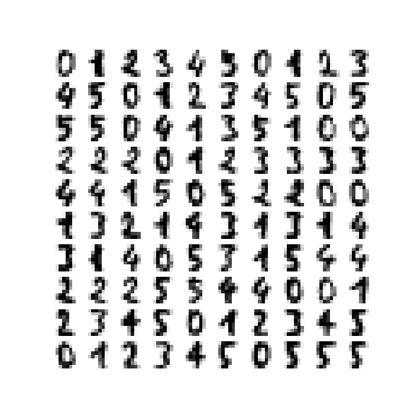

## Logistics
:::{style="font-size: .8em"}

_Lectures_

685-725 Comm Ave CAS 522

- Section A: MWF 9:05 AM -- 9:55 AM
- Section B: MWF 10:10 AM - 11:00 AM

_Discussions_

 - A2: 888 Commonwealth Ave IEC B10, M 1:25 PM -- 2:15 PM
 - B2: 64-86 Cummington Mall PSY B39, W  2:30 PM - 3:20 PM
 - B3: 871 Commonwealth Ave CGS 313, W 3:35 PM - 4:25 PM

:::

:::{.notes}
Welcome! 

My name
:::

## Logistics
:::{style="font-size: .8em"}

_Teaching Staff_

 - Instructor: Prof. Lisa Wobbes  <br>
 - TF: Wanli Chen  <br>
 - CAs: Sarah Rashed, Alyssa Tay, Yutong (Chris) Wu

Please use private messages on Piazza for all email needs!
:::

:::{.notes}
Some of them might join us.

Wanli leads discussions
:::

## Getting Set Up
:::{style="font-size: .8em"}

_Platforms_

- __Piazza__: https://piazza.com/bu/fall2025/ds121 <br>
Check it weekly!
- __Gradescope__: https://www.gradescope.com (Entry code: B3DKJ3)<br>

- __Grasple__: https://app.grasple.com/#/courses/12988 

_Resources_

- __Lecture slides and notes__: Links are on Piazza<br>
<!-- Slides reflect the latest content! -->

_Programming environment_ 

 - __Python__: Setup instructions are on Piazza

:::

:::{.notes}
Has everyone been enrolled?

Familiar with Piazza, Gradescope, Python?
:::

## Grasple
:::{style="font-size: .75em"}

- New addition to DS-121
- 5-8 questions per homework assignment (HW 0: only 1 question)
- Each question is worth 1 point on Grasple and 3 points for the assignment
- Immediate digital feedback: layered structure
- Grading: 
    - Main question correct in 1 attempt: 100%
    - Sub-question A correct, main question correct: 66%
    - Sub-question A correct, main question incorrect: 33%
    - Sub-question B correct, main question correct: 50%
    - Sub-question B correct, main question incorrect: 25%
    - Sub-question B incorrect: 0%

:::

:::{.notes}
New exciting platform

Draw the scheme

:::

## Grasple
:::{style="font-size: .8em"}

- Do **not** skip questions! 
- Only your first attempt on each assignment counts
- Report bugs directly to Yutong Wu or Prof. Wobbes

:::{.center-text}

:::

- Share your feedback with us through the survey

:::

:::{.notes}
Wanli will explain more

Pilot year

Future: integration with Gradescope
:::


## Course Grade
:::{style="font-size: .8em"}
_Computation_

- 5% Participation
- 15% Homework assignments
- 15% Midterm 1
- 15% Midterm 2 
- 15% Midterm 3 
- 35% Final exam

_Participation_

- Discussion Labs (3%): attend at least 9 out of 13
- Homework 0 and Grasple Survey (2%)
:::


## Course Grade
:::{style="font-size: .8em"}
_Homework_

- 8 homework assignments
- Due at 11:59 pm on a Wednesday
- Pen-and-paper mathematical questions and coding questions
- Each assignment has questions on both Gradescope and Grasple
- Questions during discussions and office hours are allowed and encouraged
- Bonus quizzes during discussions
- Clarity and correctness matter
- No late submissions, no assignments are dropped

:::

## Course Grade
:::{style="font-size: .8em"}
_Exams_

All exams are cumulative, with emphasis on material covered since the previous exam. Content may include lectures, discussion labs, homework, and required readings.

- Midterm 1: __October 8, before class, CAS 522__ <br>
Take-home exam. You must submit a hard copy. Late or digital submissions will not be accepted!
- Midterm 2: __October 27, during class, CAS 522__ <br>
In-person exam
- Midterm 3: __November 17, during class, CAS 522__ <br>
In-person exam
- Final exam: __December 15-19__ <br>
In-person exam
:::

:::{.notes}
Compromise between 2 and 3 midterms
:::

## Policies
:::{style="font-size: .8em"}
_Regrade requests_

- Up to one week after the grade is posted 
- Submission via Gradescope 

_Collaboration Policy_

- No copying (or allowing to copy)
- No searching for answers
- Disclose collaboration and sources

_Learning Environment_

- Inclusive environment for individuals of all genders, races, cultures, abilities, and sexual orientations


:::

:::{.notes}
Please be respectful to your fellow students and the teaching staff
:::

## General Information
:::{style="font-size: .8em"}

_Office Hours_

- Schedule is on Piazza under Resources/Staff 
- Any changes will be announced on Piazza

_Accommodations_

- Only through Office for Disability Services (ODS) 

:::

:::{.notes}
My OH: CDS 1401 at 3:30 pm
:::

## General Information
:::{style="font-size: .8em"}

__More details, including the weekly schedule, can be found in the syllabus.__

:::{.center-text}

:::
:::

:::{.notes}
Where to find the syllabus

Read the academic code of conduct 
:::


## Why Linear Algebra?   

::: {.antique-center-image}

:::

:::{style="font-size: .8em"}


::: {.center-text}
Linear algebra, probability/statistics, and optimization are the mathematical pillars of machine learning.
:::

:::

:::{.notes}
DS-121: Linear algebra

DS-122: Probability/statistics, and optimization
:::


## Why Linear Algebra?
<span style="font-size: 0.8em;">
Linear algebra enables powerful machine learning techniques such as k-means for clustering, PageRank for web search ranking, PCA for dimensionality reduction, and neural networks for deep learning.
</span>

:::{.columns}
::: {.column width="50%"}
{fig-align="left" width=110%}
:::

::: {.column width="50%"}
{fig-align="right" width=110%}
:::
:::

:::{.notes}
k-means: customer segmentation, document clustering

PageRank: number and quality of links to other pages

PCA: image compression, facial recognition
:::

## Why Linear Algebra?

:::{.center-text}

:::

<!-- :::{.columns}
::: {.column width="50%"}
{fig-align="left" width=110%}
:::

::: {.column width="50%"}
{fig-align="right" width=110%}
:::
::: -->

:::{.notes}
Data: 3000 x 500 k

Genes mirror geography

Application?
:::

## What is Linear Algebra?

::: {.center-y}
:::{.incremental}
:::{.fragment}
<span style="font-size: 0.8em;">
Linear algebra is a branch of mathematics that deals with vectors, matrices, linear systems, and linear transformations. 
</span>

:::
:::{.fragment}
<span style="font-size: 0.8em;">
It involves understanding and manipulating multi-dimensional data through concepts like vector spaces, matrix operations, and matrix factorizations.
</span>

:::
:::
:::

:::{.notes}
Vectors, matrices, linear systems, and linear transformations

Understanding and manipulating **multi-dimensional** data

:::

## Three Modes of Thinking

:::{.incremental}
<span style="font-size: 0.8em;">
- **Algebraic thinking**: how to correctly _manipulate symbols_ in a consistent logical framework.
</span>

<span style="font-size: 0.8em;">
- **Geometric thinking**: learning to _extend_ familiar two- and three-dimensional concepts _to higher dimensions_.
</span>

<span style="font-size: 0.8em;">
- **Computational thinking**: understanding the _relationship between abstract algebraic machinery and actual computations_ which _efficiently_ arrive at the correct answer.
</span>

:::{.fragment}
<span style="font-size: 0.8em;">
Integrating these three concepts is _essential_ for using linear algebra in data science.
</span>
:::

:::

## Three Modes of Thinking
:::{center-text}

:::

## Three Modes of Vector $\mathbf{v}$
:::{.incremental}
<span style="font-size: 0.8em;">
- **Algebraically:** a vector $\mathbf{v}$ is an abstract _object_ that permits addition ${\bf v} + {\bf w}$ and multiplication by a constant or *scalar* $c$ to form $c {\bf v}$.
</span>

<span style="font-size: 0.8em;">
- **Computationally:** a vector is an ordered _list_ of real numbers.
</span>

<span style="font-size: 0.8em;">
  $$
  \small{\begin{array}{ccc}
  {\bf u} = \left[\begin{array}{r}3\\-1\end{array}\right] &
  {\bf v} = \left[\begin{array}{c}2\\2\end{array}\right] &
  {\bf w} = \left[\begin{array}{c}-2\\-1\end{array}\right]
  \end{array}}
  $$
</span>
:::

:::{.notes}
Complex numbers are not the focus
:::

## Three Modes of Vector $\mathbf{v}$
<span style="font-size: 0.8em;">
- **Geometrically:** a vector is a _point_ (or an arrow) in $n$-dimensional space.
</span>

:::{.center-text}
```{python}
import matplotlib.pyplot as plt
import laUtilities as ut

# Set up plot
ax = ut.plotSetup(size=(5,5))
ut.centerAxes(ax)

# Plot points
ut.plotPoint(ax, -2, -1)
ut.plotPoint(ax, 2, 2)
ut.plotPoint(ax, 3, -1)

# Draw arrows representing vectors
ax.arrow(0, 0, -2, -1, head_width=0.2, head_length=0.2, length_includes_head=True)
ax.arrow(0, 0, 2, 2, head_width=0.2, head_length=0.2, length_includes_head=True)
ax.arrow(0, 0, 3, -1, head_width=0.2, head_length=0.2, length_includes_head=True)

# Plot boundaries
ax.plot(0, -2, '')
ax.plot(-4, 0, '')
ax.plot(0, 2, '')
ax.plot(4, 0, '')

# Add labels
ax.text(3.25, -1.1, '$(3,-1)$', size=12)
ax.text(2.25, 1.9, '$(2,2)$', size=12)
ax.text(-3.5, -1.1, '$(-2,-1)$', size=12)

plt.show()
```
:::
## <span style="font-size: .8em;">Linear Algebra for Data Science</span>
<span style="font-size: 0.75em;">
Let us consider the well known Iris Dataset.
</span>

<!-- Make the image a little smaller and the code tab smaller -->
```{python}
from sklearn.datasets import load_iris
iris = load_iris()
rows, cols = iris.data.shape
print("This dataset contains", rows, "rows.")
print("Each row contains", cols, "columns that contain the following features:")
print(iris.feature_names)
```
:::{center-text}

:::

:::{.notes}
Ronald Fisher, 1936

SEE-puhl

PET-uhl

VUR-sih-kull-ur seh-TOE-zuh vur-JIN-ih-kuh
:::

## <span style="font-size: .8em;">Linear Algebra for Data Science</span>
<span style="font-size: 0.8em;">
The data can be represented as a _matrix_.
</span>

:::{.columns}

:::{.column width="50%"}
```{python}
#|echo: true
A = iris.data
print(A.shape)

```
:::

:::{.column width="50%"}
```{python}
#|echo: true
print(A)
```
:::

:::

:::{.notes}
SEE-puhl

PET-uhl

VUR-sih-kull-ur seh-TOE-zuh vur-JIN-ih-kuh
:::

## <span style="font-size: .8em;">Linear Algebra for Data Science</span>

<span style="font-size: .8em;">This dataset might look random to the human eye. However, if we plot its attributes we can see that there is structure within the data.</span>

:::{.center-text}
```{python}
import matplotlib.pyplot as plt
#|echo: true
x_index = 2
y_index = 3 
# this formatter will label the colorbar with the correct target names
formatter = plt.FuncFormatter(lambda i, *args: iris.target_names[int(i)])
plt.scatter(A[:, x_index], A[:, y_index], c=iris.target, cmap = plt.cm.get_cmap('RdYlBu', 3))
plt.colorbar(ticks=[0, 1, 2], format=formatter)
plt.clim(-0.5, 2.5)
plt.xlabel(iris.feature_names[x_index])
plt.ylabel(iris.feature_names[y_index]);
```
:::


## <span style="font-size: .8em;">Linear Algebra for Data Science</span>

<span style="font-size: .8em;">
We can make the following observations.
</span>


<span style="font-size: .8em;">
1. There are _correlations_ among the 150 rows of A. 
</span>

<span style="font-size: .8em;">
- Knowing the petal length of an iris tells you something about the petal width. 
- Knowing the petal length and width might give you a way to classify which type of iris you have.
</span>

<span style="font-size: .8em;">
2. The matrix is _compressible_.
</span>

<span style="font-size: .8em;">
  - The 150 rows of $A$ are all samples of the same underlying physical process.<br>
  - We should be able to decompose this $150 \times 4$ matrix into simpler matrices.
</span>

:::{.notes}
Compressible: the same physics and biology laws

SEE-puhl PET-uhl VUR-sih-kull-ur seh-TOE-zuh vur-JIN-ih-kuh

What makes a matrix **simple**?
:::


## <span style="font-size: .8em;">Linear Algebra for Data Science</span>

<span style="font-size: 0.8em;">
What makes a matrix _simple_?
</span>


:::{.incremental}
<span style="font-size: 0.8em;">
- **Size:** one matrix might have fewer rows or columns than another, which means it is more compact and has fewer degrees of freedom.
</span>

<span style="font-size: 0.8em;">
- **Sparsity:** a matrix might be lower triangular (denoted $L$) or upper triangular (denoted $U$ or $R$), with all other entries equal to zero.
</span>

<span style="font-size: 0.8em;">
- **Symmetry:** the entries of the matrix might be symmetric across the diagonal $S$, or it might even be a diagonal matrix $\Sigma$ with all other entries being 0.
</span>
:::

:::{.notes}
What number is simpler, 6 or 3? Why?
:::


## Matrix Decomposition
<span style="font-size: 0.8em;">
- $A = L U$ - Gauss-Jordan Elimination <br>
- $A = Q R$ - Gram-Schmidt Orthogonalization <br>
- $A = U \Sigma V$ - Singular Value Decomposition or SVD
</span>

:::{.center-text}

:::

## Assumptions
<span style="font-size: 0.8em;">
Many techniques in this course involve dealing with high-dimensional datasets for which we assume low intrinsic dimensionality. This is often a good assumption, but not always!
</span>

:::{.center-text}

:::

:::{.notes}
Low intrinsic dimensionality: physical or mathematical structure

Caution!
:::