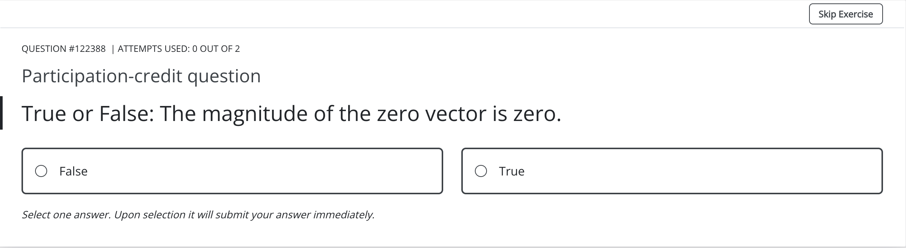

<!-- ## About me
:::{style="font-size: .8em"}

- PhD in Applied Mathematics — Delft University of Technology

:::{.center-text}

:::

- Former Data Scientist, Dutch Ministry of Education
- Now in my 4th semester teaching DS‑121
- Enjoy hiking, playing board games, and spending time with my family
::: -->

## DS-121
:::{style="font-size: .8em"}
- Downstream courses:
    * DS 320 Algorithms for Data Science
    * DS 436 Foundations of Biological Data
Science
    * DS 453 Crypto for Data Science
    * DS 592 Intro to Sequential Decision Making
    * DS 574 Algorithmic Mechanism Design 
- From student evaluations: 
_I was really worried about how I would be able to do in a class focusing entirely on linear algebra but I am so pleasantly surprised. I ended up learning a lot and I feel more confident going into future math classes._
:::

:::{.notes}
- Designed by Prof. Varia and Prof. Crovella -> footprint in the notes
- Tought by Prof. Varia, Prof. McDonald, Prof. Wobbes, and Prof. Wheelock 
:::

## Grasple
:::{style="font-size: .8em"}
- Immediate digital feedback
- Layered structure: two subquestions that both lead back to the main question
- 5 main questions per homework assignment
- Only the performance during the quiz is graded: the platform score is irrelevant
- Please complete the Grasple survey (worth 1% of your course grade)

:::{.center-text}

:::

:::

