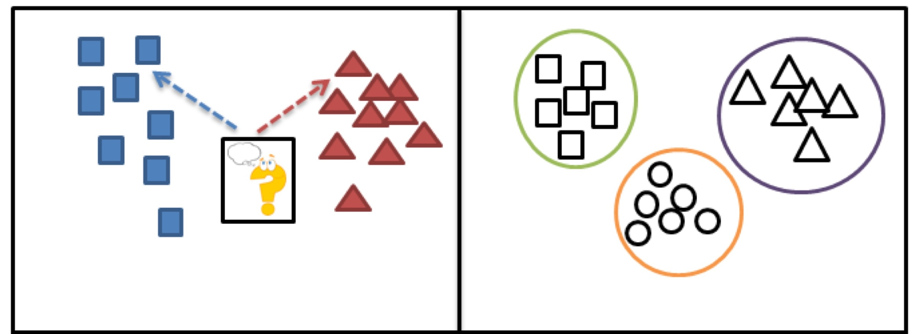

```{python}
import numpy as np
import matplotlib.pyplot as plt
import matplotlib as mp
import sklearn.datasets as sk_data
from sklearn.neighbors import KNeighborsClassifier
import sklearn.metrics as metrics
```
## Learning Objectives

::::{style="font-size: .8em"}
- Types of machine learning algorithms:
    - Supervised vs unsupervised models
    - Regression vs classification
    - Parametric vs nonparamteric models
- $k$-nearest neighbors ($k$-NN):
    - Hard vs soft classification
    - Model selection
    - Challenges

<!-- In the last lecture, we explored vector geometry, including vector length, distance, and the angle between two vectors.

:::{.fragment}
Today, we will build on that foundation by connecting the concept of distance between vectors to a widely used machine learning algorithm known as k-nearest neighbors ($k$-NN). Before diving into $k$-NN, we will discuss different types of ML methods.
:::

:::{.fragment}
By the end of this lecture, you will understand how vector distances are applied in $k$-NN, be able to differentiate between various ML approaches, and recognize the challenges posed by high-dimensional data. -->

::::

## Types of Machine Learning Algorithms {.smaller}

::::{style="font-size: 1.2em"}
Vector encoding uses geometry to reveal data structure, a core objective in data science.
::::



:::{style="font-size: 1.2em"  }
```{python}
from IPython.core.display import HTML

def generate_html():
    return r"""
    <div class="blue-box">
        <p>What kinds of machine learning algorithms do you know?
        </p>
    </div>
    """

html_content = generate_html()
display(HTML(html_content))
```
:::
:::{.notes}
Classification: DS minor vs major

Clustering: handwritten digits
:::

## Supervised vs. Unsupervised Learning {.smaller}

:::{style="font-size: 1.2em"  }
- __Supervised__ methods:  data items have labels, and we want to learn a function that correctly assigns labels to new data items.
- __Unsupervised__ methods:  data items do not have labels, and we want to learn a function that extracts  important patterns from the data.

In this class, we think of the data as a vector $\mathbf{x}$. We refer to the entries of $\mathbf{x}$ as **features**.

:::

:::{.notes}
Regression and classification fall into the supervised learning domain.
:::


## Supervised Learning
:::{style="font-size: 0.8em"}
Let us write the supervised learning problem more precisely.

- Given: **Training data** $\{(\mathbf{x_i}, y_i)\,|\,i = 1,\dots,N\}$.  

- Goal: Find a rule that allows to predict $y_j$ for a new $\mathbf{x_j}$.

- Assumption: labels $y_i$ have some _**dependence**_ on the features in $\mathbf{x_i}.$

For this reason, we sometimes say that:

- the features in the $\mathbf{x_i}$ vectors are the __independent variables__, and
- the label $y_i$ is the target or __dependent variable__.
:::

:::{.notes}
Set of N tuples
:::


## Supervised Learning

:::{style="font-size: .8em"  }
Machine learning relies on the following principles:

1. There is a set of functions ("rules") that could be used to predict $y_i$ from $\mathbf{x}_i$. In this case, the goal of learning is to find the "right" function.

2. The rule for predicting $y_i$ from $\mathbf{x}_i$ is the same as the rule for predicting $y_j$ from the new item $\mathbf{x}_j$. This is because we want the model to do a good job of predicting on __future__ data.  This is called the model's __generalization__ ability.
:::


## Regression 

::::{style="font-size: .8em"  }
If $y$ is a continuous (numeric) value, then the problem is called __regression.__ 

- For example, in predicting housing prices, the features could be lot size, square footage, number of bathrooms, etc.  and the labels could be the sale price of the house.

- Predictions are useful as long as they are _**close**_ to the true value. They don't need to be exact.

<!-- - For example, in predicting housing prices, the features $x_{i1}, x_{i2}, x_{i3}, \ldots$ could be a vector containing lot size, square footage, number of bathrooms, etc. of a collection of houses, and $y_i$ could be the sale price of house $i$. -->

::::

:::{.notes}
Advertising and sales
:::


## Classification

::::{style="font-size: .8em"  }
If $y$ is a discrete value (a color, for example) then the problem is called __classification.__

- For example, in image recognition, the features $\mathbf{x}$ could be a vector that represents the pixels of the image, and $y$ could be a label such as "tiger," "tree," etc.
    
- Predictions are useful as long as they are accurate _**most of the time**_. They do need not be 100% accurate.
 
::::


## Parametric vs. Nonparametric Models {.smaller}

::::{style="font-size: 1.2em"  }
Another way in which different machine learning models can vary is in the number of training parameters that exist.

- If the model has a _**fixed**_ number of parameters, no matter the size of the training dataset, then it is called **parametric**.
- If the number of parameters _**grows**_ with the data, the model is called **nonparametric**.
::::

:::{.notes}
Parametric: linear regression
:::


## Parametric vs. Nonparametric Models {.smaller}

::::{style="font-size: 1.2em"  }

Parametric models have 

* are often _**faster**_, 
* but make _**strong assumptions**_ about the nature of data distributions.


Nonparametric models are

* more _**flexible**_,
* but can be _**computationally intractable**_ for large datasets.
::::


## K-Nearest Neighbors 

::::{style="font-size: .8em"  }
$k$NN is an example of a supervised, nonparametric classifier.

It is trained using labeled data, with the goal of classifying new, unlabeled data points.

- During training, $k$NN simply stores the training data. This minimal processing is what makes it nonparametric.
- During classification, it:
     - Finds the $k$ nearest neighbors to the input point $\mathbf{x}$ in the training set.
    - Makes a prediction based on the labels of those neighbors.

By "nearest" we usually mean in Euclidean distance.

::::

## K-Nearest Neighbors


:::{style="font-size: .75em"}
Here is an example of a training dataset $\{(\mathbf{x_i}, y_i)\,|\,i = 1,\dots,N\}$ where the feature vectors $\mathbf{x_i}$ are each 2-dimensional, and the label $y_i$ is either 'blue' or 'red.'
:::

:::{.center-text}
```{python}
from matplotlib.colors import ListedColormap
figsize = (8,5)
cmap_light = ListedColormap(['#FFAAAA', '#AAFFAA', '#AAAAFF'])
cmap_bold = ListedColormap(['#FF0000', '#00FF00', '#0000FF'])

demo_y = [1, 1, 1, 1, 1, 1, 0, 0, 0, 0, 0, 0, 0]
demo_X = np.array([[-3,1], [-2, 4], [-2, 2], [-1.5, 1], [-1, 3], [0, 0], [1, 1.5], [2, 0.5], [2, 3], [2, 0], [3, 1], [4, 4], [0, 1]])
test_X = [-0.3, 0.7]
#
plt.figure(figsize=figsize)
plt.scatter(demo_X[:,0], demo_X[:,1], c=demo_y, cmap=cmap_bold)
#plt.scatter(demo_X[:,0], demo_X[:,1], c=demo_y)
plt.axis('equal')
plt.axis('off')
plt.title('Training Points: 2 Classes');
plt.show()
```
:::

:::{.notes}
N=13
:::

## K-Nearest Neighbors

:::{.center-text}
```{python}
plt.figure(figsize=figsize)
plt.scatter(demo_X[:,0], demo_X[:,1], c=demo_y, cmap=cmap_bold)
#plt.scatter(demo_X[:,0], demo_X[:,1], c=demo_y)
plt.plot(test_X[0], test_X[1], 'ok')
plt.annotate('Test Point', test_X, [75, 25], 
             textcoords = 'offset points', fontsize = 14, 
             arrowprops = {'arrowstyle': '->'})
plt.axis('equal')
plt.axis('off')
plt.title('Training Points: 2 Classes');
plt.show()
```
:::

## K-Nearest Neighbors

:::{.center-text}
```{python}
plt.figure(figsize=figsize)
plt.scatter(demo_X[:,0], demo_X[:,1], c=demo_y, cmap=cmap_bold)
#plt.scatter(demo_X[:,0], demo_X[:,1], c=demo_y)
plt.plot(test_X[0], test_X[1], 'ok')
ax=plt.gcf().gca()
circle = mp.patches.Circle(test_X, 0.5, facecolor = 'red', alpha = 0.2)
plt.axis('equal')
plt.axis('off')
ax.add_artist(circle)
plt.title('1-Nearest-Neighbor: Classification: Red')
plt.show()
```
:::

## K-Nearest Neighbors

:::{.center-text}

```{python}
plt.figure(figsize=figsize)
plt.scatter(demo_X[:,0], demo_X[:,1], c=demo_y, cmap=cmap_bold)
#plt.scatter(demo_X[:,0], demo_X[:,1], c=demo_y)
test_X = [-0.3, 0.7]
plt.plot(test_X[0], test_X[1], 'ok')
ax=plt.gcf().gca()
    #ellipse = mp.patches.Ellipse(gmm.means_[clus], 3 * e[0], 3 * e[1], angle, color = 'r')
circle = mp.patches.Circle(test_X, 0.9, facecolor = 'gray', alpha = 0.3)
plt.axis('equal')
plt.axis('off')
ax.add_artist(circle)
plt.title('2-Nearest-Neighbor');
plt.show()
```
:::
:::{.notes}
How can we solve the issue with the indeterminate result?
:::

## K-Nearest Neighbors

:::{.center-text}
```{python}
plt.figure(figsize=figsize)
ax=plt.gcf().gca()
    #ellipse = mp.patches.Ellipse(gmm.means_[clus], 3 * e[0], 3 * e[1], angle, color = 'r')
circle = mp.patches.Circle(test_X, 1.4, facecolor = 'blue', alpha = 0.2)
ax.add_artist(circle)
plt.scatter(demo_X[:,0], demo_X[:,1], c=demo_y, cmap=cmap_bold)
#plt.scatter(demo_X[:,0], demo_X[:,1], c=demo_y)
test_X = [-0.3, 0.7]
plt.plot(test_X[0], test_X[1], 'ok')
plt.axis('equal')
plt.axis('off')
plt.title('3-Nearest-Neighbor: Classification: Blue');
plt.show()
```
:::

## K-Nearest Neighbors

::::{style="font-size: .8em"}
Note that $k$-Nearest Neighbors can do either _**hard**_ or _**soft**_ classification.
<br><br>
As a **hard classifier**, it returns the majority vote of the labels on the $k$ nearest neighbors (which may be indeterminate). 
<br><br>
As a **soft classifier** it returns:
    
$$ 
p(x = c\,|\,\mathbf{x}, k) = \frac{\text{number of points in neighborhood with label } c}{k} 
$$
::::

:::{.notes}
It is also reasonable to weight the votes of neighborhood points according to their distance from $x$.

Return back to the previous slide: Result of soft classification?

P(red) = 1/3

P(blue) = 2/3
:::

## Model Selection for K-NN

::::{style="font-size: .8em"}
The variable $k$ itself is called a __hyperparameter__. That is, it is a parameter that must be set _**before**_ the model parameters themselves can be learned.
<br><br>


Each choice of $k$ results in a different model. Hence, the complexity of the model is controlled by the hyperparameter $k$.
<br><br>


Let us see what happens if we apply $k$-nearest neighbors to a dataset with different choices of $k$.
::::

:::{.notes}
For each k a different model
:::

## Model Selection for K-NN

:::{style="font-size: .8em"}
Consider the following dataset with 3 classes.
:::

:::{.center-text}
```{python}
X, y = sk_data.make_blobs(n_samples=150, 
                          centers=[[-2, 0],[1, 5], [2.5, 1.5]],
                          cluster_std = [2, 2, 3],
                          n_features=2,
                          center_box=(-10.0, 10.0),random_state=0)
plt.figure(figsize = figsize)
plt.axis('equal')
plt.axis('off')
plt.scatter(X[:,0], X[:,1], c = y, cmap = cmap_bold, s = 80);
#plt.scatter(X[:,0], X[:,1], c = y, s = 80);
plt.show()
```
:::

## Model Selection for K-NN

:::{style="font-size: .8em"}
Let us vary $k$ and observe the change in decision boundaries.


```{python}
# Plot the decision boundary. For that, we will assign a color to each
# point in the mesh [x_min, x_max]x[y_min, y_max].
h = .1  # step size in the mesh
x_min, x_max = X[:, 0].min() - 1, X[:, 0].max() + 1
y_min, y_max = X[:, 1].min() - 1, X[:, 1].max() + 1
xx, yy = np.meshgrid(np.arange(x_min, x_max, h),
                      np.arange(y_min, y_max, h))

f, axs = plt.subplots(1, 3, figsize=(13, 4.5))
for i, k in enumerate([1, 5, 25]):
    knn = KNeighborsClassifier(n_neighbors = k)
    knn.fit(X, y)
    Z = knn.predict(np.c_[xx.ravel(), yy.ravel()])
    Z = Z.reshape(xx.shape)
    axs[i].pcolormesh(xx, yy, Z, cmap = cmap_light, shading = 'auto')
    axs[i].pcolormesh(xx, yy, Z, shading = 'auto')
    axs[i].axis('equal')
    axs[i].axis('off')
    axs[i].set_title(f'Decision Regions for $k$ = {k}');
```


```{python}
from IPython.core.display import HTML

def generate_html():
    return r"""
    <div class="blue-box">
        <p>What is the best choice for \(k\)?
        </p>
    </div>
    """

html_content = generate_html()
display(HTML(html_content))
```
:::

## Challenges for K-NN

::::{.columns style="font-size: .8em"}
:::{.column width="40%"}
- The computational cost grows with the size of the training data
- Data scaling is required
- The curse of dimensionality
:::

:::{.column width="60%" .center-text}


:::
::::

:::{.notes}
2. Dataset uses 2 features: annual income is $ and number of children

Without scaling 1 dollar has the same effect as 1 child
:::

## The Curse of Dimensionality

::::{style="font-size: .8em"  }
The __curse of dimensionality__ refers to serious issues that occur when using geometric algorithms in high dimensions.

There are various aspects of the curse that affect $k$-NN.

1. Points are far apart in high dimensions.
2. Points tend to all be at similar distances in high dimension.


Let's analyze these two claims in more detail.
::::

## The Curse of Dimensionality

::::{style="font-size: .8em"}
__1. Points are far apart in high dimension.__

$k$-NN relies on having "close" points to the test point $x$, requiring _**dense training data**_. 

However, as the dimension $d$ of $\mathbb{R}^d$ increases, the space grows exponentially, making points rarely close. 
In order for two points to be close in $\mathbb{R}^d$, they must be close in _**each**_ of the $d$ dimensions.

Hence, it becomes hard for the algorithm to find points that are close.
::::

## The Curse of Dimensionality

::::{style="font-size: .8em"  }
__2. Points tend to all be at similar distances in high dimension.__

Let's say points are uniformly distributed in space, so that the number of points in a region is proportional to the region's volume.  

Consider the volume of a hypersphere with radius 1 around a point (say, $x$). For any dimension $d$ the volume of a hypersphere is $k_d \,r^d$.  However, $k_d$ is different for each dimension.

* For $d = 2$, $k_d$ is $\pi$, and 
* for $d = 3$, $k_d$ is 4/3 $\pi$, etc.

::::

:::{.notes}

- 2D circle $\pi r^2$
- 3D sphere $\frac{4}{3}\pi r^3$
- 4D hypersphere

:::

## The Curse of Dimensionality

::::{style="font-size: .8em" .columns}

:::{.column}
Let's also ask how many points are within a slightly smaller distance than the radius of the hypersphere. Let's say 0.99.  

The new distance can be thought of as $1 - \epsilon$ for some small $\epsilon$.

The number of points then of course is proportional to $k_d (1-\epsilon)^d$.
:::

:::{.center-text .column}
```{python}
ax = plt.figure(figsize = (7,7)).add_subplot(projection = '3d')
# coordinates of sphere surface
u, v = np.mgrid[0:2*np.pi:50j, 0:np.pi:50j]
x = np.cos(u)*np.sin(v)
y = np.sin(u)*np.sin(v)
z = np.cos(v)
#
ax.plot_surface(x, y, z, color='r', alpha = 0.3)
s3 = 1/np.sqrt(3)
ax.quiver(0, 0, 0, s3, s3, s3, color = 'b')
ax.text(s3/2, s3/2, s3/2-0.2, 'r', size = 14)
ax.set_axis_off()
plt.title('Hypersphere in $d$ dimensions\nVolume is $k_d \,r^d$');
```
:::

::::

## The Curse of Dimensionality

::::{style="font-size: .8em"}
What is the fraction $f_d$ of all the points within the unit distance but not within the distance of 0.99?

$$ 
f_d = \frac{k_d 1^d - k_d (1-\epsilon)^d}{k_d 1^d} = 1 - (1-\epsilon)^d.
$$

As $d$ approaches infinity, $f_d$ approaches 1. This means that most points are about the same distance from the point $x$.
<!-- Too much vertical whitespace for matplotlib plot so this is quick fix. -->

:::{.center-text}


:::

::::

<!-- ## The Curse of Dimensionality

:::{style="font-size: .8em"}
Let's demonstrate this effect in practice.

What we will do is create 1000 points, scattered at random within a $d$-dimensional ball of diameter 1 in each dimension.

We will look at two quantities:


* The _minimum_ distance between any two points, and
* The _average_ distance between any two points.

as we vary $d$.
:::

## The Curse of Dimensionality

:::{.center-text}
```{python}

nsamples = 1000
unif_X = np.random.default_rng().uniform(0, 1, nsamples).reshape(-1, 1)
euclidean_dists = metrics.euclidean_distances(unif_X)
# extract the values above the diagonal
dists = euclidean_dists[np.triu_indices(nsamples, 1)]
mean_dists = [np.mean(dists)]
min_dists = [np.min(dists)]
for d in range(2, 101):
    unif_X = np.column_stack([unif_X, np.random.default_rng().uniform(0, 1, nsamples)])
    euclidean_dists = metrics.euclidean_distances(unif_X)
    dists = euclidean_dists[np.triu_indices(nsamples, 1)]
    mean_dists.append(np.mean(dists))
    min_dists.append(np.min(dists))

plt.figure(figsize=figsize)
plt.plot(min_dists, label = "Minimum Distance")
plt.plot(mean_dists, label = "Average Distance")
plt.xlabel(r'Number of dimensions ($d$)')
plt.ylabel('Distance')
plt.legend(loc = 'best')
plt.title(f'Comparison of Minimum Versus Average Distance Between {nsamples} Points\nAs Dimension Grows');
```
:::

## The Curse of Dimensionality

:::{.center-text}
```{python}
plt.figure(figsize=figsize)
plt.plot([a/b for a, b in zip(min_dists, mean_dists)])
plt.xlabel(r'Number of dimensions ($d$)')
plt.ylabel('Ratio')
plt.title(f'Ratio of Minimum to Average Distance Between {nsamples} Points\nAs Dimension Grows');
```
::: -->

<!-- ## The Curse of Dimensionality

:::{style="font-size: .8em"}
The above figures show the growth of the ratio of the minimum distance to the average distance.

For $k$-NN the implication of the curse of dimensionality is that in high dimension, most points are about the same distance from the test point.

This leads to ineffectiveness of $k$-NN in higher dimensions.
::: -->

