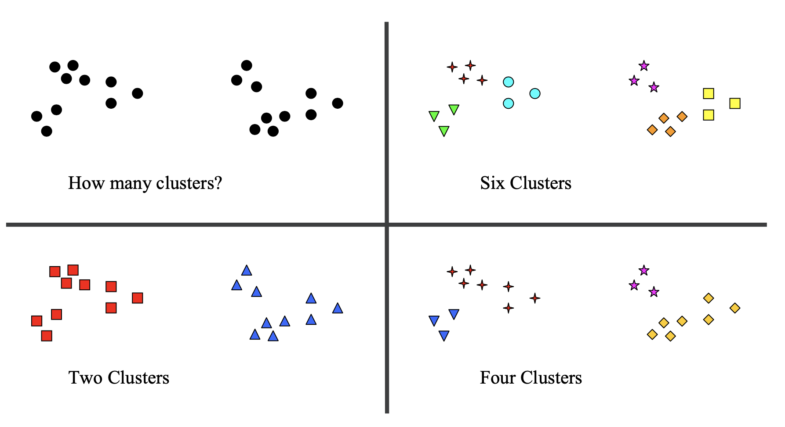

```{python}
import numpy as np
import pandas as pd
import matplotlib as mp
import matplotlib.pyplot as plt
from numpy.random import default_rng
from sklearn.cluster import KMeans
import seaborn as sns
import sklearn.manifold
import sklearn.metrics as metrics
# import sklearn.datasets as datasets
# from sklearn.neighbors import KNeighborsClassifier
# import sklearn.metrics as metrics
# import sklearn.model_selection as model_selection

```

## Learning Objectives

::::{style="font-size:.8em"}

- Limitations of $k$-means clustering
- Feature scaling
- Cluster evaluation
    - Rand Index
    - Silhouette coefficient
- Model selection for $k$-means clustering

::::

## Limitations of $k$-Means

::::{style="font-size: .8em"}
There are various settings in which $k$-means can fail to perform well.

1. The clusters are not spherical.

:::{.center-text}


:::
::::

## Limitations of $k$-Means

::::{style="font-size: .8em"}


2. Clusters have significantly different sizes.

:::{.center-text}


:::
::::

:::{.notes}
Partially caused by the cost function: sum of squared distances to the centroid. Tends to think that the number of points is the same in each cluster.
:::

## Limitations of $k$-Means

::::{style="font-size: .8em"}

3. The initial guess is poor and it is unable to improve the starting clusters.

:::{.center-text}


:::

::::

## Limitations of $k$-Means

::::{style="font-size: .8em"}
The limitations arise due to the implicit assumptions of the algorithm:

- The points in a cluster are arranged in a sphere around the center.

- The number of points in each cluster is approximately the same.

The performance of all iterative methods depends on the initial guess. The $k$-means algorithm is no exception.

A good strategy is to pick initial cluster centers that are distant to each other. This strategy is called **k-means++**. 

::::

:::{.notes}
What other iterative methods do you know? 

Gradient Descent?

 K-means works best when clusters are roughly spherical and equally sized. If clusters differ in size, shape, or DENSITY, k-means may misclassify points.
:::

## Feature Scaling

::::{style="font-size: .8em"}
Due to the tendency of $k$-means to look for spherical clusters, it
is important to consider the scales of various features.

Consider the case where people are being clustered based on their age, income, and whether they are a parent.

::::{.columns}
:::{.column width="50%"}

* Joe Smith, age 27, income USD 75,000, two children
* Eve Jones, age 45, income USD 42,000, no children

:::

:::{.column width="50%"}

$$
\begin{bmatrix} 27 \\ 75000 \\ 2 \end{bmatrix}, \begin{bmatrix} 45 \\ 42000 \\ 0 \end{bmatrix}
$$

:::
:::

```{python}
from IPython.core.display import HTML

def generate_html():
    return r"""
    <div class="blue-box">
        <p>
        What would happen if we used Euclidean distance as our dissimilarity metric in this feature space?
        </p>
    </div>
    """

html_content = generate_html()
display(HTML(html_content))
```
::::


## Feature Scaling

::::{style="font-size: .8em"}
Income dominates the feature space, making it unlikely that clustering will reveal parenting-related differences.


The most common way to handle this is **feature scaling:**
rescaling each feature so their value ranges are comparable.

For example, one may choose to:

- shift each feature independently by subtracting the mean over all observed values;
- then rescale each feature so that the standard deviation overall observed values is 1.

::::

:::{.notes}
StandardScaler in Python

- mean 0

- the same spread
:::

<!-- ## Cluster Evaluation

<!-- Not the best right now but was having lots of trouble formatting -->
<!-- :::{style="font-size: .8em"}
Consider this dataset, which we have clustered using k-means


:::{.center-text}
```{python}
#|echo: true
#|layout-ncol: 2
unif_X = np.random.default_rng().uniform(0, 1, 100)
unif_Y = np.random.default_rng().uniform(0, 1, 100)
df = pd.DataFrame(np.column_stack([unif_X, unif_Y]), columns = ['X', 'Y'])
kmeans = KMeans(init = 'k-means++', n_clusters = 3, n_init = 100)
df['label'] = kmeans.fit_predict(df[['X', 'Y']])
df.plot('X', 'Y', kind = 'scatter', c = 'label', colormap='viridis', colorbar = False)
plt.axis('equal')
plt.axis('off');
```
:::

:::{.fragment}
This dataset has no actual clusters, but $k$-means still outputs a clustering.
::: -->
<!-- :::: -->

## Cluster Evaluation

::::{style="font-size:.8em"}

&emsp;
1. Are there "real" clusters in the data?

&emsp;
2. If so, how many clusters are there?

:::{.center-text}


:::
::::

:::{.notes}
any clustering algorithm will provide some clustering of the data

the definition of a cluster is imprecise and depends on the nature of data and desired results
:::

## Rand Index

::::{style="font-size: .8em"}
The **Rand Index (RI)** is a _**similarity**_ measure used to compare two clusterings.

It is useful for evaluating clustering algorithms when ground truth labels are available.

Each data item has two labelings: one from ground truth ($T$), one from the algorithm ($C$).

:::{.center-text}


:::
::::

## Rand Index

::::{style="font-size: .8em"}
The idea behind Rand Index is to consider _**pairs**_ of points, and ask whether pairs that fall into the same cluster in $T$ also fall into the same cluster in $C$.

```{python}
from IPython.core.display import HTML

def generate_html():
    return r"""
    <div class="purple-box">
        <p>
        Let \(a\) be the number of pairs that have the same label in \(T\) and the same label in \(C\). Let \(b\) be the number of pairs that have different labels in \(T\) and different labels in \(C\). 
        Then the Rand Index is: <br>
        &emsp;&emsp;&emsp;&emsp;&emsp;&emsp;&emsp;&emsp;&emsp;&emsp;&emsp;&emsp;&emsp;&emsp;&emsp;\(\mbox{RI}(T,C) = \frac{a+b}{n \choose 2}\)
        </p>
    </div>
    """

html_content = generate_html()
display(HTML(html_content))
```

The Rand Index is frequently replaced by the Adjusted Rand Index that compares the RI score to the RI of random labelings.

::::

:::{.notes}
some agreement is by chance
:::

## Rand Index

::::{style="font-size:.8em"}
```{python}
import sklearn.datasets as sk_data
X, y = sk_data.make_blobs(n_samples=100, centers=3, n_features=30,
                          center_box=(-10.0, 10.0), random_state=0)
import sklearn.metrics as metrics
euclidean_dists = metrics.euclidean_distances(X)
labels = kmeans.labels_
idx = np.argsort(labels)
rX = X[idx, :]
```

```{python}
#|echo: true
sns.heatmap(rX, xticklabels = False, yticklabels = False, linewidths = 0);
```


Let's consider again our 3-cluster dataset. But this time, after we run $k$-means clustering, we can compare the results against the known labels `y`.
::::

## Rand Index

::::{style="font-size: .8em"}
Here is the Adjusted Rand Index, when using $k$-means to cluster this dataset for 1 to 10 clusters.

:::{.center-text}
```{python}
def ri_evaluate_clusters(X,max_clusters,ground_truth):
    ri = np.zeros(max_clusters+1)
    ri[0] = 0;
    for k in range(1,max_clusters+1):
        kmeans = KMeans(init='k-means++', n_clusters=k, n_init=10)
        kmeans.fit_predict(X)
        ri[k] = metrics.adjusted_rand_score(kmeans.labels_,ground_truth)
    return ri
    
ri = ri_evaluate_clusters(X, 10, y)
plt.figure(figsize=(8,4))
plt.plot(range(1,len(ri)), ri[1:], 'o-')
plt.xlabel('Number of clusters')
plt.title('$k$-means Clustering Compared to Known Labels')
plt.ylabel('Adjusted Rand Index');
```
:::


The Adjusted Rand Index is the highest for three clusters.

::::

## Rand Index

:::{style="font-size: .8em"}
```{python}
from IPython.core.display import HTML

def generate_html():
    return r"""
    <div class="blue-box">
        <p>
        Consider the following clusterings: <br><br>
        \(A = (\{u_1,u_2\}, \{u_3,u_4,u_5\})\) and <br>
        \(B = (\{u_1,u_2,u_3\}, \{u_4,u_5\})\).<br><br>
        What is the Rand Index between \(A\) and \(B\)?
        </p>
    </div>
    """

html_content = generate_html()
display(HTML(html_content))
```
:::

## Silhouette Coefficient

::::{style="font-size: .8em"}
Recall our definition of clustering: 

> a grouping of data objects, such that the objects within a group are similar (or near) to one another and dissimilar (or far) from the objects in other groups.

This suggests a metric that could evaluate a clustering: comparing the distances between points within a cluster to the distances between points in different clusters.
::::

## Silhouette Coefficient

::::{style="font-size: .8em"}
The Silhouette Coefficient is an example of such an evaluation. A higher Silhouette Coefficient score relates to a model with "better defined" clusters. 

```{python}
from IPython.core.display import HTML

def generate_html():
    return r"""
    <div class="purple-box">
        <p>
        Let \(a\) be the mean distance between a data point and all other points in the same cluster.
        Let \(b\) be the mean distance between a data point and all other points in the next nearest cluster.
        Then the <b>Silhouette Coefficient</b> for a point in a clustering is:<br><br>
        &emsp;&emsp;&emsp;&emsp;&emsp;&emsp;&emsp;&emsp;&emsp;&emsp;&emsp;&emsp;\(s = \frac{b-a}{\max(a, b)}\). 
        </p>
    </div>
    """

html_content = generate_html()
display(HTML(html_content))
```

The Silhouette Coefficient for the entire clustering is the mean of Silhouette Coefficients for the points.
::::


## Silhouette Coefficient

::::{style="font-size:.8em"}
Recall one more time our 30-dimensional synthetic data from earlier, which we approximated using a 2D multidimensional scaling model.

:::{.center-text}
```{python}
euclidean_dists = metrics.euclidean_distances(X)
mds = sklearn.manifold.MDS(n_components = 2, max_iter = 3000, eps = 1e-9, random_state = 0,
                   dissimilarity = "precomputed", n_jobs = 1)
fit = mds.fit(euclidean_dists)
pos = fit.embedding_
plt.axis('equal')
plt.scatter(pos[:, 0], pos[:, 1], s = 8);
```
:::
::::

## Silhouette Coefficient

:::{style="font-size: .8em"}
Let's apply the Silhouette Coefficient to this synthetic dataset.

```{python}
#|echo: true
sc = metrics.silhouette_score(X, labels, metric='euclidean')
print(sc)
```

:::{.center-text .column width="50%"}
```{python}
def sc_evaluate_clusters(X, max_clusters, n_init, seed):
    s = np.zeros(max_clusters+1)
    s[0] = 0;
    s[1] = 0;
    for k in range(2, max_clusters+1):
        kmeans = KMeans(init='k-means++', n_clusters = k, n_init = n_init, random_state = seed)
        kmeans.fit_predict(X)
        s[k] = metrics.silhouette_score(X, kmeans.labels_, metric = 'euclidean')
    return s

s = sc_evaluate_clusters(X, 10, 10, 1)
plt.plot(range(2, len(s)), s[2:], 'o-')
plt.xlabel('Number of Clusters')
plt.title('$k$-means clustering performance on synthetic data')
plt.ylabel('Silhouette Score');
```
:::
:::{.column width=45%}

These results are more perfect than typical, because we use a synthetic dataset.
<br><br>
The general idea is to look for a local maximum in the Silhouette Coefficient as the potential number of clusters.

:::
:::

## Silhouette Coefficient

::::{.columns}

:::{.column width="50%"}
```{python}
# Adjusted plot with slightly larger ellipses

fig, ax = plt.subplots()

# Draw larger ellipses
ellipse1 = plt.matplotlib.patches.Ellipse((0, -1.5), 2.5, 3.5, fill=False, edgecolor='black', linewidth=1.5)
ellipse2 = plt.matplotlib.patches.Ellipse((4, -1.5), 2.5, 3.5, fill=False, edgecolor='black', linewidth=1.5)
ax.add_patch(ellipse1)
ax.add_patch(ellipse2)

# Plot points
ax.scatter([0], [0], color='red', s=100, label='Red Point')  # Red point
ax.scatter([0, 4, 4], [-3, -3, 0], color='blue', s=100, label='Blue Points')  # Blue points

# Adjust axis limits to match requested y-range
ax.set_xlim(-2, 6)
ax.set_ylim(2, -5)  # Flipped y-axis

# Add grid
ax.grid(True, linestyle='--', alpha=0.7)

# Set equal aspect ratio
ax.set_aspect('equal', adjustable='datalim')

# Show plot
plt.show()
```
:::

:::{.column width="50%"}

:::{style="font-size: .8em"}
```{python}
import matplotlib.pyplot as plt
from IPython.core.display import HTML

def generate_html():
    return r"""
    <div class="blue-box">
        <p>
        Consider the following dataset: \(\small\begin{bmatrix} 0 \\ 0 \end{bmatrix}, \begin{bmatrix} 0 \\ -3 \end{bmatrix}, \begin{bmatrix} 4 \\ 0 \end{bmatrix}, \begin{bmatrix} 4 \\ -3 \end{bmatrix}\).<br>The points have been assigned to two clusters as shown in the figure. <br>What is the silhouette coefficient for point \(\small\begin{bmatrix} 0 \\ 0 \end{bmatrix}\)?
        </p>
    </div>
    """

html_content = generate_html()
display(HTML(html_content))
```
:::
:::
::::

## Number of Clusters

:::{style="font-size: .8em"}
How do we select the value of the hyperparameter $k$?

The first thing you might do is to look at the $k$-means cost function (or error) and see if it levels off after a certain point.
<!-- 
Recall that the $k$-means objective can be considered the clustering "error." -->

If the error stops going down, that would suggest that the clustering is not improving as the number of clusters is increased.
:::

## Number of Clusters

:::{style="font-size:.8em"}
For the synthetic dataset, here is the $k$-means objective, as a function of $k$.

:::{.center-text}
```{python}
error = np.zeros(11)
for k in range(1,11):
    kmeans = KMeans(init='k-means++', n_clusters = k, n_init = 10)
    kmeans.fit_predict(X)
    error[k] = kmeans.inertia_
plt.figure(figsize=(8,3))
plt.plot(range(1, len(error)), error[1:], 'o-')
plt.xlabel('Number of clusters')
plt.title(r'$k$-means clustering performance of synthetic data')
plt.ylabel('Error');
```
:::

We should choose $k = 3$ since it is at the "_elbow_" of this graph. Increasing the number of clusters doesn't cause the clustering error to decrease much further.
:::

<!-- ## Key Ideas

:::{style="font-size: .8em" .incremental}

- Although $k$-means is a very powerful method, it has a number of limitations. For example, it tends to look only for spherical clusters.

- Rand Index and Silhouette Coefficients are examples of measures that can even be used to evaluate clusterings.

- The number of clusters can be selected based on the clustering error.
::: -->