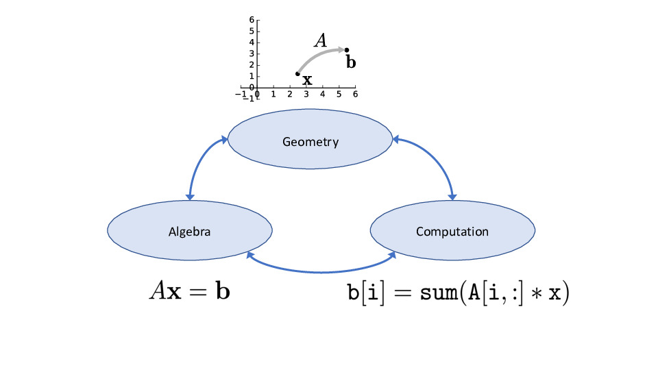
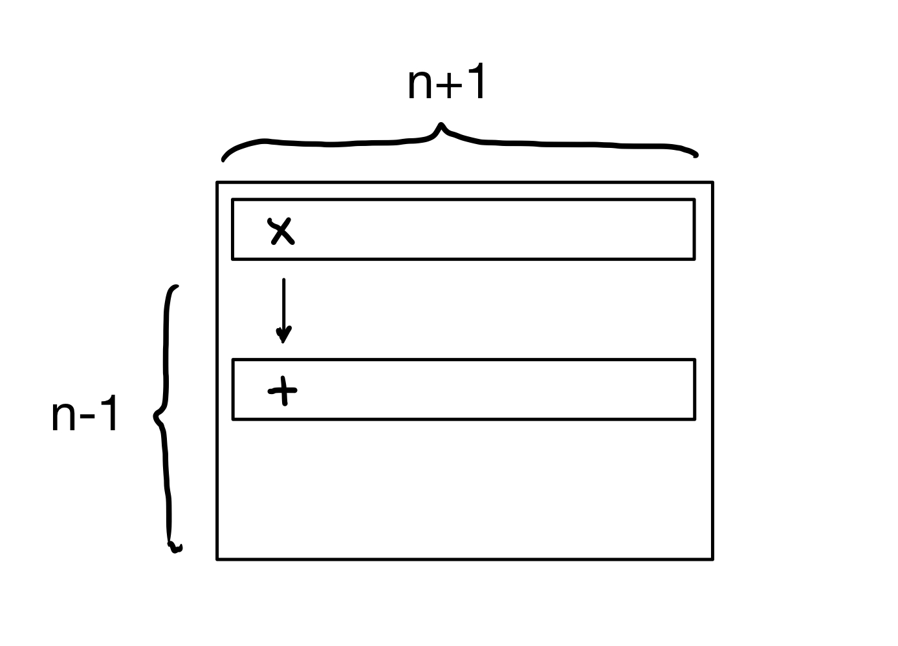
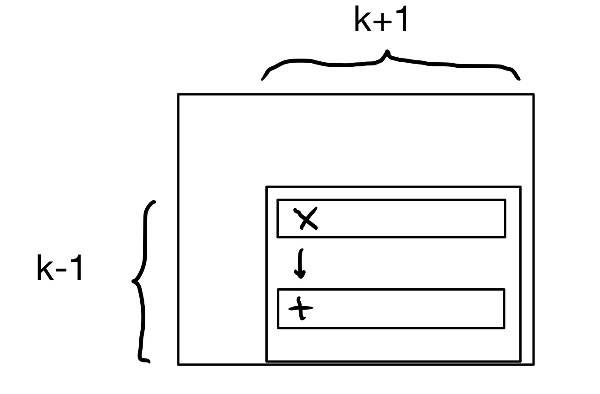

## Learning Objectives

:::{style="font-size: .8em"}

Today we will revisit Gauss-Jordan elimination that should be familiar to you from DS-120. In addition to using Gauss-Jordan elinmination to solve linear systems, we will also write it as a systematic algorithm that we can encode into a computer and calculate its flop count.


:::{.center-text}



:::

:::

## Solving Linear Systems

:::{style="font-size: .8em"}
One of the most common questions you will encounter is, given a matrix $A$ and a vector ${\bf b}$, is there an ${\bf x}$ that makes $A{\bf x} = {\bf b}$ true?

To solve a linear system, we transform it into a new system which is equivalent to the old system, meaning it has the same solution set. However, in the new system the solution is explicit.

:::{.fragment}

For instance, this is a system of equations with a clear solution.

$$
    \begin{array}{rcr}
    1 \cdot x_1 + 0 \cdot x_2 + 0 \cdot x_3 &=& 1\\
    0 \cdot x_1 + 1 \cdot x_2 + 0 \cdot x_3 &=& -2\\
    0 \cdot x_1 + 0 \cdot x_2 + 1 \cdot x_3 &=& 0
    \end{array}
$$
:::
:::

## Solving Linear Systems

:::{style="font-size: .8em"}
Our transformations will be based on three facts.

_Fact Number 1_: Given a set of linear equations, we can _change the order_ of the equations without changing anything. 

$$
\begin{array}{rcr}
3x_1 + 2x_2 &=& -3\\
-x_1 + 4x_2 &=& 2\\
\end{array}
\hspace{0.5in}
{\Large\Leftrightarrow}
\hspace{0.5in}
\begin{array}{rcr}
-x_1 + 4x_2 &=& 2\\
3x_1 + 2x_2 &=& -3\\
\end{array}
$$

:::{.fragment}
_Fact Number 2_: We can _multiply any equation by a constant_ without changing its meaning. 
$$
\begin{array}{rcr}
3x = 2
\end{array}
\hspace{0.5in}
{\Large\Leftrightarrow}
\hspace{0.5in}
\begin{array}{rcr}
9x = 6
\end{array}
$$
:::
:::

## Solving Linear Systems

:::{style="font-size:.8em"}
__Fact Number 3__: we can _add one equation to another_ without changing the solution set.


$$
    \begin{array}{rcr}
    3x_1 + 2x_2 &=& -3\\
    -x_1 + 4x_2 &=& 2\\
    \end{array}
\hspace{0.5in}
{\Large\Leftrightarrow}
\hspace{0.5in}
    \begin{array}{rcr}
    3x_1 + 2x_2 &=& -3\\
    2x_1 + 6x_2 &=& -1\\
    \end{array}
$$

:::{.fragment}
The procedure we will use to solve a linear system consists of two steps: __Elimination__ and __Backsubstitution__. 
:::
:::

## Elimination

:::{style="font-size: .8em"}
The goal of the elimination step is to create an upper triangular matrix.  

:::{.fragment}
__Example.__ Here is a linear system written both as a set of equations and an augmented matrix.

$$
\begin{array}{cc}
\begin{array}{rcr}
        x_1 - 2x_2 +x_3 &=& 5\\
        2x_2 - 8x_3 &=& -4\\
        \color{red}{6}x_1 +5x_2 +9x_3 &=& -4
\end{array}
&\;\;\;\;\;\;
\left[
\begin{array}{rrr|r}
        1  & -2  & 1 & 5\\
        0 & 2 &  - 8 & -4\\
        \color{red}{6} & 5 &9 & -4
\end{array}
\right]
\end{array}
$$

Our first objective is to change the red $\color{red}{6}$ into a 0. To do so we use Fact Number 3 that "we can add one equation to another without changing the solution set."
:::
:::

## Elimination

:::{style="font-size: .8em"}
$$
    \begin{array}{rrrrrr}
        &6x_1& +5x_2& +9x_3& =& -4\\
     +  &-6x_1& +12x_2& -6x_3& =& -30\\
     \hline
       & &      17x_2& +3x_3 &=& -34\\
    \end{array}
$$

:::{.fragment}

We substitute this result back into row 3 of the linear system. 

> $\text{row}_3 \gets \text{row}_3 - 6 \cdot \text{row}_1$.
:::

:::{.fragment}
This gives us a new, *equivalent* system.

$$
\begin{array}{cc}
\begin{array}{rcr}
        x_1 - 2x_2 +x_3 &=& 5\\
        2x_2 - 8x_3 &=& -4\\
        17x_2 +3x_3 &=& -34
\end{array}
&\;\;\;\;\;\;
\left[
\begin{array}{rrr|r}
        1  & -2  & 1 & 5\\
        0 & 2 &  -8 & -4\\
        0 & 17 & 3 & -34
\end{array}
\right]
\end{array}
$$

:::

:::

## Elimination

:::{style="font-size:.8em"}
Next, we use Fact Number 2 and multiply the second equation by $1/2$ to get its leading coefficient to be 1: $\text{row}_2 \gets \frac{1}{2} \cdot \text{row}_2.$

$$
\begin{array}{cc}
\begin{array}{rcr}
        x_1 - 2x_2 +x_3 &=& 5\\
        x_2 - 4x_3 &=& -2\\
        17x_2 +3x_3 &=& -34
\end{array}
&\;\Leftrightarrow\;
\left[
\begin{array}{rrr|r}
        1  & -2  & 1 & 5\\
        0 & 1 &  -4 & -2\\
        0 & 17 & 3 & -34
\end{array}
\right]
\end{array}
$$

:::{.fragment}
Next, we multiply the second equation by $-17$ and add it to the third equation: $\text{row}_3 \gets \text{row}_3 - 17 \cdot \text{row}_2.$

$$
\begin{array}{cc}
\begin{array}{rcr}
        x_1 - 2x_2 +x_3 &=& 5\\
        x_2 - 4x_3 &=& -2\\
        71x_3 &=& 0
\end{array}
&\;\Leftrightarrow\;
\left[
\begin{array}{rrr|r}
        1  & -2  & 1 & 5\\
        0 & 1 &  -4 & -2\\
        0 & 0 & 71 & 0
\end{array}
\right]
\end{array}
$$

:::
:::

## Elimination

:::{style="font-size: .8em"}

Note that now all entries below the main diagonal are zero. We call such matrices upper triangular.

:::{.fragment}
```{python}
from IPython.core.display import HTML

def generate_html():
    return r"""
    <div class="purple-box">
        <p>
        An <b>upper triangular</b> matrix is a matrix that has only zeros below the main diagonal. 
        </p>
    </div>
    """
html_content = generate_html()
display(HTML(html_content))
```

Now we divide the last equation by 71:

$$
\begin{array}{cc}
\begin{array}{rcr}
        x_1 - 2x_2 +x_3 &=& 5\\
        x_2 - 4x_3 &=& -2\\
        x_3 &=& 0
\end{array}
&\;\Leftrightarrow\;
\left[
\begin{array}{rrr|r}
        1  & -2  & 1 & 5\\
        0 & 1 &  -4 & -2\\
        0 & 0 & 1 & 0
\end{array}
\right]
\end{array}
$$


At this point, we have solved for the value of $x_3$: it is equal to 0. But we do not yet know the values of $x_1$ and $x_2.$

:::
:::

## Backsubstitution

:::{style="font-size: .8em"}
Once we have an upper triangular matrix, the process shifts to __backsubstitution__. We have the value for one variable. We will substitute it into other equations to simplify them and get values for the other variables.

Although we think of it as a different stage, it uses the same three rules.

:::{.fragment}
First, we substitute the value of $x_3$ into the equations above it. In this case, we subtract row 3 from row 1, and we add $4\times$ row 3 into row 2. That is, we compute $\text{row}_1 \gets \text{row}_1 - \text{row}_3$ and $\text{row}_2 \gets \text{row}_2 + 4 \cdot \text{row}_3.$

$$
\begin{array}{cc}
\begin{array}{rcr}
        x_1 - 2x_2 &=& 5\\
        x_2 &=& -2\\
        x_3 &=& 0
\end{array}
&\;\Leftrightarrow\;
\left[
\begin{array}{rrr|r}
        1  & -2  & 0 & 5\\
        0 & 1 & 0 & -2\\
        0 & 0 & 1 & 0
\end{array}
\right]
\end{array}
$$
:::
:::

## Backsubstitution

:::{style="font-size: .8em"}
Next, we do the same thing with equation 2, substituting it into equation 1 above it via the operation $\text{row}_1 \gets \text{row}_1 + 2 \cdot \text{row}_2.$

$$
\begin{array}{cc}
\begin{array}{rcr}
        x_1 &=& 1\\
        x_2 &=& -2\\
        x_3 &=& 0
\end{array}
&\;\;\;\;\;\;
\left[
\begin{array}{rrr|r}
        1  & 0  & 0 & 1\\
        0 & 1 & 0 & -2\\
        0 & 0 & 1 & 0
\end{array}
\right]
\end{array}
$$

:::{.fragment}
Now we have reached a system of linear equations with a clear answer, so we can __read off the solution__: $x_1 = 1, x_2 = -2, x_3 = 0.$

Notice the particular form of the final augmented matrix:
- The coefficient matrix is the identity matrix.
- The right-side column vector contains the solution to the system of equations.
:::

:::


## Solving Linear Systems

:::{style="font-size:.8em"}
Recall the starting equations: &emsp;&emsp;&emsp;&emsp;
:::

:::{.columns}

:::{.column width="40%"}
<br>

$$
\begin{array}{rcr}
    x_1 - 2x_2 +x_3 &=& 5\\
    2x_2 - 8x_3 &=& -4\\
    6x_1 +5x_2 +9x_3 &=& -4
\end{array}
$$
:::

:::{.column width="60%"}

<div style="text-align: center;">
  <video width="400" autoplay loop muted>
    <source src="/figures/Fig2.1.mp4" type="video/mp4">
  </video>
</div>

:::
:::


## Solving Linear Systems

:::{style="font-size:.8em"}
Now recall the final set of equations: &emsp;&emsp;&emsp;&emsp;
:::

:::{.columns}

:::{.column width="40%"}
<br>

$$
\begin{array}{rcr}x_1 &=& 1\\x_2 &=& -2\\x_3 &=& 0\end{array}
$$
:::

:::{.column width="60%"}

<div style="text-align: center;">
  <video width="400" autoplay loop muted>
    <source src="/figures/Fig2.2.mp4" type="video/mp4">
  </video>
</div>

:::
:::

:::{style ="font-size:.8em ".fragment}
All planes have shifted, but still intersect in the same point.
:::

## Pivot Positions and Values

:::{style="font-size: .8em"}

```{python}
from IPython.core.display import HTML

def generate_html():
    return r"""
    <div class="purple-box">
        <p>
        A <b>pivot position</b> is the location of the first nonzero element in each row. <b>Pivot value</b> is the number in the pivot position.
        </p>
    </div>
    """
html_content = generate_html()
display(HTML(html_content))
```

<div style="margin-bottom: 0.5em;"> </div> 


:::{.columns}

:::{.fragment .column width="50%"}

```{python}
from IPython.core.display import HTML

def generate_html():
    return r"""
    <div class="blue-box">
        <p>
        Where are the pivot positions in the following augmented matrix? <br><br>
        &emsp;&emsp;&emsp;&emsp;&emsp;&emsp;\(\left[\begin{array}{rrr|r}2&-3&2&1\\0&1&-4&8\\0&0&0&-5\end{array}\right]\)
        </p>
    </div>
    """
html_content = generate_html()
display(HTML(html_content))
```
:::

:::{.fragment .column width="50%"}
<br>
The pivot positions are shown in blue boxes below. The corresponding pivot values are 2, 1, and -5.

$$
\left[\begin{array}{rrr|r}
\color{blue}{\fbox{2}} &-3&2&1\\
0&\color{blue}{\fbox{1}} &-4&8\\
0&0&0&\color{blue}{\fbox{-5}}
\end{array}\right]
$$
:::
:::
:::

<!-- ## Pivot Positions and Values

:::{style="font-size: .8em"}

<div style="margin-bottom: 0.5em;"> </div> 

:::{.columns}

:::{.fragment .column width="50%"}

```{python}
from IPython.core.display import HTML

def generate_html():
    return r"""
    <div class="blue-box">
        <p>
        Where are the pivot positions in the following augmented matrix? <br><br>
        &emsp;&emsp;&emsp;&emsp;&emsp;&emsp;\(\left[\begin{array}{rrr|r}2&-3&2&1\\0&1&-4&8\\0&0&0&-5\end{array}\right]\)
        </p>
    </div>
    """
html_content = generate_html()
display(HTML(html_content))
```
:::

:::{.fragment .column width="50%"}
<br>
The pivot positions are shown in blue boxes below. The corresponding pivot values are 2, 1, and -5.

$$
\left[\begin{array}{rrr|r}
\color{blue}{\fbox{2}} &-3&2&1\\
0&\color{blue}{\fbox{1}} &-4&8\\
0&0&0&\color{blue}{\fbox{-5}}
\end{array}\right]
$$
:::
:::
::: -->

## Echelon Form

:::{style="font-size: .8em"}
```{python}
from IPython.core.display import HTML

def generate_html():
    return r"""
    <div class="purple-box">
        <p>
        A matrix is in <b>echelon form</b> (or row echelon form) if it has the following three properties:
        <ol type="1">
        <li>Any row that contains all zeros occurs at the bottom of the matrix (i.e., any row with a nonzero entry must appear above it).</li>
        <li>The pivot position of each row is located in a column to the right of the pivot position in the row directly above it.</li>
        <li>All entries in a column below a pivot position are zeros.</li>
        </p>
    </div>
    """
html_content = generate_html()
display(HTML(html_content))
```

:::


## Echelon Form

:::{style="font-size: .8em"}

For example:

$$
\left[\begin{array}{ccccccccc|c}
0&\blacksquare&*&*&*&*&*&*&*&*\\
0&0&0&\blacksquare&*&*&*&*&*&*\\
0&0&0&0&\blacksquare&*&*&*&*&*\\
0&0&0&0&0&\blacksquare&*&*&*&*\\
0&0&0&0&0&0&0&0&\blacksquare&*\\
0&0&0&0&0&0&0&0&0&0\\
\end{array}\right]
$$

In this diagram, the $\blacksquare$ symbols denote pivot positions, and the $*$ symbols can be any value.   
:::

## Reduced Echelon Form


:::{style="font-size: .8em"}
```{python}
from IPython.core.display import HTML

def generate_html():
    return r"""
    <div class="purple-box">
        <p>
        A matrix is in <b>reduced echelon form</b> (or reduced row echelon form) if it is echelon form, <i>and</i>:
        <ol start="4">
        <li>The pivot value in each nonzero row is 1.</li>
        <li>Each pivot value is the only nonzero entry in its column.</li>
        </p>
    </div>
    """
html_content = generate_html()
display(HTML(html_content))
```

:::

## Reduced Echelon Form

:::{style="font-size: .8em"}

:::{.fragment}
For example:

$$
\left[\begin{array}{ccccccccc|c}
0&\fbox{1}&*&0&0&0&*&*&0&*\\
0&0&0&\fbox{1}&0&0&*&*&0&*\\
0&0&0&0&\fbox{1}&0&*&*&0&*\\
0&0&0&0&0&\fbox{1}&*&*&0&*\\
0&0&0&0&0&0&0&0&\fbox{1}&*\\
0&0&0&0&0&0&0&0&0&0\\
\end{array}
\right]
$$

:::
:::

## Echelon Form

:::{.incremental style="font-size: .8em"}
Some properties of echelon forms:

- Any matrix $A$ can be row-reduced into echelon form and into reduced echelon form.

- The reduced echelon form of a matrix _is_ unique.

- Echelon forms are _not_ unique; depending on the sequence of row operations, we may produce different echelon forms.

- Given a matrix $A$, the pivot positions of in any of its (reduced) echelon matrices are the same.
:::

## Gauss-Jordan Elimination: Algorithm {.really-really-smaller-title}

:::{style="font-size: 1.2em"}
Gauss-Jordan Elimination has two stages. Given an augmented matrix $A$ representing a linear system:

1. _Elimination:_ Convert $A$ to one of its echelon forms, say $U.$

2. _Backsubstitution:_ Convert $U$ to $A$'s unique reduced row echelon form.

Each stage iterates over the rows of $A$ starting with the first row.

:::{.fragment}
It proceeds via a series of **row reduction operations or elementary row operations** that we can perform on rows of the augmented matrix without changing the solution set:

1. Swap two rows.
2. Multiply a row by a nonzero value.
3. Add a multiple of a row to another row.
:::
:::

## Stage 1: Elimination

:::{style="font-size: .8em"}
Input: matrix $A$.

For instance, let's consider the following matrix $A$ where the first column contains all 0s.

$$
\left[\begin{array}{ccccccccc|c}
0&\blacksquare&*&*&*&*&*&*&*&*\\
0&*&*&*&*&*&*&*&*&*\\
0&*&*&*&*&*&*&*&*&*\\
0&*&*&*&*&*&*&*&*&*\\
0&*&*&*&*&*&*&*&*&*\\
0&*&*&*&*&*&*&*&*&*\\
\end{array}\right]
$$
:::

## Stage 1: Elimination

:::{style="font-size: .8em" .incremental}

We will use $i$ to denote the index of the current row.  To start, let $i = 1.$
Repeat the following steps:

1. Let $j$ be the position of the _leftmost nonzero value_ in row $i$ or any row below it.  If there is no such position, stop.
2. If the $j$th position in row $i$ is zero, swap this row with a row below it to make the $j$th position nonzero.  This creates a _pivot_ in position $i,j.$
3. Use row reduction operations to create zeros in all posititions below the pivot.  If any operation creates a row that is all zeros _except the last element,_ the system is inconsistent; stop.
4. Let $i = i + 1.$ If $i$ equals the number of rows in $A,$ stop.

:::

## Stage 1: Elimination

:::{style="font-size: .8em"}
The output of this stage is an _echelon_ form of $A.$

$$
\left[\begin{array}{ccccccccc|c}
0&\blacksquare&*&*&*&*&*&*&*&*\\
0&0&0&\blacksquare&*&*&*&*&*&*\\
0&0&0&0&\blacksquare&*&*&*&*&*\\
0&0&0&0&0&\blacksquare&*&*&*&*\\
0&0&0&0&0&0&0&0&\blacksquare&*\\
0&0&0&0&0&0&0&0&0&0\\
\end{array}\right]
$$

:::

## Stage 2: Backsubstitution

:::{style="font-size:.8em" .incremental}
Input: an echelon form of $A$.

We start at the top again, so let $i = 1$.  Repeat the following steps:

1. If row $i$ is all zeros, or if $i$ exceeds the number of rows in $A,$ stop.
2. If row $i$ has a pivot value, divide row $i$ by its pivot value.  This creates a 1 in the pivot position.
3. Use row reduction operations to create zeros in all positions above the pivot.  
4. Let $i = i+1.$
:::

## Stage 2: Backsubstitution

:::{style="font-size:.8em"}

The output of this stage is the reduced echelon form of $A.$

$$
\left[\begin{array}{ccccccccc|c}
{0}&{\fbox{1}}&{*}&{0}&{0}&{0}&{*}&{*}&{0}&*\\
{0}&{0}&{0}&{\fbox{1}}&{0}&{0}&{*}&{*}&{0}&*\\
{0}&{0}&{0}&{0}&{\fbox{1}}&{0}&{*}&{*}&{0}&*\\
{0}&{0}&{0}&{0}&{0}&{\fbox{1}}&{*}&{*}&{0}&*\\
{0}&{0}&{0}&{0}&{0}&{0}&{0}&{0}&{\fbox{1}}&*\\
{0}&{0}&{0}&{0}&{0}&{0}&{0}&{0}&{0}&0\\
\end{array}
\right]
$$

:::{.fragment}
The columns that contain the pivots in the row-echelon form correspond to the __basic variables__, and the remaining variables are __free variables__.
:::
:::

## Stage 2: Backsubstitution

:::{style="font-size: .7em"}
For example, in the reduced row echelon form matrix above:

- <font color=blue>$x_2$, $x_4$, $x_5$, $x_6$, and $x_9$ are the basic variables</font>, and
- <font color=red>$x_1$, $x_3$, $x_7$, and $x_8$ are the free variables</font>.

:::{.fragment}

<!-- beautiful matrix... wow to whoever behind this -->

$$
\begin{array}{c}
\left[\begin{array}{ccccccccc|c}
\color{red}{0} & \color{blue}{\fbox{1}} & \color{red}{*} & \color{blue}{0} & \color{blue}{0} & \color{blue}{0} & \color{red}{*} & \color{red}{*} & \color{blue}{0} & *\\
\color{red}{0} & \color{blue}{0}    & \color{red}{0} & \color{blue}{\fbox{1}} & \color{blue}{0} & \color{blue}{0} & \color{red}{*} & \color{red}{*} & \color{blue}{0} & *\\
\color{red}{0} & \color{blue}{0}    & \color{red}{0} & \color{blue}{0}    & \color{blue}{\fbox{1}} & \color{blue}{0} & \color{red}{*} & \color{red}{*} & \color{blue}{0} & *\\
\color{red}{0} & \color{blue}{0}    & \color{red}{0} & \color{blue}{0}    & \color{blue}{0}    & \color{blue}{\fbox{1}} & \color{red}{*} & \color{red}{*} & \color{blue}{0} & *\\
\color{red}{0} & \color{blue}{0}    & \color{red}{0} & \color{blue}{0}    & \color{blue}{0}    & \color{blue}{0}    & \color{red}{0} & \color{red}{0}    & \color{blue}{\fbox{1}} & *\\
\color{red}{0} & \color{blue}{0}    & \color{red}{0} & \color{blue}{0}    & \color{blue}{0}    & \color{blue}{0}    & \color{red}{0} & \color{red}{0}    & \color{blue}{0}    & 0\\
\end{array}\right]
\\[6pt]
% \begin{array}{ccccccccc}
% \color{red}{x_1} & \color{blue}{x_2} & \color{red}{x_3} & \color{blue}{x_4} & \color{blue}{x_5} & \color{blue}{x_6} & \color{red}{x_7} & \color{red}{x_8} & \color{blue}{x_9}
% \end{array}
\end{array}
$$


:::
:::

## Computational Costs

:::{style="font-size: .8em"}
Assume that the augmented matrix $A$ is an $n \times (n+1)$ matrix.  

:::{.fragment}
We can summarize the Elimination stage as, in the worst case:

* For each row $i$ of $A$:
    * add a multiple of row $i$ to all rows below it

:::{.center-text}


:::
:::
:::

## Computational Costs

:::{.center-text}


:::

:::{.fragment style="font-size: .8em"}
For row 1, this becomes $2 (n-1) \cdot (n+1) = 2n^2-2$ flops.  

There are $n-1$ rows below row 1, each of those has $n+1$ elements, and each element requires one multiplication and one addition.  
:::

## Computational Costs

:::{style="font-size: .8em"}
When operating on row $i$, there are $k=n-i+1$ unknowns and so there are $2k^2-2$ flops required to process the rows below row $i.$ 

:::{.center-text}


:::

:::{.fragment .center-text style="font-size: 1em"}
$k$ ranges from $n$ down to 1
:::
:::

## Computational Costs

:::{style="font-size: .8em"}
The number of operations required for the Elimination stage is:

$$
\begin{align*} \sum_{k=1}^n (2k^2 - 2) &= 2 \left(\sum_{k=1}^n k^2 - \sum_{k=1}^n 1\right)\\
&= 2 \left(\frac{n(n+1)(2n+1)}{6} - n\right)\\
&= \frac{2}{3} n^3 + n^2 - \frac{5}{3} n,
\end{align*}
$$

This is based on the formula about sums of squares. 
When $n$ is large this expression is dominated by $\frac{2}{3} n^3$.

:::

## Computational Costs

:::{style="font-size: .8em"}

* The cost of the Elimination stage is $\frac{2}{3} n^3$.
* The cost of the Backsubstitution stage is $O(n^2)$.
    
Thus we say that:

> The flop count of Gauss-Jordan Elimination is $\frac{2}{3} n^3$.

:::{.fragment}
Remember, we think about algorithms that run in $n^3$ time to be _slow_. We should run these algorithms only when needed, and try to find faster alternatives when possible.
:::
:::

 