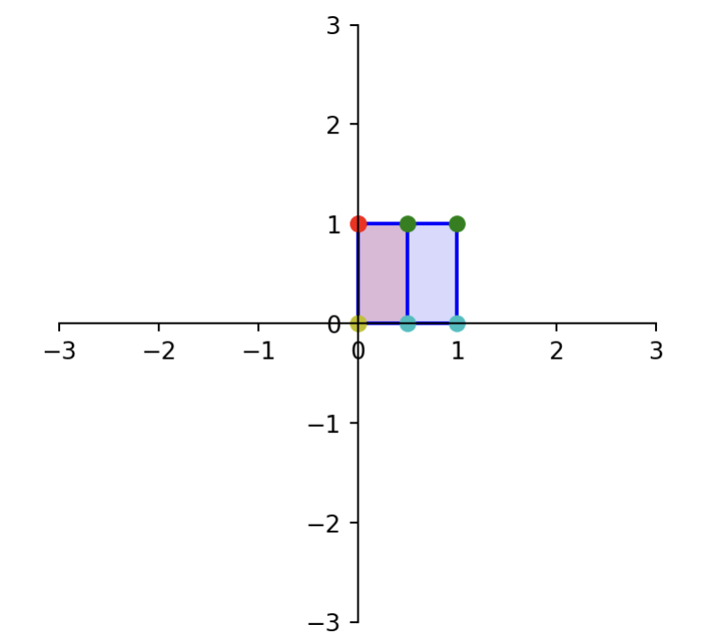

## Learning Objectives
:::{style="font-size: .8em"}
- Invertible transformations
- Invertible matrices
- Determinants
    - 2nd order determinants
    - Properties
- Computing inverses
    - Inverse of a $2 \times 2$ matrix
    - Inverse of a $n \times n$ matrix
- Solving linear systems using inverses
- Invertible Matrix Theorem (IMT)
:::

## Inverses

:::{style="font-size: .8em"}
When given a mathematical object, its "inverse" is another object that undoes the action of the first one. Some examples:

- Given a non-zero real number $r$, its multiplicative inverse $r^{-1}$ has the property that it undoes multiplication by $r$, since $r^{-1} \cdot r = r \cdot r^{-1} = 1$.
- Some functions over the real numbers like $f(x) = x^3$ have an inverse function $f^{-1}(x) = \sqrt[3]{x}$ such that $f^{-1}(f(x)) = f(f^{-1}(x)) =x.$
<!-- - Some functions over the real numbers like $f(x) = x^3$ have an inverse function $f^{-1}(x) = \sqrt[3]{x}$ such that $f^{-1} \circ f = f \circ f^{-1} =$ the identity function. -->

Let's apply the concept of inverses to linear transformations -- that is, functions of vectors.
:::

## Inverse of a Linear Transformation{.smaller-title}


:::{style="font-size:0.8em"}

```{python}
from IPython.core.display import HTML

def generate_html():
    return r"""
    <div class="purple-box">
        <p><span class="label">Invertible linear transformation</span>
        A linear transformation \(T: \mathbb{R}^n \rightarrow \mathbb{R}^n\) is <em>invertible</em> if there exists a function
\(S: \mathbb{R}^n \rightarrow \mathbb{R}^n\) such that:<br>

&emsp;&emsp;&emsp;&emsp;&emsp;&emsp;&emsp;&emsp;&emsp;&emsp;&emsp;&emsp;\(S(T({\bf x})) = {\bf x}\;\;\;\mbox{for all}\;{\bf x}\in\mathbb{R}^n,\)<br>

and
<br>
&emsp;&emsp;&emsp;&emsp;&emsp;&emsp;&emsp;&emsp;&emsp;&emsp;&emsp;&emsp;\( T(S({\bf x})) = {\bf x}\;\;\;\mbox{for all}\;{\bf x}\in\mathbb{R}^n.\)

        </p>
    </div>
    """
html_content = generate_html()
display(HTML(html_content))
```

<div style="margin-bottom: 0.5em;"> </div>

```{python}
from IPython.core.display import HTML

def generate_html():
    return r"""
    <div class="purple-box">
        <p><span class="label">Theorem</span>
        If \(T: \mathbb{R}^n \to \mathbb{R}^n\) is a linear transformation, the following statemens are equivalent:
    <ol>
       <li> \(T\) is invertible.  </li> 
       <li> \(T\) is one-to-one.  </li> 
       <li> \(T\) is onto.  </li> 
        </p>
    </div>
    """
html_content = generate_html()
display(HTML(html_content))
```

:::

## Inverse of a Matrix

:::{style="font-size:.8em"}

```{python}
from IPython.core.display import HTML

def generate_html():
    return r"""
    <div class="purple-box">
        <p><span class="label">Invertible matrix</span>
 An \(n \times n\) matrix \(A\) is called <b>invertible</b> if there exists a matrix \(C\) such that
\(AC = I \mbox{  and  } CA = I,\)

where \(I\) is the \(n \times n\) identity matrix. In this case, \(C\) is called the <b>inverse</b> of \(A\).
        </p>
    </div>
    """
html_content = generate_html()
display(HTML(html_content))
```

<div style="margin-bottom: 0.5em;"> </div>

```{python}
from IPython.core.display import HTML

def generate_html():
    return r"""
    <div class="purple-box">
        <p><span class="label">(Non)Singular matrix</span>
       A matrix that is not invertible is called a <b>singular</b> matrix. A matrix that is invertible is called <b>nonsingular</b>.
       </p>
    </div>
    """
html_content = generate_html()
display(HTML(html_content))
```
:::

## Inverse of a Matrix

:::{style="font-size:.8em"}

```{python}
from IPython.core.display import HTML

def generate_html():
    return r"""
    <div class="purple-box">
        <p><span class="label">Theorem</span>
       Let \(T: \mathbb{R}^n \rightarrow \mathbb{R}^n\) be a linear transformation and let \(A\) be the standard matrix for \(T\). Then,
<ol>
<li>\(T\) is invertible if and only if \(A\) is an invertible matrix.</li>  

<li>If \(T\) is invertible, then the inverse linear transformation \(S\) is given by \(S({\bf x}) = A^{-1}{\bf x}.\)</li>
       </p>
    </div>
    """
html_content = generate_html()
display(HTML(html_content))
```
Hence, the inverse of a matrix exists only for some square matrices.
:::


## Inverse of a Matrix

:::{style="font-size:.8em;" }

:::{.center-text}


:::
:::


## Inverse of a Matrix

:::{style="font-size: .8em"}
__Example__. Let $A = \left[\begin{array}{rr}0&-1\\1&0\end{array}\right]$ and $B = \begin{bmatrix} 0 & 1 \\ -1 & 0 \end{bmatrix}$. Show that $B$ is the inverse of $A$.

Geometrically, $A$ and $B$ correspond to counterclockwise rotations by 90 and 270 degrees, respectively. 

- $AB$ corresponds to performing a 270 degree rotation followed by a 90 degree rotation. The result is a 360 degree rotation -- that is, every vector ends up back where it started, which is the identity transformation. Hence, $AB = I$.

- Similarly, $BA$ corresponds to performing a 90 degree rotation followed by a 270 degree rotation, so once again the result $BA = I$ is the identity matrix.
:::

<!-- ## Inverse of a Matrix

:::{style="font-size: .8em"}

Consider the projection onto the $x_2$ axis $A = \left[\begin{array}{rr}0&0\\0&1\end{array}\right].$

:::{.columns}
:::{.column .center-text}
```{python}
import matplotlib.pyplot as plt
import demoUtilities as dm
import numpy as np
square = np.array(
    [[0,1,1,0],
     [1,1,0,0]])

A = np.array(
    [[0,0],
     [0,1]])
#print("A = "); print(A)
ax = dm.plotSmallerSetup()
dm.plotSquare(square)
dm.plotSquare(A @ square)
ax.arrow(1.0,1.0,-0.9,0,head_width=0.15, head_length=0.1, length_includes_head=True);
ax.arrow(1.0,0.0,-0.9,0,head_width=0.15, head_length=0.1, length_includes_head=True);
```
:::

:::{.column}
It is _**not**_ invertible. There are many equivalent ways to reach this conclusion:

- The mapping $T$ is not one-to-one.  (There are many values ${\bf x}$ that give the same $A{\bf x}.$)
- The mapping $T$ is not onto $\mathbb{R}^2.$ (Only a subset of $\mathbb{R}^2$ can be output by $T$.)
- The columns of $A$ do not span $\mathbb{R}^2.$
:::
:::
::: -->

## Inverse of a Matrix

:::{style="font-size: .8em"}
```{python}
from IPython.core.display import HTML

def generate_html():
    return r"""
    <div class="purple-box">
        <p>
<ol><span class="label">Properties of inverses</span>
<li>If \(A\) is an invertible matrix, then \(A^{-1}\) is invertible, and \((A^{-1})^{-1} = A.\)
<br>
<li>If \(A\) is an invertible matrix, then so is \(A^{\top},\) and the inverse of \(A^{\top}\) is the transpose of \(A^{-1}:\)</li> 
&emsp;&emsp;&emsp;&emsp;&emsp;&emsp;&emsp;&emsp;&emsp;&emsp;&emsp;&emsp;\((A^{\top})^{-1} = (A^{-1})^{\top}.\)

<br>
<li>If \(A\) and \(B\) are \(n\times n\) invertible matrices, then so is \(AB.\) The inverse of \(AB\) is the product of the inverses of \(A\) and \(B\) in the reverse order:  </li> <br>
&emsp;&emsp;&emsp;&emsp;&emsp;&emsp;&emsp;&emsp;&emsp;&emsp;&emsp;&emsp;\((AB)^{-1} = B^{-1}A^{-1}.\)
        </p>
    </div>
    """
html_content = generate_html()
display(HTML(html_content))
```
:::

## Determinants

:::{style="font-size: .8em"}
When does a square matrix have an inverse? A possible way to answer this question is by looking at the determinant of the matrix.


If $A$ is the standard matrix of a linear transformation $T$. The factor by which the area changes due to $T$ is known as the determinant of $A$, $\text{det}(A).$

:::{.center-text}
```{python}
# in a linear transformation
note = dm.mnote()
A = np.array([[1, 0], [ -2, 1]])

dm.plotSmallSetup()
dm.plotShape(note)
dm.plotShape(A @ note,'r')
```

:::
:::

:::{.notes}
In a linear transformation, the "size" of a shape can grow or shrink.
:::

## Determinants

:::{style="font-size: .8em;"}

Because of linearity, we simply ask what happens to the unit square (or cube, hypercube, etc). All other areas will scale similarly.

:::{.center-text}
```{python}
A = np.array([[2, 1],[0.75, 1.5]])
square = np.array([[0, 1, 1, 0],
                   [1, 1, 0, 0]])
print("A = "); print(A)
ax = dm.plotSmallSetup(-1, 4, -1, 4)
dm.plotSquare(square, 'r')
dm.plotSquare(A @ square);
```

:::
:::

## 2nd Order Determinants

:::{style="font-size: .8em;"}

Let's denote the matrix of a 2D linear transformations as: 
$A = \begin{bmatrix} a & b \\ c & d \end{bmatrix}.$

Our goal is to describe the area of the blue diamond in terms of $a, b, c,$ and $d$.

:::{.center-text}
```{python}
# unit square
v1 = np.array([2, 0.75])
v2 = np.array([1, 1.5])
A = np.column_stack([v1, v2])
ax = dm.plotSmallerSetup(-1, 4, -1, 4)
dm.plotSquare(square, 'r')
dm.plotSquare(A @ square)
plt.text(1.1, 0.1, '(1, 0)', size = 12)
plt.text(1.05, 1.05, '(1, 1)', size = 12)
plt.text(-0.6, 1.2, '(0, 1)', size = 12)
plt.text(v1[0]+0.2, v1[1]+0.1, '(a, c)', size = 12)
plt.text((v1+v2)[0]+0.1, (v1+v2)[1]+0.1, '(a+b, c+d)', size = 12)
plt.text(v2[0]-0.5, v2[1]+0.1, '(b, d)', size = 12);
```
:::
:::

## 2nd Order Determinants

:::{style="font-size: .8em;"}

:::{.center-text}
```{python}
# just paste the two bullets before area of blue diamond and python code
a = 2
b = 1
c = 0.75
d = 1.5
v1 = np.array([a, c])
v2 = np.array([b, d])
A = np.column_stack([v1, v2])
ax = dm.plotSmallSetup(-1, 4, -1, 4)
# red triangles
dm.plotShape(np.array([[0, 0], [0, d], [b, d]]).T, 'r')
plt.text(0.2, 1, r'$\frac{1}{2}bd$', size = 12)
dm.plotShape(np.array([[a, c], [a+b, c+d], [a+b, c]]).T, 'r')
plt.text(2.5, 1, r'$\frac{1}{2}bd$', size = 12)
# gray triangles
dm.plotShape(np.array([[b, d], [b, c+d], [a+b, c+d]]).T, 'k')
plt.text(1.2, 1.9, r'$\frac{1}{2}ac$', size = 12)
dm.plotShape(np.array([[0, 0], [a, c], [a, 0]]).T, 'k')
plt.text(1.2, 0.15, r'$\frac{1}{2}ac$', size = 12)
# green squares
dm.plotShape(np.array([[a, 0], [a, c], [a+b, c], [a+b, 0]]).T, 'g')
plt.text(0.2, 1.9, r'$bc$', size = 12)
dm.plotShape(np.array([[0, d], [0, c+d], [b, c+d], [b, d]]).T, 'g')
plt.text(2.5, 0.15, r'$bc$', size = 12)
#
dm.plotSquare(A @ square)
plt.text(v1[0]-0.5, v1[1]+0.05, '(a, c)', size = 12)
plt.text((v1+v2)[0]+0.1, (v1+v2)[1]+0.1, '(a+b, c+d)', size = 12)
plt.text(v2[0]+0.1, v2[1]-0.15, '(b, d)', size = 12);
```

:::

The large rectangle has area is $(a+b)(c+d)$. We subtract $bd$ (red triangles), $ac$ (gray triangles), and $2bc$ (green rectangles) from it.
Thus, the area of the blue diamond is: $(a+b)(c+d) - bd - ac - 2bc = ad - bc.$
:::

## 2nd Order Determinants

:::{style="font-size: .8em;"}

```{python}
from IPython.core.display import HTML

def generate_html():
    return r"""
    <div class="purple-box">
        <p>  <span class="label">Theorem</span>
For any linear transformation \(T: \mathbb{R}^2 \to \mathbb{R}^2\) represented by

\(A = \begin{bmatrix} a & b \\ c & d \end{bmatrix},\)

the area of a unit square (or any shape) is scaled by a factor of \(\det(A)= ad-bc\) (or \(|\det(A)|= |ad-bc|\) if \((ad-bc)<0.\))
        </p>
    </div>
    """
html_content = generate_html()
display(HTML(html_content))
```

<div style="margin-bottom: 0.5em;"> </div> 

```{python}
from IPython.core.display import HTML

def generate_html():
    return r"""
    <div class="<li>-box">
        <p>
        Which kind of linear transformation \(T: \mathbb{R}^2 \to \mathbb{R}^2\) represented by the standard matrix \(A\) leads to \(\text{det}(A)=0\)?
        </p>
    </div>
    """
html_content = generate_html()
display(HTML(html_content))
```

:::
:::{.notes}
Recall that when $A$ is the matrix of a projection, the unit square collapses onto the axis, resulting in a shape with area of zero.
:::

## 2nd Order Determinants

:::{style="font-size: .8em;"}
__Example.__ Projections are not invertible. This is confirmed by the determinant:

$$\small{
 \det\left(\begin{bmatrix}1 & 0 \\ 0 & 0\end{bmatrix}\right) = (1 \cdot 0) - (0 \cdot 0) = 0.}
$$

:::{.center-text}
```{python}
A = np.array(
    [[1,0],
     [0,0]])
#print("A = "); print(A)
ax = dm.plotSmallSetup()
dm.plotSquare(square)
dm.plotSquare(A @ square,'r')
ax.arrow(1.0,1.0,0,-0.9,head_width=0.15, head_length=0.1, length_includes_head=True);
ax.arrow(0.0,1.0,0,-0.9,head_width=0.15, head_length=0.1, length_includes_head=True);
```
:::

:::


## Determinants

:::{style="font-size: .8em;"}
The determinant can be defined for _**any**_ square matrix. In general, we use the co-factor expansion to compute the determinant.

```{python}
from IPython.core.display import HTML

def generate_html():
    return r"""
    <div class="purple-box">
        <p>  <span class="label">Theorem</span>
        Let \(\small{A}\) and \(\small{B}\) be \(\small{n \times n}\) matrices. Then
 <ol>
        <li>\(\small{\det (AB) = \det (A) \det (B).}\)</li> 
        <li>\(\small{\det (A^{\top}) = \det (A).}\)</li> 
         <li>If \(\small{A}\) is triangular, then \(\small{\det (A)}\) is the product of the entries on the main diagonal of \(\small{A}\).</li> 
        </p>
    </div>
    """
html_content = generate_html()
display(HTML(html_content))
```
:::

## Determinants

:::{style="font-size: .8em;"}

```{python}
from IPython.core.display import HTML

def generate_html():
    return r"""
    <div class="blue-box">
        <p>
        Find \(\small{\det(\mathbf{A})}\) if 
\(\small{\mathbf{A} = \begin{bmatrix}2 & 0 & 0 \\1 & 3 & 0 \\4 & 2 & 1\end{bmatrix}  \begin{bmatrix}1 & 2 & 3 \\0 & 1 & 2 \\0 & 0 & 2\end{bmatrix}.}\)
        </p>
    </div>
    """
html_content = generate_html()
display(HTML(html_content))
```


<!-- :::{.fragment}

$$
\det(\mathbf{A}) = \det \left( 
\begin{bmatrix}
2 & 0 & 0 \\
1 & 3 & 0 \\
4 & 2 & 1
\end{bmatrix}
\right) 
\cdot
\det \left( 
\begin{bmatrix}
1 & 2 & 3 \\
0 & 1 & 2 \\
0 & 0 & 2
\end{bmatrix}
\right).
$$

::: -->
:::

## Inverse of a $2 \times 2$ Matrix

:::{style="font-size: .8em"}
```{python}
from IPython.core.display import HTML

def generate_html():
    return r"""
    <div class="purple-box">
        <p>  <span class="label">Theorem</span>
Let \(\small{A}\) = \(\small{\left[\begin{array}{rr}a&b\\c&d\end{array}\right]}\).  

If \(\small{\text{det}(A) = 0}\), then \(\small{A}\) is not invertible.
Otherwise, \(\small{A}\) is invertible and \(\small{A^{-1} = \frac{1}{det(A)}\left[\begin{array}{rr}d&-b\\-c&a\end{array}\right].}\)<br>
        </p>
    </div>
    """
html_content = generate_html()
display(HTML(html_content))
```

<!-- <div style="margin-bottom: 0.5em;"> </div> 

```{python}
from IPython.core.display import HTML

def generate_html():
    return r"""
    <div class="blue-box">
        <p>  
Suppose that the columns of a \(2\times 2\) matrix \(A\) are linearly dependent. Is \(A\) invertible?
        </p>
    </div>
    """
html_content = generate_html()
display(HTML(html_content))
```


:::{.fragment}
If the columns of $A$ are linearly dependent, then one of the columns is a multiple of the other. Let the multiplier be $m$. Then we can express $A$ as:

$$
\left[\begin{array}{rr}a&ma\\b&mb\end{array}\right].
$$

The determinant of $A$ is $a(mb) - b(ma) = 0.$  

So a $2\times 2$ matrix with linearly dependent columns is _not invertible_.
::: -->
:::{.columns}

:::{.column}
__Example.__ Here is a horizontal contraction:

$$
\small{A = \left[\begin{array}{rr}0.5&0\\0&1\end{array}\right]}.
$$
:::

:::{.column}
:::{.center-text}
{width=70%}

:::
<!-- ```{python}
import demoUtilities as dm
import numpy as np
square = np.array([[0.0,1,1,0],[1,1,0,0]])
A = np.array(
    [[0.5, 0], 
     [  0, 1]])
# print("A ="); print(A)
dm.plotSmallSetup()
dm.plotSquare(square)
dm.plotSquare(A @ square,'r')
# Latex(r'Horizontal Contraction')
``` -->
:::
:::

:::

## Inverse of a $2 \times 2$ Matrix

:::{style="font-size: .8em"}

<!-- :::{.columns}

:::{.column}
Here is a horizontal contraction

$$
A = \left[\begin{array}{rr}0.5&0\\0&1\end{array}\right].
$$
:::

:::{.column}
```{python}
import demoUtilities as dm
import numpy as np
square = np.array([[0.0,1,1,0],[1,1,0,0]])
A = np.array(
    [[0.5, 0], 
     [  0, 1]])
# print("A ="); print(A)
dm.plotSmallSetup()
dm.plotSquare(square)
dm.plotSquare(A @ square,'r')
# Latex(r'Horizontal Contraction')
```
:::
::: -->
__Example (continued).__ Its determinant is $1(0.5)-0(0) = 0.5,$ so this linear transformation is invertible. <br>
Its inverse is:

$$ \frac{1}{0.5}\left[\begin{array}{rr}1&0\\0&0.5\end{array}\right] = \left[\begin{array}{rr}2&0\\0&1\end{array}\right].$$

Geometrically, $A$ contracted the $x_1$-direction by 0.5 and $A^{-1}$ will expand the $x_1$-direction by 2.
:::

## Inverse of a $n \times n$ Matrix

:::{style="font-size: .8em"}
Let's look at the equation $AA^{-1} = I.$

Denote $A^{-1}$ = $[{\bf x_1}\: {\bf x_2} \:\dots {\bf x_n}]$  and  $I$ as $[{\bf e_1} \: {\bf e_2} \dots {\bf e_n}]:$

$$
A[{\bf x_1} \: {\bf x_2} \dots {\bf x_n}] = [{\bf e_1} \: {\bf e_2} \dots {\bf e_n}].
$$

Notice that we can break this up into $n$ separate problems:
    
$$
\begin{align*}
A{\bf x_1} &= {\bf e_1} \\
A{\bf x_2} &= {\bf e_2} \\
& \; \vdots \\
A{\bf x_n} &= {\bf e_n}
\end{align*}
$$

:::

## Inverse of a $n \times n$ Matrix

:::{style="font-size: .8em"}
To compute the inverse of $A$:

* Solve the linear system $A{\bf x_1} = {\bf e_1}$ to get the first column of $A^{-1}.$
* Solve the linear system $A{\bf x_2} = {\bf e_2}$ to get the second column of $A^{-1}, etc.$

If any of the systems are inconsistent or has an infinite solution set, then $A^{-1}$ does not exist. We use Gauss-Jordan elimination on $[ A \mid I ]$ to get $[ I \mid A^{-1} ]$.

:::

## Inverse of a $n \times n$ Matrix

:::{style="font-size: .8em"}
Use `np.linalg.inv()` to invert a matrix in `Python.`

```{python}
#| echo: true
import numpy as np
A = np.array(
    [[ 2.0, 5.0],
     [-3.0,-7.0]])
print('A =\n',A)
B = np.linalg.inv(A)
print('B = \n',B)
```
:::


## Solving Linear Systems 


:::{style="font-size: .8em"}
```{python}
from IPython.core.display import HTML

def generate_html():
    return r"""
    <div class="purple-box">
        <p>  <span class="label">Theorem</span>
If \(A\) is an invertible \(n\times n\) matrix, then for each \({\bf b}\) in \(\mathbb{R}^n,\) the equation \(A{\bf x} = {\bf b}\) has the unique solution \(A^{-1}{\bf b}.\)
        </p>
    </div>
    """
html_content = generate_html()
display(HTML(html_content))
```

<div style="margin-bottom: 0.5em;"> </div> 

__Proof.__ Let's multiply both sides by $A^{-1}$ <u>on the left</u>:

$$
\begin{align*}
A^{-1}(A{\bf x}) &= A^{-1}{\bf b} \\
(A^{-1}A){\bf x} &= A^{-1}{\bf b} \\
I{\bf x} &= A^{-1}{\bf b} \\
{\bf x} &= A^{-1}{\bf b}
\end{align*}
$$

Hence, if $A$ is invertible, then the system has a unique solution $\bf x = A^{-1}\bf b$.
:::

## Solving Linear Systems 

:::{style="font-size: .8em"}
__Example.__ Solve the system:

$$
\begin{array}{rcl}
3x_1 +4x_2 &=& 3\\
5x_1 +6x_2 &=& 7
\end{array}
$$

Rewrite this system as $A{\bf x} = {\bf b}:$

$$
\left[\begin{array}{rr}3&4\\5&6\end{array}\right] {\bf x} = \left[\begin{array}{r}3\\7\end{array}\right].
$$

The determinant of $A$ is $3(6)-4(5) = -2,$ which is nonzero, so $A$ has an inverse. 

:::

## Solving Linear Systems 

:::{style="font-size: .8em"}

According to our $2\times 2$ formula, the inverse of $A$ is:

$$
A^{-1} = \frac{1}{-2}\left[\begin{array}{rr}6&-4\\-5&3\end{array}\right] = \left[\begin{array}{rr}-3&2\\5/2&-3/2\end{array}\right].
$$

Now we can calculate $A^{-1}A\mathbf{x} = A^{-1}\mathbf{b}$:

$$
\left[\begin{array}{rr}-3&2\\5/2&-3/2\end{array}\right]\left[\begin{array}{rr}3&4\\5&6\end{array}\right] \mathbf{x} = \left[\begin{array}{rr}-3&2\\5/2&-3/2\end{array}\right]\left[\begin{array}{r}3\\7\end{array}\right]
$$

$$
\mathbf{x} = \left[\begin{array}{r}5\\-3\end{array}\right].
$$
:::

## Invertible Matrix Theorem

:::{style="font-size: .6em"}
```{python}
from IPython.core.display import HTML

def generate_html():
    return r"""
    <div class="purple-box">
    <p>  <span class="label">Invertible Matrix Theorem (IMT)</span>
Let \(A\) be an \(n\times n\) matrix.  

Then the following statements are equivalent.<br>
<ol start="1">
    <li>\(A\) is an invertible matrix.</li>
    <li>\(A^{\top}\) is an invertible matrix.</li>
    <li> The equation \(A{\bf x} = {\bf b}\) has a unique solution for each \({\bf b}\) in \(\mathbb{R}^n.\)</li>
    <li>A has \(n\) pivot positions.</li>
    <li>A is row equivalent to the identity matrix.</li>
    <li>The determinant of \(A\) is nonzero.</li>
    <li>The homogeneous equation \(A{\bf x} = {\bf 0}\) has only the trivial solution.</li>
    <li>The columns of \(A\) form a linearly independent set.</li>
    <li>The columns of \(A\) span \(\mathbb{R}^n.\)</li>
    <li>The linear transformation \({\bf x} \mapsto A{\bf x}\) maps \(\mathbb{R}^n\) <b>onto</b> \(\mathbb{R}^n.\)</li>
    <li>The linear transformation \({\bf x} \mapsto A{\bf x}\) is <b>one-to-one</b>.</li>
</ol>
    </div>
    """
    
    
html_content = generate_html()
display(HTML(html_content))
```
:::


