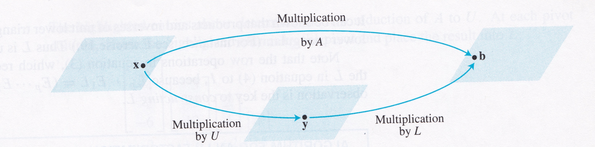

## Learning Objectives

::::{style="font-size: .8em"}
- Matrix factorization and its advantages
- LU factorization
    - Properties of $U$ and $L$
    - Calculation
- Computational complexity of LU factorization
::::

## Matrix Factorization

:::{style="font-size: .8em"}
A __factorization__ of a matrix $A$ is an equation that expresses $A$ as a product of two or more matrices.  

$$
A = BC.
$$

There are several reasons to factor (or decompose) a matrix:

1. Recasting $A$ into a form that makes computing with $A$ _**faster**_.
2. Recasting $A$ into a form that makes working with $A$ _**easier**_.
3. Recasting $A$ into a form that _**exposes important properties**_ of $A$.

_**LU factorization**_ addresses the first case. 

:::


## LU Factorization

:::{style="font-size: .8em"}
The LU factorization can be applied to a matrix of any size.

An LU factorization of an $m\times n$ matrix $A$ constructs two matrices:

1. $L$ is a __unit lower triangular__ matrix: it is an $m \times m$ lower triangular square matrix that has 1s on the diagonal.

2. $U$ is an $m \times n$ __upper triangular__ matrix.

$$
A = \begin{array}{cc}
\left[\begin{array}{cccc}1&0&0&0\\ *&1&0&0\\ *&*&1&0\\ *&*&*&1\end{array}\right]&
\left[\begin{array}{ccccc}\blacksquare&*&*&*&*\\0&\blacksquare&*&*&*\\0&0&0&\blacksquare&*\\0&0&0&0&0\end{array}\right]\\
L&U\\
\end{array}
$$

Stars ($*$) denote arbitrary entries, and blocks ($\blacksquare$) denote nonzero entries.
:::

## LU Factorization

:::{style="font-size: .8em"}
LU factorization is possible for any matrix $A$ that can be converted into echelon form:

- _**without**_ needing to interchange (or swap) two rows;
- with addition operations that only add a multiple of one row to another row _**below**_ it.

If you consider any elementary row operation that performs scaling or adding a multiple of a row to another row below it, then the corresponding matrices are both lower triangular matrices.
:::

## Calculating LU Factorization

:::{style="font-size: .8em"}
If $A$ can be converted into echelon form $U$ by scaling or adding a multiple of a row to another row below it, then there is a set of unit lower triangular elementary matrices $E_1, \dots, E_p$ such that

$$
E_p\cdots E_2 E_1 A = U.
$$

Elementary matrices are invertible. The product of invertible matrices is also invertible, so:

$$
A = (E_p\cdots E_2 E_1)^{-1} U 
  = E_1^{-1} E_2^{-1} \cdots E_p^{-1} U.
$$

```{python}
from IPython.core.display import HTML

def generate_html():
    return r"""
    <div class="purple-box">
        <p>   <span class="label">Theorem</span>
        The product of unit lower triangular matrices is unit lower triangular. The inverse of a unit lower triangular matrix is also unit lower triangular.
        </p>
    </div>
    """
html_content = generate_html()
display(HTML(html_content))
```

:::

## Calculating LU Factorization

:::{style="font-size: .8em"}
We have rewritten Gauss-Jordan Elimination as:

$$
U = L^{-1}A
$$

and shown that $L$ is unit lower triangular.

Here,

- $U$ is the row echelon form of $A$.
- $L^{-1}$ captures the row reductions that transform $A$ to row echelon form.
- $L$ is the inverse of $L^{-1}$.
:::

# Using LU Factorization

:::{style="font-size: .8em"}
__Example__. Find the $LU$ factorization of the following matrix $A$:

$$
A = \begin{bmatrix} 2 & 4 & 2 \\ 1 & 5 & 2 \\ 4 & -1 & 9 \end{bmatrix}. 
$$

We can start by performing row operations to convert $A$ to a row echelon form $U$. 

- $R_2 \gets R_2 - \frac{1}{2} \cdot R_1$

$$
{\begin{bmatrix} 1 & 0 & 0 \\ -1/2 & 1 & 0 \\ 0 & 0 & 1 \end{bmatrix}} {\begin{bmatrix} 2 & 4 & 2 \\ 1 & 5 & 2 \\ 4 & -1 & 9 \end{bmatrix}} = \begin{bmatrix} 2 & 4 & 2 \\ 0 & 3 & 1 \\ 4 & -1 & 9 \end{bmatrix}
$$

:::

## Using LU Factorization

:::{style="font-size: .8em"}
- $R_3 \gets R_3 - 2 \cdot R_1$

$$
{\begin{bmatrix} 1 & 0 & 0 \\ 0 & 1 & 0 \\ -2 & 0 & 1 \end{bmatrix}} \begin{bmatrix} 2 & 4 & 2 \\ 0 & 3 & 1 \\ 4 & -1 & 9 \end{bmatrix} = \begin{bmatrix} 2 & 4 & 2 \\ 0 & 3 & 1 \\ 0 & -9 & 5 \end{bmatrix}
$$

- $R_3 \gets R_3 + 3 \cdot R_2$

$$
{\begin{bmatrix} 1 & 0 & 0 \\ 0 & 1 & 0 \\ 0 & 3 & 1 \end{bmatrix}} \begin{bmatrix} 2 & 4 & 2 \\ 0 & 3 & 1 \\ 0 & -9 & 5 \end{bmatrix} = \begin{bmatrix} 2 & 4 & 2 \\ 0 & 3 & 1 \\ 0 & 0 & 8 \end{bmatrix} = U
$$

:::

## Using LU Factorization

:::{style="font-size: .8em"}
$$
E_1 = \begin{bmatrix} 1 & 0 & 0 \\ -1/2 & 1 & 0 \\ 0 & 0 & 1 \end{bmatrix} \quad
E_2 = \begin{bmatrix} 1 & 0 & 0 \\ 0 & 1 & 0 \\ -2 & 0 & 1 \end{bmatrix} \quad
E_3 = \begin{bmatrix} 1 & 0 & 0 \\ 0 & 1 & 0 \\ 0 & 3 & 1 \end{bmatrix}
$$

Since we have our three elementary matrices, we can create $L.$ Let $E= E_3 E_2 E_1.$ Then $EA=U$, so $L=E^{-1}.$

A composite matrix can be inverted in two ways: $(E_3E_2E_1)^{-1}$ or $E_1^{-1} E_2^{-1} E_3^{-1}.$ Either way we obtain:

$$
E^{-1} = L = \begin{bmatrix} 1 & 0 & 0 \\ 1/2 & 1 & 0 \\ 2 & -3 & 1 \end{bmatrix}.
$$

:::

## Using LU Factorization

:::{style="font-size: .8em"}

Now we can confirm that $LU = A:$

$$
\begin{bmatrix} 1&0&0\\1/2&1&0\\2&-3&1 \end{bmatrix} \;\; \begin{bmatrix} 2 & 4 & 2 \\ 0 & 3 & 1 \\ 0 & 0 & 8 \end{bmatrix} = \begin{bmatrix} 2 & 4 & 2 \\ 1 & 5 & 2 \\ 4 & -1 & 9 \end{bmatrix}
$$

```{python}
from IPython.core.display import HTML

def generate_html():
    return r"""
    <div class="blue-box">
        <p>
        Let \(A = LU\) be the LU-decomposition of the matrix
    $$\small A = \begin{bmatrix}
    2 & 3 & 2\\
    -2 & 2 & -4\\
    1 & -1 & 5
    \end{bmatrix}.$$
    a. Find \(U\).<br>
    b. Find \(L\).
        </p>
    </div>
    """
html_content = generate_html()
display(HTML(html_content))
```

:::


## Using LU Factorization

:::{style="font-size: .8em"}
Once you have the LU factorization of a matrix $A = LU$, then the system $A{\bf x} = {\bf b}$ (for any ${\bf b}$) can be solved _quickly_.

<br>

When $A = LU$, the equation $A{\bf x} = {\bf b}$ can be written as $L(U{\bf x}) = {\bf b}.$  

<br>

We can denote $U{\bf x}$ by ${\bf y}$.  Then we can find ${\bf x}$ by solving the pair of equations:

$$
L{\bf y} = {\bf b},
$$

$$
U{\bf x} = {\bf y}.
$$

:::

## Using LU Factorization

:::{style="font-size: .8em"}
The idea is that we first solve $L{\bf y} = {\bf b}$ for ${\bf y},$ then solve $U{\bf x} = {\bf y}$ for ${\bf x}.$

<br>

:::{.center-text}


:::

The key observation: _**each equation is fast to solve**_ because $L$ and $U$ are each triangular. 
:::
<!-- ## Using LU Factorization

:::{style="font-size: .75em"}
Given the following LU factorization of $A$:

$$
A = \left[\begin{array}{rrrr}3&-7&-2&2\\-3&5&1&0\\6&-4&0&-5\\-9&5&-5&12\end{array}\right] = 
\left[\begin{array}{rrrr}1&0&0&0\\-1&1&0&0\\2&-5&1&0\\-3&8&3&1\end{array}\right]
\left[\begin{array}{rrrr}3&-7&-2&2\\0&-2&-1&2\\0&0&-1&1\\0&0&0&-1\end{array}\right] = LU
$$

use this LU factorization of $A$ to solve $A{\bf x} = {\bf b}$, where ${\bf b} = \left[\begin{array}{r}-9\\5\\7\\11\end{array}\right].$
:::


## Using LU Factorization

:::{style="font-size: .8em"}
We first find ${\bf y}$ such that $L{\bf y} = {\bf b}$, then find ${\bf x}$ such that $U{\bf x} = {\bf y}$. <br>

<!-- To solve $L{\bf y} = {\bf b},$ note that the arithmetic takes place only in the augmented column (column 5).   The zeros below each pivot in $L$ are created automatically by the choice of row operations. -->

<!-- $$
[L\;| {\bf b}] = \left[\begin{array}{rrrr|r}1&0&0&0&-9\\-1&1&0&0&5\\2&-5&1&0&7\\-3&8&3&1&11\end{array}\right] \sim
\left[\begin{array}{rrrr|r}1&0&0&0&-9\\0&1&0&0&-4\\0&0&1&0&5\\0&0&0&1&1\end{array}\right] = [I\;|{\bf y}].
$$

Next, for $U{\bf x} = {\bf y}$ (the "backward" phase) the row reduction is again streamlined:

$$
[U\;|{\bf y}] =  \left[\begin{array}{rrrr|r}3&-7&-2&2&-9\\0&-2&-1&2&-4\\0&0&-1&1&5\\0&0&0&-1&1\end{array}\right] \sim
\left[\begin{array}{rrrr|r}1&0&0&0&3\\0&1&0&0&4\\0&0&1&0&-6\\0&0&0&1&-1\end{array}\right].
$$

::: -->

<!-- ## Using LU Factorization

:::{style="font-size: .8em"}
Both the forward and backward phases of solving a system as $L(U{\bf x}) = {\bf b}$ have flop counts of $\sim 2n^2$. 

Therefore the time consuming step is actually doing the LU factorization, which as we've seen is essentially Gauss-Jordan Elimination, and therefore requires $\sim\frac{2}{3}n^3$ flops.

Hence we have found that by using the LU factorization, one can solve a series of systems all involving the same $A$ with a cost of about $\frac{2}{3}n^3$ flops. 

By contrast: 

- Doing Gauss-Jordan Elimination would require $\frac{2}{3}n^3$ flops _for each_ of the $p$ linear systems.
- Using the matrix inverse would require $2n^3$ flops to invert the matrix.

::: -->


## Computational Complexity

:::{style="font-size:.8em"}
We said previously that, for Gauss-Jordan elimination of the $n \times (n+1)$ augmented matrix $[A | {\bf b}]$, the flop count was:

- $\frac{2}{3} n^3$ floating point operations for the Elimination stage
- $n^2$ floating point operations for the Backsubstitution stage

<br>

For matrix inversion, the total cost to calculate the inverse is $2 n^3$ flops. This is _**three times**_ the cost of an ordinary Gauss-Jordan elimination.
:::

## Computational Complexity

:::{style="font-size:.8em"}
If I give you a matrix $A$ then you can:

1. Calculate $A^{-1}$ at a cost of $2n^3$ flops and then be able to solve linear systems $A {\bf x} = {\bf b}$ for any vector ${\bf b}$ you receive in the future (at a cost of $2n^2$ flops each to perform the matrix-vector multiplication).

2. Solve a single linear system $A {\bf x} = {\bf b}$ at a cost of $\frac{2}{3} n^3$ flops.

LU factorization is an alternative that provides the "best of both worlds":

- Given $A$, you perform a one-time cost of $\frac{2}{3} n^3$ flops.
- Then, you can solve any matrix equation of the form $A {\bf x} = {\bf b}$ in $O(n^2)$ flops.

<!-- This alternative approach is __LU factorization__. In order to understand LU factorization, we must first introduce elementary matrices. -->
:::