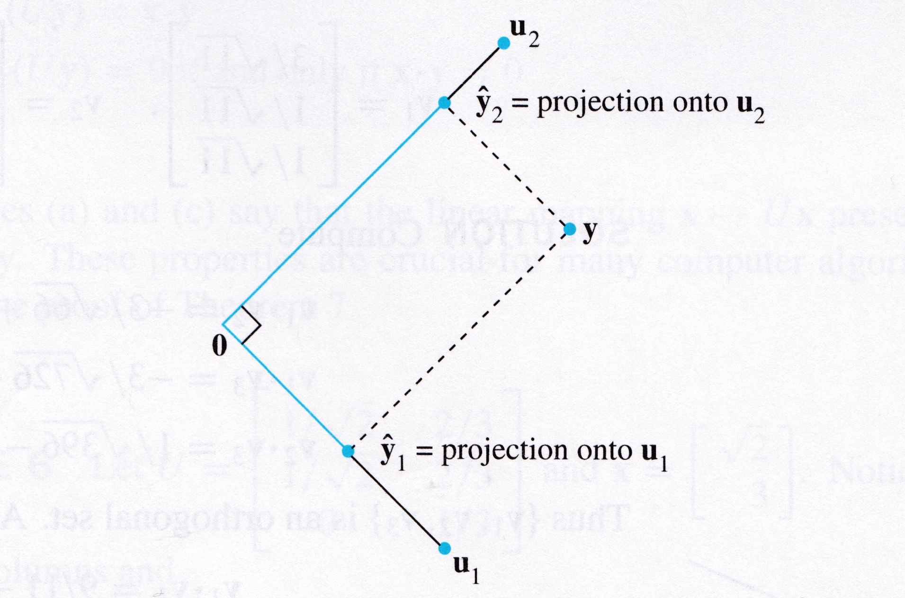

## Learning Objectives

:::{style="font-size: .8em"}
- Orthogonal projection onto a subspace
    - Important properties
- Gram-Schmidt process
    - Two perspectives
    - Creating an orthogonal basis
:::

<!-- This lecture needs some significant improvements:
1. The picture on slide 13 doesn't make any sense. Why look at the projection of the vector which is already in that space?
2. Slide 7 contains a trivial check for y being the sum of the two other vectors, and then no explanation for why we compute the inner product of y hat z. We talk all the time about z being orthogonal to u.
3. I need to add vector y to part b of the last question. This one is on me. -->

## Projections onto Subspaces

:::{style="font-size: .8em"}

:::{.center-text}
```{python}
import laUtilities as ut
import matplotlib.pyplot as plt
import numpy as np
ax = ut.plotSetup(-1,10,-1,4,(8,4))
ut.centerAxes(ax)
pt = [4., 3.]
plt.plot([0,pt[0]],[0,pt[1]],'b-',lw=2)
plt.plot([pt[0],pt[0]],[0,pt[1]],'b--',lw=2)
plt.plot([0,pt[0]],[0,0],'r-',lw=3)
plt.plot([0,0],[0,pt[1]],'g-',lw=3)
ut.plotVec(ax,pt,'b')
u = np.array([pt[0],0])
v = [0,pt[1]]
ut.plotVec(ax,u)
ut.plotVec(ax,2*u)
ut.plotVec(ax,v,'g')
ax.text(pt[0],-0.75,r'${\bf \hat{y}}=\alpha{\bf u}$',size=20)
ax.text(2*pt[0],-0.75,r'$\mathbf{u}$',size=20)
ax.text(pt[0]+0.1,pt[1]+0.2,r'$\mathbf{y}$',size=20)
ax.text(0+0.1,pt[1]+0.2,r'$\mathbf{z}$',size=20)
ax.text(0+0.1,pt[1]+0.8,r'Component of $\mathbf{y}$ orthogonal to $\mathbf{u}$',size=16)
ax.text(pt[0],-1.25,r'Orthogonal projection of $\mathbf{y}$ onto to $\mathbf{u}$',size=16);
perpline1, perpline2 = ut.perp_sym(np.array([0,0]), u, v, 0.5)
plt.plot(perpline1[0], perpline1[1], 'k', lw = 1)
plt.plot(perpline2[0], perpline2[1], 'k', lw = 1);
```
:::

When calculating the projection, only the direction of ${\bf u}$ is important.
:::

## Projections onto Subspaces

:::{style="font-size: .8em"}
- Geometrically: if we scale $\mathbf{u}$, we do not change the location of $\hat{\mathbf{y}}.$

- Algebraically: replace $\mathbf{u}$ with $c\mathbf{u}$ and recompute $\hat{\mathbf{y}}$: $\hat{\mathbf{y}} = \frac{\mathbf{y}^{\top} c\mathbf{u}}{c\mathbf{u}^{\top} c\mathbf{u}}c\mathbf{u} = \frac{\mathbf{y}^{\top} \mathbf{u}}{\mathbf{u}^{\top} \mathbf{u}}\mathbf{u}.$

Therefore, the projection of $\mathbf{y}$ is determined by the __subspace__ $L$ that is spanned by $\mathbf{u},$ the line through $\mathbf{u}$ and the origin.

<br>

Hence, sometimes $\hat{\mathbf{y}}$ is denoted by $\mbox{proj}_L \mathbf{y}$ and is called the __orthogonal projection of $\mathbf{y}$ onto $L$:__

$$
\hat{\mathbf{y}} = \mbox{proj}_L \mathbf{y} = \frac{\mathbf{y}^{\top} \mathbf{u}}{\mathbf{u}^{\top} \mathbf{u}}\mathbf{u}.
$$
:::

## Projections onto Subspaces{.smaller-title}

:::{style="font-size: .9em"}
__Example__. Let $\mathbf{y} = \begin{bmatrix}7\\6\end{bmatrix}$ and $\mathbf{u} = \begin{bmatrix}4\\2\end{bmatrix}.$  We are going to write $\mathbf{y}$ as the sum of a vector in Span$\{\mathbf{u}\}$ and a vector orthogonal to $\mathbf{u}.$

:::{.center-text}
```{python}
ax = ut.plotSetup(-3,11,-1,7,(7,5))
ut.centerAxes(ax)
plt.axis('equal')
u = np.array([4.,2])
y = np.array([7.,6])
yhat = (y.T.dot(u)/u.T.dot(u))*u
z = y-yhat
ut.plotLinEqn(1.,-2.,0.)
ut.plotVec(ax,u)
ut.plotVec(ax,z)
ut.plotVec(ax,y)
ut.plotVec(ax,yhat)
ax.text(u[0]+0.3,u[1]-0.5,r'$\mathbf{u}$',size=20)
ax.text(yhat[0]+0.3,yhat[1]-0.5,r'$\mathbf{\hat{y}}$',size=20)
ax.text(y[0],y[1]+0.8,r'$\mathbf{y}$',size=20)
ax.text(z[0]-2,z[1],r'$\mathbf{y - \hat{y}}$',size=20)
ax.text(10,4.5,r'$L = $Span$\{\mathbf{u}\}$',size=20)
perpline1, perpline2 = ut.perp_sym(yhat, y, np.array([0,0]), 0.75)
plt.plot(perpline1[0], perpline1[1], 'k', lw = 1)
plt.plot(perpline2[0], perpline2[1], 'k', lw = 1)
ax.plot([y[0],yhat[0]],[y[1],yhat[1]],'b--')
ax.plot([0,y[0]],[0,y[1]],'b-')
ax.plot([0,z[0]],[0,z[1]],'b-');
```
:::
:::

## Projections onto Subspaces

:::{style="font-size: .8em"}
First, we compute the inner products:

$$
\mathbf{y}^\top \mathbf{u} = \begin{bmatrix}7&6\end{bmatrix}\begin{bmatrix}4\\2\end{bmatrix} = 40,
$$

$$
\mathbf{u}^\top \mathbf{u} = \begin{bmatrix}4&2\end{bmatrix}\begin{bmatrix}4\\2\end{bmatrix} = 20.
$$

The orthogonal projection of $\mathbf{y}$ onto $\mathbf{u}$ is

$$
\hat{\mathbf{y}} = \frac{\mathbf{y}^\top \mathbf{u}}{\mathbf{u}^\top \mathbf{u}} \mathbf{u}
$$

$$
=\frac{40}{20}\mathbf{u} = 2\begin{bmatrix}4\\2\end{bmatrix} = \begin{bmatrix}8\\4\end{bmatrix}.
$$

:::

## Projections onto Subspaces

:::{style="font-size: .8em"}
The component of $\small \mathbf{y}$ orthogonal to $\small \mathbf{u}$ is

$$ \small
\mathbf{y}-\hat{\mathbf{y}} = \begin{bmatrix}7\\6\end{bmatrix} - \begin{bmatrix}8\\4\end{bmatrix} = \begin{bmatrix}-1\\2\end{bmatrix}.
$$

We can write
$$ \small
\begin{array}{ccccc}
\mathbf{y} &=& \hat{\mathbf{y}} &+& \mathbf{z}. \\
\begin{bmatrix}7\\6\end{bmatrix} &=& \begin{bmatrix}8\\4\end{bmatrix} &+& \begin{bmatrix}-1\\2\end{bmatrix}
\end{array}.
$$

Furthermore, $\small \hat{\mathbf{y}}$ and $\small \mathbf{z}$ are orthogonal. We can quickly check this for ourselves using the inner product:

$$\small
\hat{\mathbf{y}}^\top \mathbf{z} = 8(-1) + 4(2) = -8 + 8 = 0.
$$
:::

## Projections onto Subspaces

:::{style="font-size: .8em"}
```{python}
from IPython.core.display import HTML

def generate_html():
    return r"""
    <div class="blue-box">
        <p>Let \(\mathbf{y} = \begin{bmatrix} 5 \\ 2 \end{bmatrix}\) and \(\mathbf{u} = \begin{bmatrix} 1 \\ 3 \end{bmatrix}.\) Calculate the orthogonal projection of \(\mathbf{y}\) onto the subspace spanned by \(\mathbf{u}.\)
            <br>
            <br>
            <br>
            <br>
        </p>
    </div>
    """

html_content = generate_html()
display(HTML(html_content))
```
:::

:::{.notes}
The orthogonal projection is $\operatorname{proj}_{\mathbf{u}}(\mathbf{y}) = \frac{\mathbf{y}^\top \mathbf{u}}{\mathbf{u}^\top \mathbf{u}}\mathbf{u} = \frac{5 \cdot 1 + 2 \cdot 3}{1^2 + 3^2}\mathbf{u} = \frac{5 + 6}{1 + 9}\mathbf{u} = \frac{11}{10}\mathbf{u} = \begin{bmatrix} 11/10 \\ 33/10 \end{bmatrix}.$ 
:::

## Properties of $\hat{\mathbf{y}}$

:::{style="font-size: .8em"}

**1.** _The closest point._

Recall from geometry that given a line and a point $P$, the closest point on the line to $P$ is given by the perpendicular from $P$ to the line.

Hence, $\hat{\mathbf{y}}$ is __the closest point to $\mathbf{y}$ in the subspace $L$.__

:::{.center-text}
```{python}
#
ax = ut.plotSetup(-3,11,-1,7,(6,4))
ut.centerAxes(ax)
plt.axis('equal')
u = np.array([4.,2])
y = np.array([7.,6])
yhat = (y.T.dot(u)/u.T.dot(u))*u
z = y-yhat
ut.plotLinEqn(1.,-2.,0.)
ut.plotVec(ax,u)
ut.plotVec(ax,z)
ut.plotVec(ax,y)
ut.plotVec(ax,yhat)
ax.text(u[0]+0.3,u[1]-0.5,r'$\mathbf{u}$',size=20)
ax.text(yhat[0]+0.3,yhat[1]-0.5,r'$\mathbf{\hat{y}}$',size=20)
ax.text(y[0],y[1]+0.8,r'$\mathbf{y}$',size=20)
ax.text(z[0]-2,z[1],r'$\mathbf{y - \hat{y}}$',size=20)
ax.text(10,4.5,r'$L = $Span$\{\mathbf{u}\}$',size=20)
perpline1, perpline2 = ut.perp_sym(yhat, y, np.array([0,0]), 0.75)
plt.plot(perpline1[0], perpline1[1], 'k', lw = 1)
plt.plot(perpline2[0], perpline2[1], 'k', lw = 1)
ax.plot([y[0],yhat[0]],[y[1],yhat[1]],'b--')
ax.plot([0,y[0]],[0,y[1]],'b-')
ax.plot([0,z[0]],[0,z[1]],'b-');
```
:::
:::

## Properties of $\hat{\mathbf{y}}$

:::{style="font-size: .8em"}
**2.** _The distance from $\mathbf{y}$ to $L$_

The distance from $\mathbf{y}$ to $L$ is the length of the perpendicular from $\mathbf{y}$ to its orthogonal projection on $L$, namely $\hat{\mathbf{y}}$.
    
This distance equals the length of $\mathbf{y} - \hat{\mathbf{y}}$, or in other words the norm of ${\bf z}$.

In the previous example, the distance is 

$$
\Vert\mathbf{y}-\hat{\mathbf{y}}\Vert = \Vert {\bf z} \Vert = \sqrt{(-1)^2 + 2^2} = \sqrt{5}.
$$

:::


## Projections onto Subspaces

:::{style="font-size:.8em"}

1. To decompose a vector $\mathbf{y}$ into a linear combination of vectors $\{\mathbf{u}_1,\dots,\mathbf{u}_p\}$ in a orthogonal basis, we compute

    $$\begin{align*}
    \mathbf{y} &= c_1\mathbf{u}_1 + \dots + c_p\mathbf{u}_p\text{, where }
    c_j = \frac{\mathbf{y}^\top \mathbf{u}_j}{\mathbf{u}_j^\top \mathbf{u}_j}.
    \end{align*}$$

2. The projection of $\mathbf{y}$ onto the subspace spanned by any $\mathbf{u}$ is

$$
\mbox{proj}_L \mathbf{y} = \frac{\mathbf{y}^\top \mathbf{u}}{\mathbf{u}^\top \mathbf{u}}\mathbf{u}.
$$

 $\mathbf{y} = c_1\mathbf{u}_1 + \dots + c_p\mathbf{u}_p$ is decomposing $\mathbf{y}$ into _**a sum of orthogonal projections onto one-dimensional subspaces.**_

:::

## Projections onto Subspaces

:::{style="font-size:.8em"}
For example, let's look at $\mathbb{R}^2$, and suppose that we are given two orthogonal vectors $\mathbf{u}_1$ and $\mathbf{u}_2$, so together they span $\mathbb{R}^2.$

Then any $\mathbf{y} \in \mathbb{R}^2$ can be written in the form

$$
\mathbf{y} = \underbrace{\frac{\mathbf{y}^\top \mathbf{u}_1}{\mathbf{u}_1^\top \mathbf{u}_1}\mathbf{u}_1}_{\text{projection of $\mathbf{y}$ onto the subspace spanned by $\mathbf{u}_1$}} + 
\underbrace{\frac{\mathbf{y}^\top \mathbf{u}_2}{\mathbf{u}_2^\top \mathbf{u}_2}\mathbf{u}_2}_{\text{projection of $\mathbf{y}$ onto the subspace spanned by $\mathbf{u}_2$}}
$$

Thus, $\mathbf{y}$ is expressed as the sum of its projections onto the (orthogonal) axes determined by $\mathbf{u}_1$ and $\mathbf{u}_2$.

:::

## Projections onto Subspaces

:::{style="font-size: .8em"}
Hence, coordinates are projections onto the axes!

:::{.center-text}


:::
:::

## Gram-Schmidt Orthogonalization{.really-smaller-title}

The __Gram-Schmidt process__ is an algorithm that transforms a basis $\{ {\bf v}_1, {\bf v}_2, \ldots, {\bf v}_n \}$ for subspace $H$ into an orthogonal basis $\{ {\bf u}_1, {\bf u}_2, \ldots, {\bf u}_n \}$ for the same subspace $H$. It operates as follows.

$$
\begin{eqnarray*}
{\bf u}_1 &=& {\bf v}_1 \\
{\bf u}_2 &=& {\bf v}_2 - \mbox{proj}_{{\bf u}_1}({\bf v}_2) \\
{\bf u}_3 &=& {\bf v}_3 - \mbox{proj}_{{\bf u}_1}({\bf v}_3) - \mbox{proj}_{{\bf u}_2}({\bf v}_3) \\
&\vdots& \\
{\bf u}_n &=& {\bf v}_n - \sum_{i=1}^{n-1} \mbox{proj}_{{\bf u}_i}({\bf v}_n)
\end{eqnarray*}
$$

In other words, we can find an orthogonal basis by iteratively removing the projections of all previous vectors, in order to keep only the component of each vector that is orthogonal to all vectors before it.

## Gram-Schmidt Orthogonalization{.really-smaller-title}

Here is another way to think about the Gram-Schmidt process.

- Set ${\bf u}_1 = {\bf v}_1$.
- Overwrite each of ${\bf v}_2, {\bf v}_3, \ldots, {\bf v}_n$ with the component of those vectors that are orthogonal to ${\bf u}_1$.
- At this point, ${\bf v}_2$ is now orthogonal to the subspace spanned by ${\bf u}_1$. So, set ${\bf u}_2 = {\bf v}_2$.
- Overwrite each of ${\bf v}_3, {\bf v}_4, \ldots, {\bf v}_n$ with the component of those vectors that are orthogonal to ${\bf u}_2$.
- At this point, ${\bf v}_3$ is now orthogonal to the subspace spanned by ${\bf u}_1$ and ${\bf u}_2$. So, set ${\bf u}_3 = {\bf v}_3$.
- Overwrite each of ${\bf v}_4, {\bf v}_5, \ldots, {\bf v}_n$ with the component of those vectors that are orthogonal to ${\bf u}_3$.
- $\ldots$

## Gram-Schmidt Orthogonalization{.really-smaller-title}

We are going to apply the Gram-Schmidt process to the following three vectors in $\mathbb{R}^3$ to produce an orthogonal set:

$$
{\bf v_1} = \begin{bmatrix} 1 \\ 1 \\ 0 \end{bmatrix}, \qquad 
{\bf v_2} = \begin{bmatrix} 1 \\ 0 \\ 1 \end{bmatrix}, \qquad 
{\bf v_3} = \begin{bmatrix} 0 \\ 1 \\ 1 \end{bmatrix}.
$$

Note that these vectors $\{ {\bf v_1}, {\bf v_2}, {\bf v_3} \}$ do not form an orthogonal set. 

For example, ${\bf v}_{\bf 1}^\top {\bf v_2} = 1$, not zero.
<br><br>

The first step of the Gram-Schmidt process is simple: ${\bf u_1} = {\bf v_1} = \begin{bmatrix} 1 \\ 1 \\ 0 \end{bmatrix}.$

## Gram-Schmidt Orthogonalization{.really-smaller-title}

:::{style="font-size: .9em"}

Next, we need to calculate only the part of ${\bf v_2}$ that is orthogonal to ${\bf u_1}$.

$$
\begin{align*}
{\bf u_2} &= {\bf v_2} - \mbox{proj}_{{\bf u_1}}({\bf v_2}) \\
&= {\bf v_2} - \left(\frac{{\bf v_2}^\top {\bf u_1}}{{\bf u_1}^\top {\bf u_1}}\right) {\bf u_1} \\
&= \begin{bmatrix} 1 \\ 0 \\ 1 \end{bmatrix} - \frac{1}{2} \cdot \begin{bmatrix} 1 \\ 1 \\ 0 \end{bmatrix} \\
&= \begin{bmatrix} 1/2 \\ -1/2 \\ 1 \end{bmatrix}
\end{align*}
$$

This process guarantees that ${\bf u_2}$ is orthogonal to ${\bf u_1}$. We can check this for ourselves.

$$
{\bf u}_{\bf 1}^\top {\bf u_2} = \begin{bmatrix} 1 & 1 & 0 \end{bmatrix}  \begin{bmatrix} 1/2 \\ -1/2 \\ 1 \end{bmatrix} = 1/2 - 1/2 + 0 = 0.
$$
:::

## Gram-Schmidt Orthogonalization{.really-smaller-title}

Finally, we calculate $\bf{u_3}$:

$$
\begin{align*}
{\bf u}_3 &= {\bf v}_3 - \mbox{proj}_{{\bf u}_1}({\bf v}_3) - \mbox{proj}_{{\bf u}_2}({\bf v}_3) \\
&= \begin{bmatrix} 0 \\ 1 \\ 1 \end{bmatrix} - \frac{{\bf v_3}^\top {\bf u_1}}{{\bf u_1}^\top {\bf u_1}}\begin{bmatrix} 1 \\ 1 \\ 0 \end{bmatrix} - \frac{{\bf v_3}^\top {\bf u_2}}{{\bf u_2}^\top {\bf u_2}}\begin{bmatrix} 1/2 \\ -1/2 \\ 1 \end{bmatrix} \\
&= \begin{bmatrix} 0 \\ 1 \\ 1 \end{bmatrix} - \frac{1}{2} \cdot \begin{bmatrix} 1 \\ 1 \\ 0 \end{bmatrix} - \frac{1/2}{3/2} \cdot \begin{bmatrix} 1/2 \\ -1/2 \\ 1 \end{bmatrix} \\
&= \begin{bmatrix} -2/3 \\ 2/3 \\ 2/3 \end{bmatrix}.
\end{align*}
$$

## Gram-Schmidt Orthogonalization{.really-smaller-title}

It is not difficult to confirm that $\mathbf{u}_3$ is orthogonal to $\mathbf{u}_2$ and $\mathbf{u}_1.$

Therefore, $\{ {\bf u_1}, {\bf u_2}, {\bf u_3} \}$ is an orthogonal set.

```{python}
from IPython.core.display import HTML

def generate_html():
    return r"""
    <div class="purple-box">
         <p><span class="label">Theorem</span>
        If we apply Gram-Schmidt starting from a basis \(\{ {\bf v}_1, {\bf v}_2, \ldots, {\bf v}_n \}\) for subspace \(H\), then the resulting set \(\mathcal{B} = \{ {\bf u}_1, {\bf u}_2, \ldots, {\bf u}_n \}\) satisfies the following properties:
        <ol start=1>
        <li>The vectors in \(\mathcal{B}\) are orthogonal.</li>
        <li>\(\mathcal{B}\) spans the same subspace \(H\), and hence is a basis for \(H\).</li>
        </p>
    </div>
    """
html_content = generate_html()
display(HTML(html_content))
```

## Gram-Schmidt Orthogonalization{.really-smaller-title}

```{python}
from IPython.core.display import HTML

def generate_html():
    return r"""
    <div class="blue-box">
        <p>
        Given are the following vectors in \(\small \mathbb{R}^4:\)

$$\small \vec a_1 = \begin{bmatrix} 1 \\ 1 \\ 1 \\ 0 \end{bmatrix},
\vec a_2 = \begin{bmatrix} 0 \\ 1 \\ 2 \\ 1 \end{bmatrix},
\vec a_3 = \begin{bmatrix} 1 \\ 1 \\ 1 \\ 1 \end{bmatrix}.$$

a. Calculate an orthogonal basis for \(\small W = \text{Span}\{\vec a_1, \vec a_2, \vec a_3\}.\)<br>
<br>
<br>
<br>
<br><br>
<br>

        </p>
    </div>
    """
html_content = generate_html()
display(HTML(html_content))
```

## Gram-Schmidt Orthogonalization{.really-smaller-title}

```{python}
from IPython.core.display import HTML

def generate_html():
    return r"""
    <div class="blue-box">
        <p>
    b. Using your work from part a, calculate the projection \(\hat{y}\: \) of \(\: \vec y\) into \(\text{Span}\{\vec a_1, \vec a_2, \vec a_3\}.\)<br>
    <br>
    <br>
    <br>
    <br>
    <br>
    <br>
    <br>
        </p>
    </div>
    """
html_content = generate_html()
display(HTML(html_content))
```