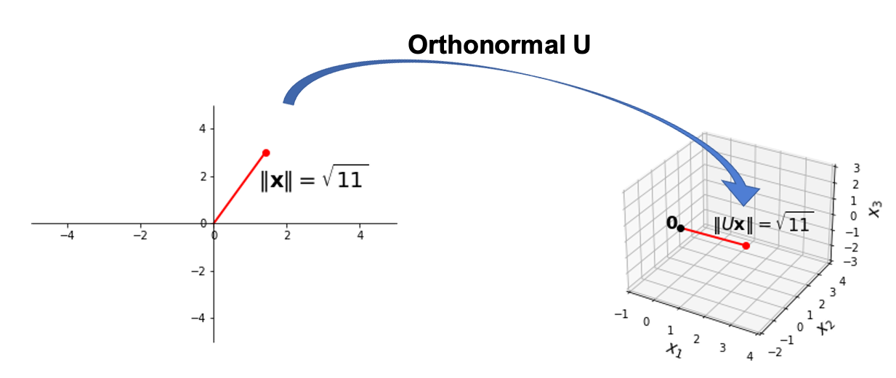
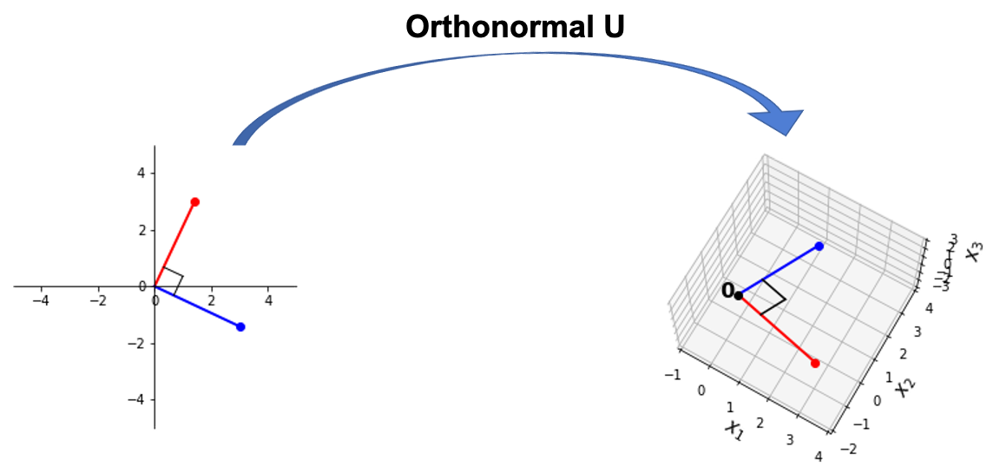

## Learning Objectives

:::{style="font-size: .8em"}

- From Gram-Schmidt to QR: orthonormal sets and orthogonal matrices
- Orthonormal transformations and their properties
- QR factorization
    - Computation by hand and in Python
    - Solving linear systems using QR

:::

## Definition: Orthonormal Sets{.smaller-title}

:::{style="font-size: .8em"}
Orthogonal sets become particularly useful when we __normalize__ the vectors in the set.

```{python}
from IPython.core.display import HTML

def generate_html():
    return r"""
    <div class="purple-box">
        <p><span class="label">Orthonormal Set</span>
        A set \(\{\mathbf{u}_1,\dots,\mathbf{u}_p\}\) is an <b>orthonormal set</b> if it is an orthogonal set of unit vectors.
        </p>
    </div>
    """
html_content = generate_html()
display(HTML(html_content))
```

<br>

:::{.fragment}
Since orthogonal sets are linearly independent, so are orthonormal sets. Hence, when they span the space, they form an __orthonormal basis__ for that space.

<br><br>

:::

:::{.fragment}
```{python}
from IPython.core.display import HTML

def generate_html():
    return r"""
    <div class="blue-box">
        <p>Is the standard basis \(\{\mathbf{e}_1, \dots, \mathbf{e}_n\}\) for \(\mathbb{R}^n\) orthonormal?</p>
    </div>
    """
display(HTML(generate_html()))
```
:::

:::

## Orthonormal Columns:  $U^{\top} U = I${.smaller-title}

:::{style="font-size: .8em"}
```{python}
from IPython.core.display import HTML

def generate_html():
    return r"""
    <div class="purple-box">
        <p><span class="label">Theorem</span>
        An \(m\times n\) matrix \(U\) has orthonormal columns if and only if \(U^{\top} U = I\).
        </p>
    </div>
    """
html_content = generate_html()
display(HTML(html_content))
```

__Proof.__ Let $U = [\mathbf{u}_1\;\mathbf{u}_2\; \dots \; \mathbf{u}_n]$ denote the column vectors of $U$. Then:
:::
:::{style="font-size: .55em"}


:::{.fragment}
$$
U^\top U = \begin{bmatrix}
\cdots & \cdots & {\bf u}_1^\top & \cdots & \cdots \\
\cdots & \cdots & {\bf u}_2^\top & \cdots & \cdots \\
&& \vdots && \\
\cdots & \cdots & {\bf u}_n^\top & \cdots & \cdots
\end{bmatrix}
\left[\begin{array}{cccc}\begin{array}{c}\vdots\\\vdots\\{\bf u_1}\\\vdots\\\vdots\end{array}&\begin{array}{c}\vdots\\\vdots\\{\bf u_2}\\\vdots\\\vdots\end{array}&\dots&\begin{array}{c}\vdots\\\vdots\\{\bf u_n}\\\vdots\\\vdots\end{array}\\\end{array}\right] 
$$

:::
:::{.fragment}
$$
=
\begin{bmatrix}
\mathbf{u}_1^\top \mathbf{u}_1&\mathbf{u}_1^\top \mathbf{u}_2& \cdots & \mathbf{u}_1^\top \mathbf{u}_n\\
\mathbf{u}_2^\top \mathbf{u}_1&\mathbf{u}_2^\top \mathbf{u}_2& \cdots & \mathbf{u}_2^\top \mathbf{u}_n\\
\vdots & \vdots & \ddots & \vdots \\
\mathbf{u}_n^\top \mathbf{u}_1&\mathbf{u}_n^\top \mathbf{u}_2& \cdots & \mathbf{u}_n^\top \mathbf{u}_n
\end{bmatrix}.
$$
:::
:::

##  $U^{\top} U = I$ proof continued{.smaller-title}

:::{style="font-size: .8em"}
Every diagonal entry of this matrix equals 1 because each $\mathbf{u}_i$ is a unit vector so $\mathbf{u}_i^\top \mathbf{u}_i = 1$

Every non-diagonal entry of this matrix equals 0 because each pair of vectors $\mathbf{u}_i$ and $\mathbf{u}_j$ are orthogonal, so $\mathbf{u}_i^\top \mathbf{u}_j = 0$.

Hence, $U^\top U = I.$

:::

:::{.fragment}
```{python}
from IPython.core.display import HTML

def generate_html():
    return r"""
    <div class="blue-box">
        <p>If \(U\) is a \(3\times 2\) matrix with orthonormal columns, does \(UU^T = I_3\)? Why or why not?</p>
    </div>
    """
display(HTML(generate_html()))
```
:::

## Orthonormal Transformations Preserve Lengths{.smaller-title}

:::{style="font-size: .8em"}
```{python}
from IPython.core.display import HTML

def generate_html():
    return r"""
    <div class="purple-box">
        <p><span class="label">Theorem</span>
        Let \(U\) be an \(m\times n\) matrix with orthonormal columns, and let \(\mathbf{x}\) and \(\mathbf{y}\) be in \(\mathbb{R}^n.\)  Then:
<ol start=1>
<li> \(\Vert U\mathbf{x}\Vert = \Vert\mathbf{x}\Vert.\)</li>
<li> \((U\mathbf{x})^\top (U\mathbf{y}) = \mathbf{x}^\top \mathbf{y}.\)</li>
<li> \((U\mathbf{x})^\top (U\mathbf{y}) = 0\;\mbox{if and only if}\; \mathbf{x}^\top \mathbf{y} = 0.\)</li>
</ol>
        <br><br>That is, the linear transformation \(\mathbf{x}\mapsto U\mathbf{x}\) preserves lengths, inner products, and orthogonality. We call this an <b>orthonormal transformation</b>.
        </p>
    </div>
    """
html_content = generate_html()
display(HTML(html_content))
```
:::

## Visualizing Distance Preservation{.smaller-title}

:::{.center-text}


:::

:::{style="font-size: .8em"}
Since $U$ is $m \times n$, it may map vectors from one vector space to an entirely different vector space, but the distances between points will not be changed.

:::

## Orthonormal Transformations Preserve Orthogonality{.smaller-title}

:::{.center-text}


:::

## Orthonormal Maps Can't Decrease Dimension{.smaller-title}

:::{style="font-size: .8em"}
Note that we cannot in general construct an orthonormal transformation from a higher dimension to a lower one.

<br>

```{python}
from IPython.core.display import HTML

def generate_html():
    return r"""
    <div class="blue-box">
        <p>
Why is this impossible? 
        </p>
    </div>
    """
html_content = generate_html()
display(HTML(html_content))
```
:::

## Verifying Orthonormal Columns: Example{.smaller-title}

:::{style="font-size: .8em"}
An $m \times n$ matrix with orthonormal (or even orthogonal) columns must have $m \geq n$.

__Example.__  Let $\small U = \begin{bmatrix}1/\sqrt{2}&2/3\\1/\sqrt{2}&-2/3\\0&1/3\end{bmatrix}$ and $\small \mathbf{x} = \begin{bmatrix}\sqrt{2}\\3\end{bmatrix}.$ 

Verify that $U$ has orthonormal columns and that $\Vert U \mathbf{x}\Vert = \Vert \mathbf{x} \Vert.$

<br>

:::{.fragment}
We can use our earlier theorem to check that $U$ has orthonormal columns.

$$ \small
U^{\top} U = \begin{bmatrix}1/\sqrt{2}&1/\sqrt{2}&0\\2/3&-2/3&1/3\end{bmatrix}\begin{bmatrix}1/\sqrt{2}&2/3\\1/\sqrt{2}&-2/3\\0&1/3\end{bmatrix} = \begin{bmatrix}1&0\\0&1\end{bmatrix}.
$$
:::
:::

## Verifying Length Preservation: Example{.really-smaller-title}

:::{style="font-size: .8em"}
Next, let's verify that $\Vert U \mathbf{x}\Vert = \Vert \mathbf{x} \Vert.$

$$ \small
U\mathbf{x} = \begin{bmatrix}1/\sqrt{2}&2/3\\1/\sqrt{2}&-2/3\\0&1/3\end{bmatrix}\begin{bmatrix}\sqrt{2}\\3\end{bmatrix} = \begin{bmatrix}3\\-1\\1\end{bmatrix}
$$

:::{.fragment}
As a result,

$$ \small
\begin{eqnarray*}
\Vert\mathbf{x}\Vert &=& \sqrt{2+9} &=& \sqrt{11} \\
\Vert U\mathbf{x}\Vert &=& \sqrt{9 + 1 + 1} &=& \sqrt{11}
\end{eqnarray*}
$$
:::
:::


## Orthogonal Matrices{.smaller-title}

:::{style="font-size: .8em"}

```{python}
from IPython.core.display import HTML

def generate_html():
    return r"""
    <div class="purple-box">
        <p> <span class="label">Orthogonal matrix</span>
        A square matrix is called <b>orthogonal</b> if it has ortho<u>normal</u> columns.
        </p>
    </div>
    """
html_content = generate_html()
display(HTML(html_content))
```
<br>

When $U$ is orthogonal, then $U^{\top} U = I$ implies that $U^{-1} = U^{\top}.$ 

An example of an orthogonal matrix is a __rotation__ matrix:
    
$$
{\displaystyle T ={\begin{bmatrix}\cos \theta &-\sin \theta \\\sin \theta &\cos \theta \\\end{bmatrix}}.}
$$ 


:::{.fragment}
```{python}
from IPython.core.display import HTML

def generate_html():
    return r"""
    <div class="blue-box">
        <p>
Thinking of T as a transformation, why does \(U^{-1} = U^{\top}\)? 
        </p>
    </div>
    """
html_content = generate_html()
display(HTML(html_content))
```
:::
:::

## Definition: QR Factorization{.smaller-title}

:::{style="font-size: .75em"}
```{python}
from IPython.core.display import HTML

def generate_html():
    return r"""
    <div class="purple-box">
        <p><span class="label">QR factorization</span>
        Let \(A\) be an \(m \times n\) matrix <em>with linearly independent columns</em> (so it must be that \(m \geq n\)). Then, the <b>QR factorization</b> \(A = QR\) satisfies:
<ol>
<li> \(Q\) is an \(m \times n\) matrix whose column vectors are orthonormal,</li>
<li> \(R\) is an upper triangular \(n \times n\) matrix.</li>
        </p>
    </div>
    """
html_content = generate_html()
display(HTML(html_content))
```
:::

:::{style="font-size: .6em"}
$$
\begin{array}{cc} \left[\begin{array}{ccccc}*&*&*\\ *&*&*\\ *&*&*\\ *&*&* \\ *&*&* \end{array}\right] = & \left[\begin{array}{ccccc} | & | & | \\ | & | & | \\{\bf u_1} & {\bf u_2} & {\bf u_3} \\ | & | & | \\ | & | & | \end{array}\right] &
\left[\begin{array}{ccccc}*&*&*\\0&*&*\\0&0&*\end{array}\right]\\
A&Q&R\\
\end{array}
$$
:::


## Steps of QR Factorization{.smaller-title}

:::{style="font-size: .8em"}

1. Use Gram-Schmidt orthogonalization on the columns of $A$

:::{.fragment}
2. Find the columns of $Q$ by normalizing each column individually.
:::

:::{.fragment}
3. Calculate $R = Q^\top A$ as the matrix containing the inner products of the columns of $Q$ and $A$, as shown below in the $3 \times 3$ case.

$$
R =
\begin{bmatrix} {\bf u}_1^\top {\bf a}_1 & {\bf u}_1^\top {\bf a}_2 & {\bf u}_1^\top {\bf a}_3 \\ {\bf u}_2^\top {\bf a}_1 & {\bf u}_2^\top {\bf a}_2 & {\bf u}_2^\top {\bf a}_3 \\ {\bf u}_3^\top {\bf a}_1 & {\bf u}_3^\top {\bf a}_2 & {\bf u}_3^\top {\bf a}_3 \end{bmatrix}
= \begin{bmatrix} {\bf u}_1^\top {\bf a}_1 & {\bf u}_1^\top {\bf a}_2 & {\bf u}_1^\top {\bf a}_3 \\ 0 & {\bf u}_2^\top {\bf a}_2 & {\bf u}_2^\top {\bf a}_3 \\ 0 & 0 & {\bf u}_3^\top {\bf a}_3 \end{bmatrix}
$$
:::
:::

:::{style="font-size: .8em"}
:::{.fragment}
```{python}
from IPython.core.display import HTML

def generate_html():
    return r"""
    <div class="blue-box">
        <p>Why is \(R\) guaranteed to be upper triangular in the QR factorization?</p>
    </div>
    """
display(HTML(generate_html()))
```
:::
:::

## QR Factorization: Example{.smaller-title}

:::{style="font-size: .8em"}
__Example__. Use Gram-Schmidt orthogonalization to find QR factorization of 
$$
A = \begin{bmatrix} 0 & 1 & 1 \\ 1 & 1 & 1 \\ 1 & 2 & 1 \end{bmatrix}.
$$

The three column vectors of $A$ are ${\bf a}_1 = \begin{bmatrix} 0 \\ 1 \\ 1 \end{bmatrix}$, ${\bf a}_2 = \begin{bmatrix} 1 \\ 1 \\ 2 \end{bmatrix}$, and ${\bf a}_3 = \begin{bmatrix} 1 \\ 1 \\ 1 \end{bmatrix}$.

Let's find the corresponding orthogonal (not orthonormal!) set.

:::

## QR Step 1: Gram-Schmidt Step{.smaller-title}

:::{style="font-size: .8em"}
$$ \small
\begin{eqnarray*}
{\bf v}_1 &=& {\bf a}_1 = \begin{bmatrix} 0 \\ 1 \\ 1 \end{bmatrix} \\ 
{\bf v}_2 &=& {\bf a}_2 - \mbox{proj}_{{\bf v}_1}({\bf a}_2) = \begin{bmatrix} 1 \\ 1 \\ 2 \end{bmatrix} - \frac{0\cdot1 + 1\cdot1 + 1\cdot2}{0 + 1^2 + 1^2} \begin{bmatrix} 0 \\ 1 \\ 1 \end{bmatrix} = \begin{bmatrix} 1 \\ -1/2 \\ 1/2 \end{bmatrix} \\ \\ \\
{\bf v}_3 &=& {\bf a}_3 - \mbox{proj}_{{\bf v}_1}({\bf a}_3) - \mbox{proj}_{{\bf v}_2}({\bf a}_3)\\
&=& \begin{bmatrix} 1 \\ 1 \\ 1 \end{bmatrix} - \begin{bmatrix} 0 \\ 1 \\ 1 \end{bmatrix} - \frac{2}{3} \begin{bmatrix} 1 \\ -1/2 \\ 1/2 \end{bmatrix} = \begin{bmatrix} 1/3 \\ 1/3 \\ -1/3 \end{bmatrix}.
\end{eqnarray*}
$$
:::

## QR Step 2: Forming Q{.smaller-title}
:::{style="font-size: .8em"}

Now let's normalize each of the orthogonal vectors to get an orthonormal set, and use them as the columns of $Q$:

$$\small
{\bf u}_1 = \frac{{\bf v}_1}{\Vert {\bf v}_1 \Vert} = \frac{1}{\sqrt{2}}\begin{bmatrix} 0 \\ 1 \\ 1 \end{bmatrix}, \quad
{\bf u}_2 = \frac{{\bf v}_2}{\Vert {\bf v}_2 \Vert} = \frac{1}{\sqrt{6}}\begin{bmatrix} 2 \\ -1 \\ 1 \end{bmatrix}, \quad
{\bf u}_3 = \frac{{\bf v}_3}{\Vert {\bf v}_3 \Vert} = \frac{1}{\sqrt{3}}\begin{bmatrix} 1 \\ 1 \\ -1 \end{bmatrix}.
$$

$$\small
Q = \begin{bmatrix}  0 & 2/\sqrt{6} & 1/\sqrt{3} \\ 1/\sqrt{2} & -1/\sqrt{6} & 1/\sqrt{3} \\ 1/\sqrt{2} & 1/\sqrt{6} & -1/\sqrt{3} \end{bmatrix}.
$$

:::

## Visualizing the Orthonormalization{.really-smaller-title}

:::{.columns}
::: {.column width="50%"}
```{python}
import matplotlib.pyplot as plt
import numpy as np
from mpl_toolkits.mplot3d import Axes3D

fig = plt.figure(figsize=(5, 5))
ax = fig.add_subplot(111, projection='3d')

# Original columns of A
a1 = np.array([0, 1, 1])
a2 = np.array([1, 1, 2])
a3 = np.array([1, 1, 1])

# Orthonormal columns (Q)
u1 = np.array([0, 1/np.sqrt(2), 1/np.sqrt(2)])
u2 = np.array([2/np.sqrt(6), -1/np.sqrt(6), 1/np.sqrt(6)])
u3 = np.array([1/np.sqrt(3), 1/np.sqrt(3), -1/np.sqrt(3)])

origin = [0, 0, 0]

# Plot original vectors (dashed)
for v, label, c in [(a1, r'$\mathbf{a}_1$', '#d62728'),
                      (a2, r'$\mathbf{a}_2$', '#2ca02c'),
                      (a3, r'$\mathbf{a}_3$', '#1f77b4')]:
    ax.quiver(*origin, *v, color=c, alpha=0.35, linewidth=2, linestyle='dashed',
              arrow_length_ratio=0.1)
    ax.text(*(v * 1.1), label, fontsize=12, color=c, alpha=0.5)

# Plot orthonormal vectors (solid)
for v, label, c in [(u1, r'$\mathbf{u}_1$', '#d62728'),
                      (u2, r'$\mathbf{u}_2$', '#2ca02c'),
                      (u3, r'$\mathbf{u}_3$', '#1f77b4')]:
    ax.quiver(*origin, *v, color=c, linewidth=2.5, arrow_length_ratio=0.12)
    ax.text(*(v * 1.15), label, fontsize=12, fontweight='bold', color=c)

ax.set_xlim([-0.5, 2])
ax.set_ylim([-0.5, 2])
ax.set_zlim([-0.5, 2])
ax.set_xlabel('x'); ax.set_ylabel('y'); ax.set_zlabel('z')
ax.view_init(elev=20, azim=35)
plt.tight_layout()
plt.show()
```
:::

::: {.column width="50%"}
:::{style="font-size: .7em"}

<br>

**Dashed:** original columns of $A$

- Different lengths
- Not orthogonal to each other

<br>

**Solid:** orthonormal columns of $Q$

- All unit length
- Mutually orthogonal

<br>

Gram-Schmidt reshapes the columns while preserving the same column space: $\text{Col}\, A = \text{Col}\, Q.$
:::
:::

:::

## QR Step 3: Computing R{.smaller-title}
:::{style="font-size: .8em"}

Finally, we calculate the upper triangular matrix:

$$\small R = Q^\top A = \begin{bmatrix} {\bf u}_1^\top {\bf a}_1 & {\bf u}_1^\top {\bf a}_2 & {\bf u}_1^\top {\bf a}_3 \\ 0 & {\bf u}_2^\top {\bf a}_2 & {\bf u}_2^\top {\bf a}_3 \\ 0 & 0 & {\bf u}_3^\top {\bf a}_3 \end{bmatrix} =
\begin{bmatrix}
2/\sqrt{2} & 3/\sqrt{2} & 2/\sqrt{2} \\
0 & 3/\sqrt{6} & 2/\sqrt{6} \\
0 & 0 & 1/\sqrt{3}
\end{bmatrix}.
$$

It is easy to check that $A = Q R$.
:::

## QR Factorization in Python{.smaller-title}
:::{style="font-size: .8em"}

Let us factorize the following matrix using Python. We will use the built-in method `np.linalg.qr`.
$$\small
A = \left[\begin{array}{rrrr}3&-7&-2&2\\-3&5&1&0\\6&-4&0&-5\\-9&5&-5&12\end{array}\right].
$$

```{python}
#| echo: true
import numpy as np
A = np.array([[3,-7,-2,2],
             [-3,5,1,0],
             [6,-4,0,-5],
             [-9,5,-5,12]])
Q, R = np.linalg.qr(A)
print(Q)
print(R)
```

:::


## Verifying Orthonormal Columns of Q{.really-smaller-title}

:::{style="font-size: .8em"}
We can use `Numpy` to check that columns of $Q$ are orthonormal by computing pairwise inner products or directly verifying $Q^\top Q = I$.
:::

```{python}
#| echo: true
for i in range(Q.shape[1]):
    for j in range(i,Q.shape[1]):
        print("the inner product between columns", i, "and", j,"is", Q[:,i].dot(Q[:,j]))
```

:::{.fragment}
```{python}
#| echo: true
# Equivalently, check Q^T Q = I (rounding to suppress floating-point noise)
print((Q.T @ Q).round(12))
```
:::

:::{.fragment}
:::{style="font-size: .8em"}
This is a very useful property! It means we can take the inverse of $Q$ very efficiently, without using the typical (slow) matrix inverse algorithm.
:::
:::

## Solving Ax = b Using QR{.smaller-title}

:::{style="font-size: .8em"}

> "One algorithm in numerical linear algebra is more important than all the others: QR factorization." — [Trefethen](https://people.maths.ox.ac.uk/trefethen/text.html), p. 48

Let's use QR factorization to make it faster to solve linear systems.

Given the QR factorization of a matrix $A$, we can then solve the linear system $A {\bf x} = {\bf b}$ by rewriting it as:

:::{.fragment}
$$\begin{align*}
A {\bf x} &= {\bf b} \\
QR {\bf x} &= {\bf b} \\
Q^\top Q R {\bf x} &= Q^\top {\bf b} \\
R {\bf x} &= Q^\top {\bf b},\\
\end{align*}
$$

where the last step uses the fact that $Q^\top Q = I$.
:::

:::{.fragment}
Because $R$ is upper triangular, solving this system only requires the (fast) backsubstitution step rather than the entirety of Gauss-Jordan elimination. 
:::
:::

## QR for Linear Systems: Example{.smaller-title}

:::{style="font-size: .8em"}

Solve the following system of equations using QR factorization.

$$
\underbrace{\begin{bmatrix} 0 & 1 & 1 \\ 1 & 1 & 1 \\ 1 & 2 & 1 \end{bmatrix}}_A \begin{bmatrix}x_1 \\ x_2 \\ x_3 \end{bmatrix} = \underbrace{\begin{bmatrix} 2 \\ 3 \\ 4 \end{bmatrix}}_{{\bf b}}.
$$

<br>

We already know what $Q$ and $R$ are for this particular $A$:
$$\small
Q = \begin{bmatrix}  0 & 2/\sqrt{6} & 1/\sqrt{3} \\ 1/\sqrt{2} & -1/\sqrt{6} & 1/\sqrt{3} \\ 1/\sqrt{2} & 1/\sqrt{6} & -1/\sqrt{3} \end{bmatrix} \text{ and } 
R = \begin{bmatrix}
2/\sqrt{2} & 3/\sqrt{2} & 2/\sqrt{2} \\
0 & 3/\sqrt{6} & 2/\sqrt{6} \\
0 & 0 & 1/\sqrt{3}
\end{bmatrix}.
$$

:::


## QR for Linear Systems: Back-Substitution{.smaller-title}
:::{style="font-size: .8em"}

To solve $A {\bf x} = {\bf b}$, it suffices to find the solutions for $R {\bf x} = Q^\top {\bf b}$.

$$\small
\begin{eqnarray*}
\begin{bmatrix}
2/\sqrt{2} & 3/\sqrt{2} & 2/\sqrt{2} \\
0 & 3/\sqrt{6} & 2/\sqrt{6} \\
0 & 0 & 1/\sqrt{3}
\end{bmatrix}
\begin{bmatrix}x_1 \\ x_2 \\ x_3 \end{bmatrix}
&=&
\begin{bmatrix}  0 & 1/\sqrt{2} & 1/\sqrt{2} \\ 2/\sqrt{6} & -1/\sqrt{6} & 1/\sqrt{6} \\ 1/\sqrt{3} & 1/\sqrt{3} & -1/\sqrt{3} \end{bmatrix}
\begin{bmatrix} 2 \\ 3 \\ 4 \end{bmatrix} \\
\begin{bmatrix}
2/\sqrt{2} & 3/\sqrt{2} & 2/\sqrt{2} \\
0 & 3/\sqrt{6} & 2/\sqrt{6} \\
0 & 0 & 1/\sqrt{3}
\end{bmatrix}
\begin{bmatrix}x_1 \\ x_2 \\ x_3 \end{bmatrix}
&=& \begin{bmatrix} 7/\sqrt{2} \\ 5/\sqrt{6} \\ 1/\sqrt{3} \end{bmatrix}.
\end{eqnarray*}
$$

From the last row it is clear that $x_3 = 1$, then substituting that into the middle row gives us $x_2 = 1$, and finally in the top row we find that $x_1 = 1$ as well.

So the solution is ${\bf x} = \begin{bmatrix} 1 & 1 & 1 \end{bmatrix}^\top.$
:::

## Practice: QR Factorization by Hand{.smaller-title}

```{python}
from IPython.core.display import HTML

def generate_html():
    return r"""
    <div class="blue-box">
        <p>Let \(A = \begin{bmatrix} 1 & 3 \\ 2 & 3 \\ 2 & 0 \end{bmatrix}.\)
        <ol type="a">
            <li>Apply Gram-Schmidt to the columns of \(A\) to find an orthogonal set \(\{\mathbf{v}_1, \mathbf{v}_2\}\).</li>
            <li>Normalize to get orthonormal columns and form \(Q\).</li>
            <li>Compute \(R = Q^\top A\) and verify that \(A = QR\).</li>
        </ol>
        </p>
    </div>
    """
display(HTML(generate_html()))
```

:::{.notes}
v1 = a1 = [1,2,2]^T, ||v1|| = 3.
v2 = a2 − proj_{v1}(a2) = [3,3,0]^T − (9/9)[1,2,2]^T = [3,3,0]^T − [1,2,2]^T = [2,1,−2]^T, ||v2|| = 3.
Normalize: u1 = [1,2,2]^T/3, u2 = [2,1,−2]^T/3.
Q = [[1/3, 2/3],[2/3, 1/3],[2/3, −2/3]].
R = Q^T A = [[3, 3],[0, 3]]. Verify A = QR.
:::

## Computational Cost of QR vs. Other Methods{.smaller-title}

:::{style="font-size: .8em"}

QR is a __fundamentally different way of solving linear systems__. No matrix inverse, no Gauss-Jordan elimination.

- **Cost:** $\sim\frac{2}{3}n^3$ to factorize (comparable to LU), then $O(n^2)$ per solve
- **Key advantage is numerical stability:** $Q$'s orthonormal columns prevent rounding errors from accumulating the way they do when computing inverses

:::

## LU vs. QR: When to Use Which?{.smaller-title}

:::{style="font-size: .8em"}

| | **LU** | **QR** |
|---|----|------|
| **Factorization cost** | $\sim \frac{2}{3}n^3$ | $\sim \frac{2}{3}n^3$ |
| **Per-solve cost** | $O(n^2)$ | $O(n^2)$ |
| **Matrix shape** | Any $m \times n$ | $m \times n$ with $m \geq n$, linearly independent columns |
| **Stability** | Good (with pivoting) | Better (orthonormal columns) |
| **Best for** | General systems | Least-squares / ill-conditioned systems |

<br>

Both handle rectangular matrices, but QR requires linearly independent columns. The main reason to prefer QR is **numerical stability**, and it naturally handles overdetermined ($m > n$) systems for least squares.

:::

## Practice: QR and Rotations{.smaller-title}

```{python}
from IPython.core.display import HTML

def generate_html():
    return r"""
    <div class="blue-box">
        <p>Let \(A = \begin{bmatrix} 1 & 0 \\ 1 & 1 \end{bmatrix}.\)
        <ol type="a">
            <li>Find the QR factorization of \(A\).</li>
            <li>Look at \(Q\). What kind of transformation is it?</li>
            <li>Use the factorization to solve \(A\mathbf{x} = \begin{bmatrix}1\\2\end{bmatrix}.\)</li>
        </ol>
        </p>
    </div>
    """
display(HTML(generate_html()))
```

:::{.notes}
(a) Gram-Schmidt: v1 = a1 = [1,1]^T, ||v1|| = √2, u1 = [1/√2, 1/√2]^T.
v2 = a2 − proj_{v1}(a2) = [0,1]^T − (1/2)[1,1]^T = [−1/2, 1/2]^T. ||v2|| = 1/√2, u2 = [−1/√2, 1/√2]^T.
Q = [[1/√2, −1/√2],[1/√2, 1/√2]]. R = Q^T A = [[√2, 1/√2],[0, 1/√2]].

(b) Q is a rotation matrix! Compare to [[cos θ, −sin θ],[sin θ, cos θ]] with θ = π/4 (45°).

(c) Solve Rx = Q^T b: Q^T [1,2]^T = [3/√2, 1/√2]^T.
Row 2: x2/√2 = 1/√2 → x2 = 1.
Row 1: √2 x1 + 1/√2 = 3/√2 → √2 x1 = 2/√2 → x1 = 1.
x = [1, 1]^T. Check: A[1,1]^T = [1, 2]^T.
:::

## Looking Ahead: Least Squares{.smaller-title}

:::{style="font-size: .85em"}
QR factorization is the key to solving **overdetermined systems**: systems $A\mathbf{x} = \mathbf{b}$ where $\mathbf{b}$ is not in $\text{Col}\,A$.

- When there is no exact solution, we seek $\hat{\mathbf{x}}$ that **minimizes** $\|\mathbf{b} - A\hat{\mathbf{x}}\|$, the **least-squares solution**.
- The least-squares solution satisfies the **normal equations**: $A^\top A \hat{\mathbf{x}} = A^\top \mathbf{b}$.
- With QR: substitute $A = QR$ to get $R\hat{\mathbf{x}} = Q^\top \mathbf{b}$, already in triangular form.

**Next lecture (L25):** We'll derive the least-squares problem and see how QR makes it efficient to solve.
:::
