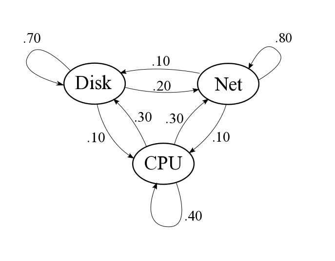

## Learning Objectives

:::{style="font-size: .8em"}

- Definition of a Markov chain
    - Probability vector
    - Stochastic matrix
    - Initial state vector
    - Transition matrix
- Steady-state vector

:::

## Markov Chains

:::{style="font-size: .8em"}
:::{.center-text}
Andrei Markov, 1856 - 1922, St Petersburg.


:::

In the early 1900s, Andrei Markov introduced the study of _stochastic systems in which transitions between states, and the future state depend only on the current state_. 

:::

## Markov Chains

:::{style="font-size: .8em"}
We refer to the systems that were introduced by Markov as _Markov chains_ when they satisfy the following properties:

- the system moves between states in discrete time steps;

- the state space is discrete: the set of states is finite (or countably infinite) and at a certain time the system can only be in one state.

<br>

Markov chains are used for 

- analyzing stock price movements, 
- analyzing the dynamics of animal populations, 
- the PageRank algorithm, ...
:::

## PageRank
:::{style="font-size: .8em"}
 PageRank is an algorithm used by Google to rank web pages in their search engine results.


<style>
  .resized-image {
    width: 20%; /* Adjust this percentage to your desired size */
  }
</style>

<div style="text-align: center;">
  
</div>
<!-- ::: {.antique-center-image}
{fig-align="right" width=50%}
::: -->

- Web pages are the states. 
- Each link between web pages has an associated probability, representing the likelihood of transitioning from one page to another.

<!-- The PageRank algorithm determins the long-term importance of each page. -->
:::

<!-- ## Markov Chains

:::{style="font-size: .8em"}
This week, we will study Markov chains as an application of linear algebra. You will see how the concepts we use, such as vectors and matrices, get applied to a particular problem. 

<br>

In DS122, you will study Markov Chains as an application of probability.
::: -->

## Markov Chains

:::{style="font-size: .8em"}
To model Markov chains we perform the following steps:

* we define some vector that describes the state of the system, and 
* we formulate a rule that tells us how to compute the next state of the system based on the current state of the system.

This situation is so common that it goes by many names:

* _dynamical system_,

* _recurrence relation,_  

* _difference equation._
:::

## Markov Chains

:::{style="font-size: .8em"}
Mathematically, we define the state of the system at time $k$ as a vector ${\bf x_k} \in \mathbb{R}^n,$ and

$$
{\bf x_{k+1}} = T({\bf x_k}),\;\;\;\mbox{for time}\;k=0,1,2...
$$

where $T: \mathbb{R}^n \rightarrow \mathbb{R}^n.$

The vector ${\bf x_k}$ is called the __state vector__.

When $T$ is a linear transformation, we find the state vector at time $k+1$ as

$$
{\bf x_{k+1}} = A{\bf x_k},
$$

where $A \in \mathbb{R}^{n\times n}.$   

This is a __linear difference equation__.
:::


<!-- ## Markov Chains

:::{style="font-size: .8em"}
Of course, we are going to be particularly interested in the case where $T$ is a linear transformation.   

<br>

Then we know that we describe  as:

$$
{\bf x_{k+1}} = A{\bf x_k},
$$

where $A \in \mathbb{R}^{n\times n}.$   

<br>

This is a _linear difference equation._
::: -->

## Population Distribution

:::{style="font-size: .8em"}
<!-- **Example:** population movement -->

Suppose we are interested in the population of two regions, say the city and the suburbs. For this simple example, we only concern ourselves with movements of people between the two regions (no immigration, emigration, birth, death, etc).

Fix an initial year (say 2000) and let 
:::

:::{style="font-size: .6em"}
$$
\begin{eqnarray}
{\bf x_0} &= \left[\begin{array}{ll}\mbox{population of the city in 2000}\\\mbox{population of the suburbs in 2000}\end{array}\right], \\
{\bf x_1} &= \left[\begin{array}{ll}\mbox{population of the city in 2001}\\\mbox{population of the suburbs in 2001}\end{array}\right], \\
{\bf x_2} &= \left[\begin{array}{ll}\mbox{population of the city in 2002}\\\mbox{population of the suburbs in 2002}\end{array}\right],\\
\end{eqnarray}
$$
:::
:::{style="font-size: .8em"}
and so on.
:::

## Population Distribution

:::{style="font-size: .8em"}
Suppose that in any given year 

* 5% of the people living in the city move to the suburbs, and 
* 3% of the people living in the suburbs move to the city.

You can think of this as a matrix:
:::

:::{style="font-size: .6em"}
$$
\begin{array}{rcc}&\mbox{From City}&\mbox{From Suburbs}\\\mbox{To City}& .95&.03\\\mbox{To Suburbs}&.05&.97\end{array}
$$
:::

:::{style="font-size: .8em"}
This matrix transitions one state into another:
:::

:::{style="font-size: .6em"}
$$
\left[\begin{array}{cc}\mbox{city pop. in 2001}\\\mbox{suburb pop. in 2001}\end{array}\right] =\left[\begin{array}{rr}.95&.03\\.05&.97\end{array}\right] \left[\begin{array}{cc}\mbox{city pop. in 2000}\\\mbox{suburb pop. in 2000}\end{array}\right].
$$
:::

## Population Distribution
:::{style="font-size: .8em"}
Let's denote the update rule matrix as $P$:

$$
P = \left[\begin{array}{rr}.95&.03\\.05&.97\end{array}\right].
$$

<br>

Note that $P$ has two special properties, due to the fact that the total number of people in the system is not changing over time:

- Each of its columns adds up to 1.
- Each of its entries is non-negative.

This leads to a number of definitions.
:::

## Markov Chains

:::{style="font-size: .8em"}
```{python}
from IPython.core.display import HTML

def generate_html():
    return r"""
    <div class="purple-box">
        <p> <span class="label">Probability vector</span>
        A <b>probability vector</b> is a vector of nonnegative entries that sums to 1.  
        </p>
    </div>
    """
html_content = generate_html()
display(HTML(html_content))
```
<br>

```{python}
from IPython.core.display import HTML

def generate_html():
    return r"""
    <div class="purple-box">
        <p><span class="label">Stochastic matrix</span>
        A <b>stochastic</b> matrix is a square matrix of nonnegative values whose columns each sum to 1.
        </p>
    </div>
    """
html_content = generate_html()
display(HTML(html_content))
```
<br>

```{python}
from IPython.core.display import HTML

def generate_html():
    return r"""
    <div class="purple-box">
        <p><span class="label">Markov chain</span>
        A <b>Markov chain</b> is a dynamical system whose state is a probability vector and which evolves according to a stochastic matrix. 
        </p>
    </div>
    """
html_content = generate_html()
display(HTML(html_content))
```
:::

## Markov Chains

:::{style="font-size: .8em"}
A probability vector ${\bf x}$ describs how things are "distributed" across various categories -- the fraction of items that are in each category. 

<br>

The probability vector ${\bf x_0}$ describes the initial distribution and is called __initial state vector__.

<br>

The stochastic matrix $P$ describes how things "redistribute" themselves at each time step. $P$ is frequently called the __transition matrix__.
:::

## Population Distribution
:::{style="font-size: .8em"}

Suppose that in the year 2000, the population of the city is 600,000 and the population of the suburbs is 400,000.  

What is the distribution of the population in 2001?  In 2002?  In 2010?

First, we convert the population distribution to a probability vector by dividing it by the sum of the vector elements.

$$
\frac{1}{600,000 + 400,000}\left[\begin{array}{rr}600,000\\400,000\end{array}\right] = \left[\begin{array}{rr}0.60\\0.40\end{array}\right].
$$
:::


## Population Distribution
:::{style="font-size: .8em"}
Then the distribution of population in 2001 is:

$$
{\bf x_{1}} = P{\bf x_0} = \left[\begin{array}{rr}.95&.03\\.05&.97\end{array}\right]\left[\begin{array}{rr}0.60\\0.40\end{array}\right] = \left[\begin{array}{rr}0.582\\0.418\end{array}\right].
$$

There will be 582,000 people in the city, and 418,000 people in the suburbs.

And the distribution of the population in 2002 is:

$$
{\bf x_{2}} = P{\bf x_1} = \left[\begin{array}{rr}.95&.03\\.05&.97\end{array}\right]\left[\begin{array}{rr}0.582\\0.418\end{array}\right] = \left[\begin{array}{rr}0.565\\0.435\end{array}\right].
$$

Note that another way we could have written this is:
$$
{\bf x_{2}} = P{\bf x_1} = P(P{\bf x_0}) = P^2 {\bf x_0}.
$$
:::

## Population Distribution
:::{style="font-size: .8em"}
To answer the question for 2010, i.e., $k=10$, we note that 

$$
{\bf x_{10}} = \overbrace{P\cdots P}^{10} {\bf x_0} = P^{10}{\bf x_0}.
$$

```{python}
import numpy as np
```

By plugging this into `Python`, we get:

:::{.center-text style="font-size: 1.2em"}
```{python}
# stochastic matrix P
P = np.array(
    [[0.95,0.03],
     [0.05,0.97]])

# initial state vector x_0
x_0 = np.array([0.60,0.40])

# compute P^10
P_10 = np.linalg.matrix_power(P, 10)

# compute x_10
x_10 = P_10 @ x_0
print(x_10)
```
:::
So after 10 years, only about 47% of the population will remain in the city.
:::

## Population Distribution

:::{style="font-size: .8em"}
We noticed that the population of the city is going down.

<br>

Will this pattern continue forever? In the "long run," will everyone eventually live in the suburbs?

More generally: when given any Markov chain, how do we calculate what happens in the distant future?
:::

## Predicting a Distant Future

:::{style="font-size: .8em"}
To find out, let's use Python to compute the state vectors for the next 75 years, in 5 year increments.

<br>

```{python}
# stochastic matrix P
P = np.array(
    [[0.95,0.03],
     [0.05,0.97]])
P_5 = np.linalg.matrix_power(P, 5)

# initial state vector x_0
x_0 = np.array([0.60,0.40])
x = x_0

# compute future state vectors, in increments of 5 years
for i in range(0,80,5):
    print(f'x({i}) = {x}')
    x = P_5 @ x
```
:::

## Predicting a Distant Future

:::{style="font-size: .8em"}
Based on visual inspection, these vectors seem to be approaching

$$
{\bf q} = \left[\begin{array}{r}.375\\.625\end{array}\right] = \left[\begin{array}{r} 3/8 \\ 5/8 \end{array}\right].
$$

The components of ${\bf x_k}$ don't seem to be changing much past about $k = 50.$

<br>

We can confirm that the this system would be stable at $\mathbf{q}$ by noting that:

$$
P{\bf q} = \left[\begin{array}{rr}.95&.03\\.05&.97\end{array}\right]\left[\begin{array}{r}.375\\.625\end{array}\right] = \left[\begin{array}{r}.35625+.01875\\.01875+.60625\end{array}\right] = \left[\begin{array}{r}.375\\.625\end{array}\right] = {\bf q}.
$$
:::

## Predicting a Distant Future

:::{style="font-size: .8em"}

This calculation is exact.  So it seems that:

* the sequence of vectors is approaching $\left[\begin{array}{r}3/8 \\ 5/8 \end{array}\right]$ as a limit, and 
* when they get to that point, they will stabilize there.

Starting with the total population of 1 million, the populations would eventually stabilize at 375,000 people in the city and 625,000 people in the suburbs.

Then the population counts would _stay the same in all future years_. Note that individual people would continue to move between the city and the suburbs, but they would do so in equal amounts.
:::

## Steady-State Vectors
:::{style="font-size: .8em"}

```{python}
from IPython.core.display import HTML

def generate_html():
    return r"""
    <div class="purple-box">
        <p><span class="label">Steady-state vector</span>
        If \(P\) is a stochastic matrix, then a <b>steady-state vector</b> (or <b>equilibrium vector</b>) for \(P\) is a probability vector \(\bf q\)  such that: 
         \(P{\bf q} = {\bf q}.\)
        </p>
    </div>
    """
html_content = generate_html()
display(HTML(html_content))
```

<br>

It can be shown that _**every stochastic matrix has at least one steady-state vector.**_ 

<br>

A steady-state vector may not be unique: some matrices have more than one steady-state vector.

:::

<!-- ## Finding the Steady State
:::{style="font-size: .8em"}
This leads to the following questions:

1. _Can we compute the steady state directly?_ So far we have guessed what the steady state is, and then checked.  

2. _How do we know_ (a) if a Markov Chain has a unique steady state, and (b) whether it will always converge to that steady state?
::: -->

## Finding Steady State
:::{style="font-size: .8em"}

Can we compute the steady-state directly?

<br>

Let $P = \left[\begin{array}{rr}.6&.3\\.4&.7\end{array}\right].$  Find a steady-state vector for $P$.

Let's simply solve the equation $P{\bf x} = {\bf x}.$

$$
\begin{align*}
P{\bf x} &= {\bf x} \\
P{\bf x} -{\bf x} &= {\bf 0} \\
P{\bf x} -I{\bf x} &= {\bf 0} \\
(P-I){\bf x} &= {\bf 0}
\end{align*}
$$

Now, $P-I$ is a matrix, so this is a linear system that we can solve.
:::
## Finding Steady State
:::{style="font-size: .8em"}
$$
P-I = \left[\begin{array}{rr}.6&.3\\.4&.7\end{array}\right] - \left[\begin{array}{rr}1&0\\0&1\end{array}\right] = \left[\begin{array}{rr}-.4&.3\\.4&-.3\end{array}\right].
$$


To find all solutions of $(P-I){\bf x} = {\bf 0},$ we row reduce the augmented matrix:

$$
\left[\begin{array}{rr|r}-.4&.3&0\\.4&-.3&0\end{array}\right] \sim \left[\begin{array}{rr|r}-.4&.3&0\\0&0&0\end{array}\right] \sim \left[\begin{array}{rr|r}1&-3/4&0\\0&0&0\end{array}\right].
$$

Hence, $x_1 = \frac{3}{4}x_2$ and $x_2$ is free. This means that there are an infinite set of solutions: $\left[\begin{array}{c}\frac{3}{4}x_2\\x_2\end{array}\right].$

```{python}
from IPython.core.display import HTML

def generate_html():
    return r"""
    <div class="blue-box">
        <p>
        Which solution are we interested in?
        </p>
    </div>
    """
html_content = generate_html()
display(HTML(html_content))
```

<!-- <br>

:::{.fragment}
Remember that our vectors ${\bf x}$ are _probability vectors._   So we are interested in the solution in which the vector elements are nonnegative and sum to 1.
::: -->
:::
## Finding Steady State
:::{style="font-size: .8em"}
We are interested in the solution in which the vector elements are nonnegative and sum to 1. To find it we take any solution and divide it by the sum of the entries.

Let's choose $x_2 = 1$, then the specific solution is:

$$
\left[\begin{array}{r}\frac{3}{4}\\1\end{array}\right].
$$

Dividing this by the sum of the entries $\left(\frac{7}{4}\right)$ we find the steady state vector:

$$
{\bf q} = \left[\begin{array}{r}\frac{3}{7}\\\frac{4}{7}\end{array}\right].
$$
:::
## Finding Steady State
:::{style="font-size: .8em"}
So, we have found how to solve a Markov Chain for its steady state:

* Solve the linear system $(P-I){\bf x} = {\bf 0}.$  
* The system will have an infinite number of solutions, with one free variable.  Obtain a general solution.
* Pick any specific solution (choose any value for the free variable), and scale it so the entries add up to 1.
:::

## Markov Chains
:::{style="font-size: .8em"}

```{python}
from IPython.core.display import HTML

def generate_html():
    return r"""
    <div class="blue-box">
        <p>
       Consider a Markov chain involving the movement of people between three possible states: the city, the suburbs, and rural areas. Suppose that every year, people move between these states according to the following rules:<br>

    * 10% of all people currently living in the city move to the suburbs, and 5% move to rural areas;<br>
    * 20% of all people in the suburbs move into the city, and 10% move to rural areas;<br>
    * 15% of all people in rural areas move to the city, and 5% move to the suburbs.<br>

     Write the stochastic matrix \( P \) corresponding to this Markov chain. This is the matrix that can be used to find next year's fraction of people in the city, suburbs, and rural areas, respectively. Ensure that \(P\) follows the provided order of states.
     <br>
     <br>
        </p>
    </div>
    """
html_content = generate_html()
display(HTML(html_content))
```

:::

## Markov Chains
:::{style="font-size: .8em"}

```{python}
from IPython.core.display import HTML

def generate_html():
    return r"""
    <div class="blue-box">
        <p>
       Consider a Markov chain involving the movement of people between three possible states: the city, the suburbs, and rural areas. Suppose that every year, people move between these states according to the following rules:<br>

    * 10% of all people currently living in the city move to the suburbs, and 5% move to rural areas;<br>
    * 20% of all people in the suburbs move into the city, and 10% move to rural areas;<br>
    * 15% of all people in rural areas move to the city, and 5% move to the suburbs.<br>

     Write the stochastic matrix \( P \) corresponding to this Markov chain. This is the matrix that can be used to find next year's fraction of people in the city, suburbs, and rural areas, respectively. Ensure that \(P\) follows the provided order of states.
     <br>
     <br>
        </p>
    </div>
    """
html_content = generate_html()
display(HTML(html_content))
```

:::
:::{.notes}
     $$P = \begin{bmatrix} 0.85 & 0.2 & 0.15\\
     0.1 & 0.7 & 0.05 \\
     0.05 & 0.1 & 0.8 \end{bmatrix}.$$
     This square matrix is stochastic because its entries are non-negative and each column adds to 1.
:::

## Markov Chains
:::{style="font-size: .8em"}

```{python}
from IPython.core.display import HTML

def generate_html():
    return r"""
    <div class="blue-box">
        <p>
Consider the Markov chain described by \(P = \begin{bmatrix}
    0.7 & 0.6\\ 0.3 & 0.4
\end{bmatrix}\) and initial probability vector \(\mathbf{x}_0 = \begin{bmatrix} 0 \\ 1 \end{bmatrix}.\) Find the probability vector \(\mathbf{x}_2\) specifying the probabilities of the states after 2 time periods.
     <br>
     <br>
          <br>
     <br>
          <br>
     <br>
          <br>
     <br>
        </p>
    </div>
    """
html_content = generate_html()
display(HTML(html_content))
```

:::
:::{.notes}
    The question is asking us to compute $\mathbf{x}_2:$
    $$\mathbf{x}_2 = P^2 \mathbf{x}_0 = P(P\mathbf{x}_0) = \begin{bmatrix}
    0.7 & 0.6\\ 0.3 & 0.4
    \end{bmatrix} 
    \left(
    \begin{bmatrix}
    0.7 & 0.6\\ 0.3 & 0.4
    \end{bmatrix} 
    \begin{bmatrix} 0 \\ 1 
    \end{bmatrix} 
    \right)= 
    \begin{bmatrix}
    0.7 & 0.6\\ 0.3 & 0.4
    \end{bmatrix} 
    \begin{bmatrix} 0.6 \\ 0.4 \end{bmatrix}
    = \begin{bmatrix} 0.66 \\ 0.34 \end{bmatrix}.$$
:::

<!-- ## Convergence to a Steady State
:::{style="font-size: .8em"}
Note that the calculation of the steady-state vector does _not_ depend on the initial state ${\bf x_0}$.

<br>

> A Markov chain converges to a steady-state vector _no matter what state the chain starts in_.

<br>

We say that the long-term behavior of the chain has "no memory of the starting state."
::: -->

<!-- ## Resource Allocation
:::{style="font-size: .8em"}

Consider a computer system that consists of a disk, a CPU, and a network interface. A set of jobs are loaded into the system.   Each job makes requests for service from each of the components of the system.
<br>

Jobs move between system components according to the following diagram.   
:::

<style>
  .resized-image {
    width: 40%; /* Adjust this percentage to your desired size */
  }
</style>

<div style="text-align: center;">
  
</div>

## Resource Allocation
:::{style="font-size: .8em"}
For example, after receiving service from the Disk, 70% of jobs return to the disk for another unit of service;  20% request service from the network interface;  and 10% request service from the CPU.

<br>

It turns out that this Markov chain reaches a unique steady-state vector. What is it?
:::

## Resource Allocation
:::{style="font-size: .8em"}
From the diagram, the movement of jobs among components is given by:

$$
\begin{array}{rccc}&\mbox{From Disk}&\mbox{From Net}&\mbox{From CPU}\\\mbox{To Disk}&0.70&0.10&0.30\\\mbox{To Net}&0.20&0.80&0.30\\\mbox{To CPU}&0.10&0.10&0.40\end{array}
$$

This corresponds to the stochastic matrix:

$$
P = \left[\begin{array}{rrr}0.70&0.10&0.30\\0.20&0.80&0.30\\0.10&0.10&0.40\end{array}\right].
$$
:::

## Resource Allocation
:::{style="font-size: .8em"}
We find the steady state of the system by solving $(P-I){\bf x} = {\bf 0}:$
:::
:::{style="font-size: .6em"}
$$
[P-I \mid {\bf 0}] = \left[\begin{array}{rrr|r}-0.30&0.10&0.30&0\\0.20&-0.20&0.30&0\\0.10&0.10&-0.60&0\end{array}\right] \sim \left[\begin{array}{rrr|r}1&0&-9/4&0\\0&1&-15/4&0\\0&0&0&0\end{array}\right].
$$
:::

:::{style="font-size: .8em"}
Thus, the general solution of $(P-I){\bf x} = {\bf 0}$ is 
:::

:::{style="font-size: .6em"}
$$
x_1 = \frac{9}{4} x_3, \;\;\; x_2 = \frac{15}{4} x_3,\;\;\; x_3\;\mbox{free.}
$$
:::

:::{style="font-size: .8em"}
Since $x_3$ is free (there are infinitely many solutions) we can find a solution whose entries sum to 1:
:::

:::{style="font-size: .6em"}
$$
{\bf q} \approx \left[\begin{array}{r}.32\\.54\\.14\end{array}\right].
$$
:::

## Resource Allocation

:::{style="font-size: .8em"}

We did not have to concern ourselves with the state in which that the system started. The influence of the starting state is eventually lost!

<br>

Let's demonstrate that computationally.   Let's say that at the start, all the jobs happened to be using the CPU.  Then:

$$
{\bf x}_0 = \left[\begin{array}{r}0\\0\\1\end{array}\right].
$$

Then let's look at how the three elements of the ${\bf x}$ vector evolve with time, by computing $P{\bf x}_0$, $P^2{\bf x}_0$, $P^3{\bf x}_0$, etc.
:::

## Resource Allocation
:::{style="font-size: .8em"}

:::{.center-text}
```{python}
import matplotlib.pyplot as plt
#
# system definition
A = np.array(
    [[.7,.1,.3],
     [.2,.8,.3],
     [.1,.1,.4]])
x = np.array([0,0,1])
xs = np.zeros((15,3))
#
# compute 15 steps in the evolution of the system stae
for i in range(15):
    xs[i] = x
    x = A @ x
#
# plot the results
ax = plt.subplot(131)
plt.plot(range(15),xs.T[0],'o-')
ax.set_ylim([0,1])
plt.title(r'$x_1$',size=24)
ax = plt.subplot(132)
plt.plot(range(15),xs.T[1],'o-')
ax.set_ylim([0,1])
plt.title(r'$x_2$',size=24)
ax = plt.subplot(133)
plt.plot(range(15),xs.T[2],'o-')
ax.set_ylim([0,1])
plt.title(r'$x_3$',size=24)
plt.tight_layout()
```
:::
:::

## Resource Allocation

:::{style="font-size: .8em"}

Notice how the system starts in the state $\left[\begin{array}{r}0\\0\\1\end{array}\right],$ but quickly reaches our predicted equilibrium state, $\left[\begin{array}{r}.32\\.54\\.14\end{array}\right].$

Let's compare what happens if the system starts in a different state, say ${\left[\begin{array}{r}1\\0\\0\end{array}\right]}.$ The following figure shows graphically that even though the systems started differently, they quickly converge to the same steady state.
:::
## Resource Allocation
:::{style="font-size: .6em"}

:::{.center-text}
```{python}
A = np.array([[.7,.1,.3],[.2,.8,.3],[.1,.1,.4]])
x = np.array([1,0,0])
ys = np.zeros((15,3))
for i in range(15):
    ys[i] = x
    x = A.dot(x)
ax = plt.subplot(131)
plt.plot(range(15),xs.T[0],'o-',range(15),ys.T[0],'o-r')
ax.set_ylim([0,1])
plt.title(r'$x_1$',size=24)
ax = plt.subplot(132)
plt.plot(range(15),xs.T[1],'o-',range(15),ys.T[1],'o-r')
ax.set_ylim([0,1])
plt.title(r'$x_2$',size=24)
ax = plt.subplot(133)
plt.plot(range(15),xs.T[2],'o-',range(15),ys.T[2],'o-r')
ax.set_ylim([0,1])
plt.title(r'$x_3$',size=24)
plt.tight_layout()
```
:::
:::
## Resource Allocation
:::{style="font-size: .8em"}
The entire state vector of the system can be thought of as evolving in space.

The figure below shows the movement of the state vector starting from six different initial conditions. It shows how regardless of the starting state, the eventual state is the same.
:::

:::{.center-text}
```{python}
import laUtilities as ut

A = np.array([[.7,.1,.3],[.2,.8,.3],[.1,.1,.4]])
x = np.array([[0., 0., 1.], [1., 0., 0.], [0., 1., 0.], [0.5, 0., 0.5], [0., 0.5, 0.5], [0.5, 0.5, 0.]]).T
colors = ['r', 'b', 'g', 'y', 'c', 'm']
npts = x.shape[1]
fig = ut.three_d_figure((11, 1), fig_desc = 'Convergence to Steady State',
                        xmin = 0, xmax = 1, ymin = 0, ymax = 1, zmin = 0, zmax = 1, qr = None)
#plt.close()
for pt in range(npts):
    fig.plotPoint(x[0][pt], x[1][pt], x[2][pt], colors[pt])
for i in range(10):
    xnext = A @ x
    for pt in range(npts):
        # fig.plotPoint(xnext[0][pt], xnext[1][pt], xnext[2][pt], colors[pt])
        fig.plotLine(np.array([[x[0][pt], xnext[0][pt]], [x[1][pt], xnext[1][pt]], [x[2][pt], xnext[2][pt]]]).T, 
                     colors[pt])
    x = xnext
fig.text(x[0][0]-0.05, x[1][0], x[2][0]+0.05, 'Steady State', 'Steady State', 12)
fig.plotPoint(x[0][0], x[1][0], x[2][0], 'k')
fig.ax.view_init(azim=40.0,elev=20.0)
#
def anim(frame):
    fig.ax.view_init(azim = frame, elev = 20)
```
:::

## Key Takeaways

:::{style="font-size: .8em"}

* Many phenomena can be describe using Markov's idea:
    * There are "states", and
    * Transition between states only depends on the current state.

* Examples: population movement, jobs in a computer, ...

* Such a system can be expressed in terms of a stochastic matrix and a probability vector.

* Evolution of the system in time is described by matrix multiplication.

* Using linear algebraic tools we can predict the steady state of such a system.

::: -->