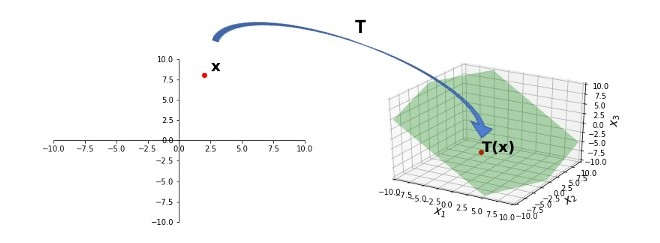
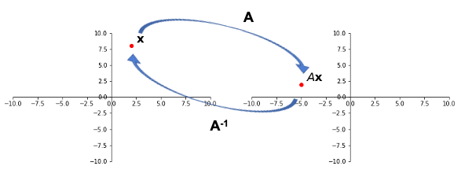

## Learning Objectives

```{python}
import demoUtilities as dm
import numpy as np
import matplotlib.pyplot as plt
```

:::{style="font-size: .8em;"}
In the last lecture we introduced linear transformations. Today we will talk about some of their properties. In particular, we will explore what it means for a linear transformation to be one-to-one, onto, and invertible. We will also reintrodcue the concepts of a determinant and inverse of a matrix.
:::

## Determinants

:::{style="font-size: .7em;"}

In a linear transformation, the "size" of a shape can grow or shrink.

:::{.center-text}
```{python}
# in a linear transformation
note = dm.mnote()
A = np.array([[1, 0], [ -2, 1]])

dm.plotSmallSetup()
dm.plotShape(note)
dm.plotShape(A @ note,'r')
```

:::

Let's see how the area (or volume) of a shape gets affected by a linear transformation from matrix $A$. The factor by which the area (or volume) changes is known as the determinant of $A$, $\text{det}(A)$

:::

## Determinants

:::{style="font-size: .7em;"}

Because of linearity, we can just ask what happens to the unit square (or cube, hypercube, etc). All other areas will scale similarly.

:::{.center-text}
```{python}
A = np.array([[2, 1],[0.75, 1.5]])
square = np.array([[0, 1, 1, 0],
                   [1, 1, 0, 0]])
print("A = "); print(A)
ax = dm.plotSmallSetup(-1, 4, -1, 4)
dm.plotSquare(square, 'r')
dm.plotSquare(A @ square);
```

:::
:::

## Determinants of $2x2$ Matrices

:::{style="font-size: .7em;"}

Let's denote the matrix of general 2-dimensional linear transformations as:

$$
A = \begin{bmatrix} a & b \\ c & d \end{bmatrix}
$$

Below is what happens to the unit square. The goal is to find an equation that is in terms of $a, b, c,$ and $d;$ which determines the blue diamond areas.

:::{.center-text}
```{python}
# unit square
v1 = np.array([2, 0.75])
v2 = np.array([1, 1.5])
A = np.column_stack([v1, v2])
ax = dm.plotSmallerSetup(-1, 4, -1, 4)
dm.plotSquare(square, 'r')
dm.plotSquare(A @ square)
plt.text(1.1, 0.1, '(1, 0)', size = 12)
plt.text(1.05, 1.05, '(1, 1)', size = 12)
plt.text(-0.6, 1.2, '(0, 1)', size = 12)
plt.text(v1[0]+0.2, v1[1]+0.1, '(a, c)', size = 12)
plt.text((v1+v2)[0]+0.1, (v1+v2)[1]+0.1, '(a+b, c+d)', size = 12)
plt.text(v2[0]-0.5, v2[1]+0.1, '(b, d)', size = 12);
```

:::
:::

## Determinants of $2x2$ Matrices

:::{style="font-size: .5em;"}

:::{.center-text}
```{python}
# just paste the two bullets before area of blue diamond and python code
a = 2
b = 1
c = 0.75
d = 1.5
v1 = np.array([a, c])
v2 = np.array([b, d])
A = np.column_stack([v1, v2])
ax = dm.plotSmallSetup(-1, 4, -1, 4)
# red triangles
dm.plotShape(np.array([[0, 0], [0, d], [b, d]]).T, 'r')
plt.text(0.2, 1, r'$\frac{1}{2}bd$', size = 12)
dm.plotShape(np.array([[a, c], [a+b, c+d], [a+b, c]]).T, 'r')
plt.text(2.5, 1, r'$\frac{1}{2}bd$', size = 12)
# gray triangles
dm.plotShape(np.array([[b, d], [b, c+d], [a+b, c+d]]).T, 'k')
plt.text(1.2, 1.9, r'$\frac{1}{2}ac$', size = 12)
dm.plotShape(np.array([[0, 0], [a, c], [a, 0]]).T, 'k')
plt.text(1.2, 0.15, r'$\frac{1}{2}ac$', size = 12)
# green squares
dm.plotShape(np.array([[a, 0], [a, c], [a+b, c], [a+b, 0]]).T, 'g')
plt.text(0.2, 1.9, r'$bc$', size = 12)
dm.plotShape(np.array([[0, d], [0, c+d], [b, c+d], [b, d]]).T, 'g')
plt.text(2.5, 0.15, r'$bc$', size = 12)
#
dm.plotSquare(A @ square)
plt.text(v1[0]-0.5, v1[1]+0.05, '(a, c)', size = 12)
plt.text((v1+v2)[0]+0.1, (v1+v2)[1]+0.1, '(a+b, c+d)', size = 12)
plt.text(v2[0]+0.1, v2[1]-0.15, '(b, d)', size = 12);
```

:::

- The large rectangle has sides $(a+b)$ and $(c+d)$, so its area is $(a+b)(c+d)$.
- We need to subtract $bd$ (red triangles), $ac$ (gray triangles), and $2bc$ (green rectangles).

:::{.fragment}
So, the area of the blue diamond is:

$$
(a+b)(c+d) - bd - ac - 2bc = ad - bc.
$$
:::
:::

## Determinants of $2x2$ Matrices

:::{style="font-size: .7em;"}

```{python}
from IPython.core.display import HTML

def generate_html():
    return r"""
    <div class="purple-box">
        <p>  
For any linear transformation \(\mathbb{R}^2 \to \mathbb{R}^2\) represented by the \(2 \times 2\) matrix

&emsp;&emsp;&emsp;&emsp;\(A = \begin{bmatrix} a & b \\ c & d \end{bmatrix},\)<br>

the area of a unit square (or any shape) is scaled by a factor of \(\det(A) = ad-bc\).
        </p>
    </div>
    """
html_content = generate_html()
display(HTML(html_content))
```

<div style="margin-bottom: 0.5em;"> </div> 

```{python}
from IPython.core.display import HTML

def generate_html():
    return r"""
    <div class="purple-box">
        <p>
        When does it happen that \(\text{det}(A)=0\)?
        </p>
    </div>
    """
html_content = generate_html()
display(HTML(html_content))
```

:::{.fragment}
Consider when $A$ is the matrix of a projection.

The unit square has been collapsed onto the $x$-axis, resulting in a shape with area of zero.
:::
:::

## Determinants of $2x2$ Matrices

:::{style="font-size: .6em;"}
This is confirmed by the determinant, which is 

$$
 \det\left(\begin{bmatrix}1 & 0 \\ 0 & 0\end{bmatrix}\right) = (1 \cdot 0) - (0 \cdot 0) = 0.
$$

:::{.center-text}
```{python}
A = np.array(
    [[1,0],
     [0,0]])
print("A = "); print(A)
ax = dm.plotSmallSetup()
dm.plotSquare(square)
dm.plotSquare(A @ square,'r')
ax.arrow(1.0,1.0,0,-0.9,head_width=0.15, head_length=0.1, length_includes_head=True);
ax.arrow(0.0,1.0,0,-0.9,head_width=0.15, head_length=0.1, length_includes_head=True);
```
:::

:::


## Determinants

:::{style="font-size: .8em;"}
The determinant can be defined for _any_ $n\times n$ square matrix.

Here is a way to calculate the determinant of any square matrix. It is based on the elementary row operations from Gauss-Jordan elimination.

:::{.fragment}
```{python}
from IPython.core.display import HTML

def generate_html():
    return r"""
    <div class="purple-box">
        <p>
        Let \(A\) be a <em>square</em> \(n\times n\) matrix, and let \(U\) be any echelon form obtained from \(A\) by row replacements and row interchanges -- without using any row scalings! Also, let \(r\) be the number of such row interchanges. <br> <br>
        
        Then the <b>determinant</b> of \(A\), written as \(\det A\), equals \((-1)^r\) times the product of the diagonal entries \(u_{11},\dots,u_{nn}\) in \(U\).
        </p>
    </div>
    """
html_content = generate_html()
display(HTML(html_content))
```
:::
:::


## Determinants

:::{style="font-size: .8em;"}

__Example.__  Compute $\det A$ for $A = \begin{bmatrix}1&5&0\\2&4&-1\\0&-2&0\end{bmatrix}.$

:::{.fragment}
 The following row reduction uses _one_ row interchange:
$$
\begin{bmatrix}1&5&0\\2&4&-1\\0&-2&0\end{bmatrix} \sim
\begin{bmatrix}1&5&0\\\color{red}{0}&\color{red}{-6}&\color{red}{-1}\\0&-2&0\end{bmatrix} \sim
\begin{bmatrix}1&5&0\\\color{red}{0}&\color{red}{-2}&\color{red}{0}\\\color{red}{0}&\color{red}{-6}&\color{red}{-1}\end{bmatrix} \sim
\begin{bmatrix}1&5&0\\0&-2&0\\\color{red}{0}&\color{red}{0}&\color{red}{-1}\end{bmatrix}.
$$

So $\det A$ equals $(-1)^1(1)(-2)(-1) = -2.$  

The remarkable thing is that _any other_ way of computing the echelon form gives the same determinant.
:::
:::

## Determinants

:::{style="font-size: .6em;"}
Some useful facts about determinants:

1. $\det AB = (\det A) (\det B).$
2. $\det A^{\top} = \det A.$
3. If $A$ is triangular, then $\det A$ is the product of the entries on the main diagonal of $A$.

```{python}
from IPython.core.display import HTML

def generate_html():
    return r"""
    <div class="blue-box">
        <p>
        Find \(\det(\mathbf{A})\) if 
\(
\mathbf{A} = \begin{bmatrix}2 & 0 & 0 \\1 & 3 & 0 \\4 & 2 & 1\end{bmatrix}  \begin{bmatrix}1 & 2 & 3 \\0 & 1 & 2 \\0 & 0 & 2\end{bmatrix}.\)
        </p>
    </div>
    """
html_content = generate_html()
display(HTML(html_content))
```


:::{.fragment}

$$
\det(\mathbf{A}) = \det \left( 
\begin{bmatrix}
2 & 0 & 0 \\
1 & 3 & 0 \\
4 & 2 & 1
\end{bmatrix}
\right) 
\cdot
\det \left( 
\begin{bmatrix}
1 & 2 & 3 \\
0 & 1 & 2 \\
0 & 0 & 2
\end{bmatrix}
\right).
$$

:::
:::

## Existence and Uniqueness

:::{style="font-size: .8em;"}

Recall some of the linear transformations of $\mathbb{R}^2$:
- Dilations and contractions
- Rotations
- Reflections
- Shears
- Projections

Some of these transformations map multiple inputs to the same output, and some are incapable of generating certain outputs.

For example, the _projections_ above can send different points to the same point.

We need terminology to understand these properties of linear transformations.

:::

## One to One

:::{style="font-size: .6em;"}
```{python}
from IPython.core.display import HTML

def generate_html():
    return r"""
    <div class="purple-box">
        <p>
        A transformation \(T: \mathbb{R}^n \rightarrow \mathbb{R}^m\) is said to be <b>one-to-one</b> if each \(\mathbf{b}\) in \(\mathbb{R}^m\) is the image of <em>at most one</em> \(\mathbf{x}\) in \(\mathbb{R}^n\).
        </p>
    </div>
    """
html_content = generate_html()
display(HTML(html_content))
```

If $T$ is one-to-one, then for each $\mathbf{b},$ the equation $T(\mathbf{x}) = \mathbf{b}$ has either 0 or 1 solutions.

Hence, the concept of one-to-one is asking a _uniqueness_ question about solutions to the equation $T(\mathbf{x}) = \mathbf{b}$ for all $\mathbf{b}.$


:::

## Onto

:::{style="font-size: .8em;"}
```{python}
from IPython.core.display import HTML

def generate_html():
    return r"""
    <div class="purple-box">
        <p>
        A transformation \(T: \mathbb{R}^n \rightarrow \mathbb{R}^m\) is said to be <b>onto</b> \(\mathbb{R}^m\) if each \(\mathbf{b}\) in \(\mathbb{R}^m\) is the image of <em>at least one</em> \(\mathbf{x}\) in \(\mathbb{R}^n\).
        </p>
    </div>
    """
html_content = generate_html()
display(HTML(html_content))
```
In other words, $T$ is onto if every element of its codomain is in its range.

<br>

If $T$ is onto, then for each $\mathbf{b},$ the equation $T(\mathbf{x}) = \mathbf{b}$ has either 1 or infinitely many solutions.

<br>

Hence, the concept of onto is asking an _existence_ question about solutions to the equation $T(\mathbf{x}) = \mathbf{b}$ for all $\mathbf{b}.$

:::


## Onto

:::{style="font-size: .6em;"}
```{python}
from IPython.core.display import HTML

def generate_html():
    return r"""
    <div class="blue-box">
        <p>
        For the transformation \(T\) pictured below, is \(T\) onto?
        </p>
    </div>
    """
html_content = generate_html()
display(HTML(html_content))
```

:::{.center-text}


:::

:::{.fragment}
Here, we see that $T$ maps points in $\mathbb{R}^2$ to a plane lying _within_ $\mathbb{R}^3$. That is, the range of $T$ is a strict subset of the codomain of $T$.

So $T$ is _not onto_ $\mathbb{R}^3$.
:::

:::

## One-to-one and Onto

:::{style="font-size: .6em;"}
```{python}
from IPython.core.display import HTML

def generate_html():
    return r"""
    <div class="blue-box">
        <p>
        If the equation \(A\mathbf{x} = \mathbf{b}\) is consistent (i.e., has at least one solution) for all \(\mathbf{b}\), then is \(T(\mathbf{x}) = A\mathbf{x}\) one-to-one? Is it onto?
        </p>
    </div>
    """
html_content = generate_html()
display(HTML(html_content))
```

:::{.fragment}

- $T(\mathbf{x})$ may or may not be one-to-one.  If the system has multiple solutions for some $\mathbf{b}$, $T(\mathbf{x})$ is not one-to-one.
- $T(\mathbf{x})$ is onto.

:::

:::{.fragment}
```{python}
from IPython.core.display import HTML

def generate_html():
    return r"""
    <div class="blue-box">
        <p>
        If \(A\mathbf{x} = \mathbf{b}\) is consistent and has a unique solution for all \(\mathbf{b}\), then is \(T(\mathbf{x}) = A\mathbf{x}\) one-to-one? Is it onto?
        </p>
    </div>
    """
html_content = generate_html()
display(HTML(html_content))
```

:::

:::{.fragment}

- Yes to both.

:::

:::

## Inverses

:::{style="font-size: .8em"}
When given a mathematical object, its "inverse" is another object that undoes the action of the first one. Some examples:

- Given a non-zero real number $r$, its multiplicative inverse $r^{-1}$ has the property that it undoes multiplication by $r$, since $r^{-1} \cdot r = r \cdot r^{-1} = 1$.
- Some functions over the real numbers like $f(x) = x^3$ have an inverse function $f^{-1}(x) = \sqrt[3]{x}$ such that $f^{-1} \circ f = f \circ f^{-1} =$ the identity function.

Let's apply the concept of inverses to linear transformations -- that is, functions of vectors.
:::

## Inverse of a Linear Transformation{.smaller-title}


:::{style="font-size:.8em"}

```{python}
from IPython.core.display import HTML

def generate_html():
    return r"""
    <div class="purple-box">
        <p>
        A linear transformation \(T: \mathbb{R}^n \rightarrow \mathbb{R}^n\) is <em>invertible</em> if there exists a function
\(S: \mathbb{R}^n \rightarrow \mathbb{R}^n\) such that:<br>

&emsp;&emsp;&emsp;&emsp;&emsp;&emsp;&emsp;&emsp;&emsp;&emsp;&emsp;&emsp;\(S(T({\bf x})) = {\bf x}\;\;\;\mbox{for all}\;{\bf x}\in\mathbb{R}^n,\)<br>

and
<br>
&emsp;&emsp;&emsp;&emsp;&emsp;&emsp;&emsp;&emsp;&emsp;&emsp;&emsp;&emsp;\( T(S({\bf x})) = {\bf x}\;\;\;\mbox{for all}\;{\bf x}\in\mathbb{R}^n.\)

        </p>
    </div>
    """
html_content = generate_html()
display(HTML(html_content))
```

<div style="margin-bottom: 0.5em;"> </div>

```{python}
from IPython.core.display import HTML

def generate_html():
    return r"""
    <div class="purple-box">
        <p>
       An invertible transformation \(T: \mathbb{R}^n \to \mathbb{R}^n\) must be both one-to-one and onto.
        </p>
    </div>
    """
html_content = generate_html()
display(HTML(html_content))
```
<br>

__Proof.__ In this case, it is easier to reason about the contrapositive statement: if a transformation $T$ is not one-to-one or is not onto, then it cannot be invertible. This is called a _proof by contradiction_.

:::

## Inverse of a Linear Transformation{.smaller-title}


:::{style="font-size:.8em"}
- Suppose that $T$ is not one-to-one. Then there exist two different vectors ${\bf x}$ and ${\bf x'}$ such that $T({\bf x}) = T({\bf x'})$. In this case, it is not possible for both

$$
\begin{align*}
    S(T({\bf x})) &= {\bf x} \\
    S(T({\bf x'})) &= {\bf x'},\end{align*}
$$

since the left sides of the two equations are equal but the right sides are not. Hence, $T$ is not invertible.

:::{.fragment}
- Suppose that $T$ is not onto, meaning that there exists some $y \in \mathbb{R}^n$ that is not in the range of $T$. Hence for any transformation $S$ it is the case that $T(S({\bf y})) \neq {\bf y}$, so $T$ is not invertible.
:::
:::

## Inverse of a Matrix

:::{style="font-size:.6em"}

```{python}
from IPython.core.display import HTML

def generate_html():
    return r"""
    <div class="purple-box">
        <p>
 An \(n \times n\) matrix \(A\) is called <b>invertible</b> if there exists a matrix $C$ such that

 &emsp;&emsp;&emsp;&emsp;&emsp;&emsp;&emsp;\(AC = I \mbox{  and  } CA = I,\)

where \(I\) is the \(n \times n\) identity matrix. In this case, \(C\) is called the <b>inverse</b> of \(A\).
        </p>
    </div>
    """
html_content = generate_html()
display(HTML(html_content))
```

<div style="margin-bottom: 0.5em;"> </div>

```{python}
from IPython.core.display import HTML

def generate_html():
    return r"""
    <div class="purple-box">
        <p>
       A matrix that is not invertible is called a <b>singular</b> matrix. A matrix that is invertible is called <b>nonsingular</b>.
       </p>
    </div>
    """
html_content = generate_html()
display(HTML(html_content))
```
<br>

:::{.fragment}
__Example.__ If $A = \left[\begin{array}{rr}2&5\\-3&-7\end{array}\right]$ and $C = \left[\begin{array}{rr}-7&-5\\3&2\end{array}\right]$, 

then: $AC = \left[\begin{array}{rr}2&5\\-3&-7\end{array}\right]\left[\begin{array}{rr}-7&-5\\3&2\end{array}\right] = \left[\begin{array}{rr}1&0\\0&1\end{array}\right],$ and: $CA = \left[\begin{array}{rr}-7&-5\\3&2\end{array}\right]\left[\begin{array}{rr}2&5\\-3&-7\end{array}\right] = \left[\begin{array}{rr}1&0\\0&1\end{array}\right],$

so we conclude that $C = A^{-1}$, and both $A$ and $C$ are invertible (i.e., nonsingular) matrices.
:::
:::


## Inverse of a Matrix

:::{style="font-size:.6em"}

```{python}
from IPython.core.display import HTML

def generate_html():
    return r"""
    <div class="purple-box">
        <p>
       Let \(T: \mathbb{R}^n \rightarrow \mathbb{R}^n\) be a linear transformation and let \(A\) be the standard matrix for \(T\). Then,
<ol>
<li>\(T\) is invertible if and only if \(A\) is an invertible matrix.</li>  

<li>In \(T\) is invertible, then the inverse linear transformation \(S\) is given by \(S({\bf x}) = A^{-1}{\bf x}\)</li>
       </p>
    </div>
    """
html_content = generate_html()
display(HTML(html_content))
```
<br>

:::{.fragment}
So, the inverse of a matrix does not exist for all matrices.

:::{.center-text}


:::
:::
:::


## Inverse of a Matrix

:::{style="font-size: .6em"}
__Example.__ Let $A = \left[\begin{array}{rr}0&-1\\1&0\end{array}\right]$ and $B = \begin{bmatrix} 0 & 1 \\ -1 & 0 \end{bmatrix}$. Show that $B$ is the inverse of $A$.

You can calculate $AB$ and $BA$ algebraically, but it is easier to reason about this problem geometrically. Note that $A$ and $B$ corresponds to counterclockwise rotations by 90 and 270 degrees, respectively. Hence:

- $AB$ corresponds to performing a 270 degree rotation followed by a 90 degree rotation. The result is a 360 degree rotation -- that is, every vector ends up back where it started, which is the identity transformation. Hence, $AB = I$.

- Similarly, $BA$ corresponds to performing a 90 degree rotation followed by a 270 degree rotation, so once again the result $BA = I$ is the identity matrix.
:::

## Inverse of a Matrix

:::{style="font-size: .6em"}

__Example.__ Consider the projection onto the $x_2$ axis $A = \left[\begin{array}{rr}0&0\\0&1\end{array}\right].$

:::{.columns}
:::{.column .center-text}
```{python}
A = np.array(
    [[0,0],
     [0,1]])
print("A = "); print(A)
ax = dm.plotSmallerSetup()
dm.plotSquare(square)
dm.plotSquare(A @ square)
ax.arrow(1.0,1.0,-0.9,0,head_width=0.15, head_length=0.1, length_includes_head=True);
ax.arrow(1.0,0.0,-0.9,0,head_width=0.15, head_length=0.1, length_includes_head=True);
```
:::

:::{.column .incremental}
It is __not__ invertible. There are many equivalent ways to reach this conclusion:

- The mapping $T$ is not one-to-one.  (There are many values ${\bf x}$ that give the same $A{\bf x}.$)
- The mapping $T$ is not onto $\mathbb{R}^2.$ (Only a subset of $\mathbb{R}^2$ can be output by $T$).
- The columns of $A$ do not span $\mathbb{R}^2.$
:::
:::
:::

## Inverse of a Matrix

:::{style="font-size: .7em"}
```{python}
from IPython.core.display import HTML

def generate_html():
    return r"""
    <div class="purple-box">
        <p>
<ol>
<li>If \(A\) is an invertible matrix, then \(A^{-1}\) is invertible, and</li> <br>
&emsp;&emsp;&emsp;&emsp;&emsp;&emsp;&emsp;&emsp;&emsp;&emsp;&emsp;&emsp;\((A^{-1})^{-1} = A.\)
<br>
<li>If \(A\) is an invertible matrix, then so is \(A^{\top},\) and the inverse of \(A^{\top}\) is the transpose of \(A^{-1}.\)</li> <br>
&emsp;&emsp;&emsp;&emsp;&emsp;&emsp;&emsp;&emsp;&emsp;&emsp;&emsp;&emsp;\((A^{\top})^{-1} = (A^{-1})^{\top}.\)

<br>
<li>If \(A\) and \(B\) are \(n\times n\) invertible matrices, then so is \(AB,\) and the inverse of \(AB\) is the product of the inverses of \(A\) and \(B\) in the reverse order.  </li> <br>
&emsp;&emsp;&emsp;&emsp;&emsp;&emsp;&emsp;&emsp;&emsp;&emsp;&emsp;&emsp;\((AB)^{-1} = B^{-1}A^{-1}.\)
        </p>
    </div>
    """
html_content = generate_html()
display(HTML(html_content))
```
:::

## Key Ideas

:::{style="font-size: .8em" .incremental}
- The determinant is a number associated with a square matrix. If $A = \begin{bmatrix} a & b \\ c & d \end{bmatrix}$, then $\det(A) = ad-bc.$

- A linear transformation is both one-to-one and onto if and only if it is invertible.

- A square matrix $A$ is invertible if there exists a square matrix $C$ such that $AC=CI$.
:::