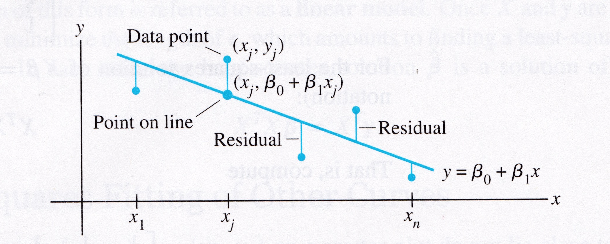

## Learning Objectives
:::{style="font-size: .8em"}
In this lecture, we will delve into the specifics of linear regression, a method that we previously explored during our discussions on supervised learning.


We will start by applying the least squares method to derive the best-fit line for a given set of data points. We will utilize the knowledge of least squares to analyze and solve problems involving simple linear regression. 

Finally, we will extend the principles of simple linear regression to multiple linear regression. 
:::


## Modeling via Regression

:::{style="font-size: .8em"}
One of the most fundamental kinds of machine learning is the construction of a model that can be used to summarize a set of data.   

A model is a concise description of a dataset or a real-world phenomenon.

For example, an equation can be a model if we use the equation to describe something in the real world.

<br>

The most common form of modeling is __regression__, which means constructing an equation that describes the relationships among variables.
:::

## Modeling via Regression

:::{style="font-size: .8em"}
As a reminder: the supervised learning problem in general is
    
- You are given some example data, which we'll think of abstractly as tuples $\{(\mathbf{x_i}, y_i)\,|\,i = 1,\dots,N\}$.  

- Your goal is to learn a rule that allows you to predict $y_j$ for some $\mathbf{x_j}$ that is not in the example data you were given.

<br>

If the label $y$ is...

- a continuous numeric value, then the problem is called __regression.__ 

- a discrete value from a finite set, then the problem is called __classification.__

:::

## Modeling via Regression

:::{style="font-size: .7em"}
If we observe that these points approximately lie on a line, we could decide to _model_ this data using a line.

:::{.center-text}
```{python}
import laUtilities as ut
import matplotlib.pyplot as plt
import numpy as np
import pandas as pd

qr_setting = None

ax = ut.plotSetup(-10, 10, -10, 10, size = (6, 6))
ut.centerAxes(ax)
line = np.array([1, 0.5])
xlin = -10.0 + 20.0 * np.random.random(100)
ylin = line[0] + (line[1] * xlin) + np.random.normal(scale = 1.5, size = 100)
ax.plot(xlin, ylin, 'ro', markersize=6);
```
:::
:::
## Modeling via Regression

:::{style="font-size: .7em"}
We may decide to model these points using a quadratic function.

:::{.center-text}
```{python}
#
ax = ut.plotSetup(-10, 10, -10, 20, size = (6, 6))
ut.centerAxes(ax)
quad = np.array([1, 3, 0.5])
xquad = -10.0 + 20.0 * np.random.random(100)
yquad = quad[0] + (quad[1] * xquad) + (quad[2] * xquad * xquad) + np.random.normal(scale = 1.5, size = 100)
ax.plot(xquad, yquad, 'ro', markersize=6); 
```
:::
:::

<!-- ## Modeling via Regression

:::{style="font-size: .65em"}
And we may decide to model these points using a logarithmic function.

:::{.center-text}
```{python}
#
ax = ut.plotSetup(-10, 10, -10, 15, size = (7, 7))
ut.centerAxes(ax)
log = np.array([1, 4])
xlog = 10.0 * np.random.random(100)
ylog = log[0] + log[1] * np.log(xlog) + np.random.normal(scale = 1.5, size = 100)
ax.plot(xlog, ylog, 'ro', markersize=6);
```
:::
::: -->

## Modeling via Regression

:::{style="font-size: .8em"}
Clearly, none of these datasets agrees perfectly with the proposed model. So how do we find the _best_ linear function (or quadratic function) given the data?

The answer to this comes from linear regression. Let us start by introducing the terminology required for regression:
<!-- 
Terminology used for regression: -->

* Some values are referred to as "independent" and,
* Some values are referred to as "dependent."
* The independent variables are collected into the __design matrix__ $X.$
* The dependent variables are collected into an __observation__ vector $\mathbf{y}.$
* The parameters of the model (for any kind of model) are collected into a __parameter__ vector $\beta.$
:::

## Modeling via Regression

:::{style="font-size: .8em"}
:::{.columns}

:::{.column}
The basic regression task is: 

Given a set of independent variables 
and the associated dependent variables, 
estimate the parameters of a model (such as a line, parabola, etc) that describes how the dependent variables are related to the independent variables.
:::

:::{.column}
```{python}
#
ax = ut.plotSetup(-10, 10, -10, 10, size = (7, 7))
ut.centerAxes(ax)
line = np.array([1, 0.5])
xlin = -10.0 + 20.0 * np.random.random(100)
ylin = line[0] + (line[1] * xlin) + np.random.normal(scale = 1.5, size = 100)
ax.plot(xlin, ylin, 'ro', markersize = 6)
ax.plot(xlin, line[0] + line[1] *xlin, 'b-')
plt.text(-9, 3, r'$y = \beta_0 + \beta_1x$', size=20); 
```
:::
:::
:::

## Fitting a Line to Data

:::{style="font-size: .8em"}
The first kind of model we'll study is a linear equation:

$$
y = \beta_0 + \beta_1 x.
$$


This is the most commonly used type of model, particularly in fields like economics, psychology, biology, etc.
The reason it is so commonly used is that experimental data often produce points $(x_1, y_1), \dots, (x_n,y_n)$ that seem to lie close to a line.   

<br>

We want to determine the parameters $\beta_0, \beta_1$ that define a line that is as "close" to the points as possible.

Suppose we have a line $y = \beta_0 + \beta_1 x$.   For each data point $(x_j, y_j),$ there is a point $(x_j, \beta_0 + \beta_1 x_j)$ that is the point on the line with the same $x$-coordinate.
:::

## Fitting a Line to Data

:::{style="font-size: .8em"}

:::{.center-text}


:::

<br>

We call $y_j$ the __observed__ value of $y$ and we call $\beta_0 + \beta_1 x_j$ the __predicted__ $y$-value.   

The difference between an observed $y$-value and a predicted $y$-value is called a __residual__.
:::

## Fitting a Line to Data

:::{style="font-size: .8em"}
There are several ways to measure how "close" the line is to the data. 

The usual choice is to sum the squares of the residuals.  

Note that the residuals themselves may be positive or negative -- by squaring them, we ensure that our error measures don't cancel out.

<br>

The __least-squares line__ is the line $y = \beta_0 + \beta_1x$ that minimizes the sum of squares of the residuals. 

The coefficients $\beta_0, \beta_1$ of the line are called __regression coefficients.__
:::

## Regression and Least Squares

:::{style="font-size: .8em"}
Let's imagine for a moment that the data fit a line perfectly.

Then, if each of the data points happened to fall exactly on the line, the parameters $\beta_0$ and $\beta_1$ would satisfy the equations:

$$
\beta_0 + \beta_1 x_1 = y_1 
$$
$$
\beta_0 + \beta_1 x_2 = y_2 
$$
$$
\beta_0 + \beta_1 x_3 = y_3 
$$
$$
\vdots
$$

$$
\beta_0 + \beta_1 x_n = y_n
$$
:::


## Regression and Least Squares

:::{style="font-size: .8em"}
We can write this system as the following matrix equation:

$$
X\mathbf{\beta} = \mathbf{y},
$$ 

$$
X=\begin{bmatrix}1&x_1\\1&x_2\\\vdots&\vdots\\1&x_n\end{bmatrix},\;\;\mathbf{\beta} = \begin{bmatrix}\beta_0\\\beta_1\end{bmatrix},\;\;\mathbf{y}=\begin{bmatrix}y_1\\y_2\\\vdots\\y_n\end{bmatrix}.
$$
:::


## Regression and Least Squares

:::{style="font-size: .8em"}
If the data points don't actually lie exactly on a line: 

there are no parameters $\beta_0, \beta_1$ for which the predicted $y$-values in $X\mathbf{\beta}$ equal the observed $y$-values in $\mathbf{y}$. Also, $X\mathbf{\beta}=\mathbf{y}$ has no solution.

<br>

When the data doesn't fall exactly on a line, seek the $\beta$ that minimizes the sum of squared residuals, i.e.,

$$
\sum_i ((\beta_0 + \beta_1 x_i) - y_i)^2 =\Vert X\beta -\mathbf{y}\Vert^2
$$

:::{.center-text style="font-size: 1.1em"}
_The sum of squares of the residuals is exactly the square of the distance between the vectors $X\mathbf{\beta}$ and $\mathbf{y}.$_
:::
:::

## Regression and Least Squares

:::{style="font-size: .8em"}
This is a least-squares problem, $A\mathbf{x} = \mathbf{b},$ just with different notation. That is, computing the least-squares solution of $X\mathbf{\beta} = \mathbf{y}$ is equivalent to finding the $\mathbf{\beta}$ that determines the least-squares line.

:::{.center-text}
```{python}
#
ax = ut.plotSetup(-10, 10, -10, 10, size = (6, 5))
ut.centerAxes(ax)
line = np.array([1, 0.5])
xlin = -10.0 + 20.0 * np.random.random(100)
ylin = line[0]+ (line[1] * xlin) + np.random.normal(scale = 1.5, size = 100)
ax.plot(xlin, ylin, 'ro', markersize=6)
ax.plot(xlin, line[0] + line[1] * xlin, 'b-')
plt.text(-9,3,r'$y = \beta_0 + \beta_1x$',size=20);
```
:::
:::

## Regression and Least Squares

:::{style="font-size: .8em"}
:::{.columns}

:::{.column}
__Example 1.__  Find the equation $y = \beta_0 + \beta_1 x$ of the least-squares line that best fits:

:::{.center-text}
| x | y |
|---|---|
| 2 | 1 |
| 5 | 2 |
| 7 | 3 |
| 8 | 3 |
:::
:::

:::{.column}
```{python}
#
ax = ut.plotSetup(0, 10, 0, 3.5, size = (7, 6))
ut.centerAxes(ax)
pts = np.array([[2,1], [5,2], [7,3], [8,3]]).T
ax.plot(pts[0], pts[1], 'ro', markersize = 10);
plt.xlabel('x', size = 20)
plt.ylabel('y', size = 20);
```
:::
:::
:::

## Regression and Least Squares

:::{style="font-size: .8em"}
__Solution.__ Use the $x$-coordinates of the data to build the design matrix $X$, and the $y$-coordinates to build the observation vector $\mathbf{y}$:

$$
X = \begin{bmatrix}1&2\\1&5\\1&7\\1&8\end{bmatrix},\;\;\;\mathbf{y}=\begin{bmatrix}1\\2\\3\\3\end{bmatrix}
$$


To obtain the least-squares line, find the least-squares solution to $X\mathbf{\beta} = \mathbf{y}.$

<br>

We do this by solving the __normal equation__ with new notation:

$$
X^\top X\mathbf{\beta} = X^\top \mathbf{y}.
$$
:::

## Regression and Least Squares

:::{style="font-size: .8em"}
$$
X^\top X = \begin{bmatrix}1&1&1&1\\2&5&7&8\end{bmatrix}\begin{bmatrix}1&2\\1&5\\1&7\\1&8\end{bmatrix} = \begin{bmatrix}4&22\\22&142\end{bmatrix},
$$

$$
X^\top \mathbf{y} =  \begin{bmatrix}1&1&1&1\\2&5&7&8\end{bmatrix}\begin{bmatrix}1\\2\\3\\3\end{bmatrix} = \begin{bmatrix}9\\57\end{bmatrix}.
$$

The normal equations are: $\begin{bmatrix}4&22\\22&142\end{bmatrix}\begin{bmatrix}\beta_0\\\beta_1\end{bmatrix} = \begin{bmatrix}9\\57\end{bmatrix}.$

:::

## Regression and Least Squares

:::{style="font-size: .8em"}
Solving, we get:
    
$$
\begin{bmatrix}\beta_0\\\beta_1\end{bmatrix}=\begin{bmatrix}4&22\\22&142\end{bmatrix}^{-1}\begin{bmatrix}9\\57\end{bmatrix}
$$

$$
= \frac{1}{84}\begin{bmatrix}142&-22\\-22&4\end{bmatrix}\begin{bmatrix}9\\57\end{bmatrix}
$$

$$
= \begin{bmatrix}2/7\\5/14\end{bmatrix}.
$$
:::


## Regression and Least Squares

:::{style="font-size: .8em"}
So the least-squares line has the equation $y = \frac{2}{7} + \frac{5}{14}x.$

:::{.center-text}
```{python}
#
ax = ut.plotSetup(0, 10, 0, 4, size = (5, 5))
ut.centerAxes(ax)
pts = np.array([[2,1], [5,2], [7,3], [8,3]]).T
ax.plot(pts[0], pts[1], 'ro', markersize = 10)
ut.plotLinEqn(-5./14, 1, 2./7, color='b')
plt.text(6,1.5, r'$y = \frac{2}{7} + \frac{5}{14}x$', size=24);
```
:::
:::

<!-- ## Regression and Least Squares

:::{style="font-size: .8em"}

__Example 2.__ Say I have a 10 year old car I want to sell. To find the ideal price, I surveyed the prices and ages of cars for sale in my neighborhood.
:::

:::{.center-text}
:::{style="font-size: .6em"}
| Car age | Selling price |
|---|---|
| 1 | 23,650 |
| 2 | 19,988 |
| 3 | 20,998 |
| 3 | 20,448 |
| 4 | 15,700 |
| 5 | 25,985 |
| 6 | 16,964 |
| 10 | 15,000 |
| 11 | 11,500|
| 14 | 7,950 |
| 14 | 9,000 |
| 16 | 3,950 |
| 17 | 5,250 |
:::
::: -->

## Regression and Least Squares

:::{style="font-size: .8em"}

__Example 2.__ Say I have a 10 year old car I want to sell. To find the ideal price, I surveyed the prices and ages of cars for sale in my neighborhood.
:::

<br> 

:::{.columns}
:::{.column}
:::{style="font-size: .6em"}
| Car age | Selling price |
|---|---|
| 1 | 23,650 |
| 2 | 19,988 |
| 3 | 20,998 |
| 3 | 20,448 |
| 4 | 15,700 |
| 5 | 25,985 |
| 6 | 16,964 |
:::
:::
:::{.column}
:::{style="font-size: .6em"}
| Car age | Selling price |
|---|---|
| 10 | 15,000 |
| 11 | 11,500 |
| 14 | 7,950 |
| 14 | 9,000 |
| 16 | 3,950 |
| 17 | 5,250 |
:::
:::
:::


## Regression and Least Squares

:::{style="font-size: .8em"}
```{python}
#| echo: false
ax = ut.plotSetup(0, 20, 0, 25000, size = (12, 6))
ut.centerAxes(ax)
cars = np.array([[1,23650], [2,19988], [3,20998], [3,20448], [4, 15700], [5, 25985], [6, 16964], [10, 15000], [11, 11500], [14, 7950], [14, 9000], [16, 3950], [17, 5250]]).T
ax.plot(cars[0], cars[1], 'ro', markersize = 10);
plt.xlabel('age of car', size = 20)
plt.ylabel('selling price ($)', size = 20);
```
:::

## Regression and Least Squares

:::{style="font-size: .8em"}
__Solution.__ First we need to set up our design matrix $X$, which contains the independent variable (age), and our observation vector $\mathbf{y}$, which contains our dependent variable (price).

```{python}
#| echo: true
cars = np.array([[1,23650], [2,19988], [3,20998], [3,20448], [4, 15700], [5, 25985], [6, 16964], [10, 15000], [11, 11500], [14, 7950], [14, 9000], [16, 3950], [17, 5250]]).T
prices = cars[1:].T
age = cars[:-1].T

X = np.column_stack([np.ones(age.shape[0], dtype = 'int'), age])

print(X)
```
:::

## Regression and Least Squares

:::{style="font-size: .8em"}
Now that we have $X$ and $\mathbf{y}$, we want to solve for $\beta$. We can again use the normal equations to do this.

$$
\beta = (X^\top X)^{-1} X^\top \mathbf{y}
$$

<br>

```{python}
#| echo: true
beta_hat = np.linalg.inv(X.T @ X) @ X.T @ prices
print(beta_hat)
```

```{python}
from IPython.core.display import HTML

def generate_html():
    return r"""
    <div class="blue-box">
        <p>
       What does \(\beta\) tell us about car prices?
        </p>
    </div>
    """
html_content = generate_html()
display(HTML(html_content))
```
:::

## Regression and Least Squares

:::{style="font-size: .8em"}
Using this model, we can estimate prices of cars we did not train the model on. For example, with this model if my car was 10 years old, I might charge \$12,900.

```{python}
#| echo: true
pred_price = beta_hat[0] + beta_hat[1]*10
print(pred_price)
```

```{python}
#| echo: false
ax = ut.plotSetup(0, 20, 0, 25000, size = (12, 3))
ut.centerAxes(ax)
ax.plot(cars[0], cars[1], 'ro', markersize = 10);
#ax.axline([0,beta_hat[0]], [20, beta_hat[0] + beta_hat[1]*20])
ax.plot([0,20], [beta_hat[0], beta_hat[0] + beta_hat[1]*20], '-', label='yhat = y')
plt.xlabel('age of car', size = 20)
plt.ylabel('selling price ($)', size = 20);
```
:::

## General Linear Model

:::{style="font-size: .8em"}
Another way that the inconsistent linear system is often written is to collect all the residuals into a __residual vector:__ 

$$
y = X\mathbf{\beta} + {\mathbf\epsilon}.
$$

Any equation of this form is referred to as a __linear model.__ In this formulation, the goal is to minimize the length of $\epsilon$ -- that is, minimize $\Vert\epsilon\Vert.$

When one would like to fit data points with something other than a straight line, the matrix equation is still $X\mathbf{\beta} = \mathbf{y}$, but the specific form of $X$ changes from one problem to the next.

<br>

The least-squares solution $\hat{\mathbf{\beta}}$ is a solution of the normal equations

$$
X^\top X\mathbf{\beta} = X^\top \mathbf{y}.
$$
:::

## Least-Squares Fitting

:::{style="font-size: .8em"}
Most models have parameters, and the object of _model fitting_ is to to fix those parameters.

In model fitting, the parameters are the unknown.  A central question for regression is whether the model is _linear_ in its parameters.

For example, the model $y = \beta_0 \cdot e^{-\beta_1 x}$ is _not_ linear in its parameters, but $y = \beta_0 \cdot e^{-2 x}$ _is_ linear in its parameters.

<br>

For a model that is linear in its parameters, an observation is a linear combination of (arbitrary) known functions:

$$y = \beta_0 \: f_0(x) + \beta_1 \: f_1(x) + \dots + \beta_n \: f_n(x)$$

where $f_0, \dots, f_n$ are known functions and $\beta_0,\dots,\beta_k$ are parameters.
:::

## Least-Squares Fitting

:::{style="font-size: .8em"}

__Example.__  Suppose data points $(x_1, y_1), \dots, (x_n, y_n)$ appear to lie along some sort of parabola instead of a straight line.  Suppose we wish to approximate the data by an equation of the form

$$
y = \beta_0 + \beta_1x + \beta_2x^2.
$$

<br>

Describe the linear model that produces a __least-squares fit__ of the data by the equation.
:::

## Least-Squares Fitting

:::{style="font-size: .8em"}

__Solution.__  The ideal relationship is $y = \beta_0 + \beta_1x + \beta_2x^2.$

<br>

Suppose the actual values of the parameters are $\beta_0, \beta_1, \beta_2.$  Then the coordinates of the first data point satisfy the equation

$$
y_1 = \beta_0 + \beta_1x_1 + \beta_2x_1^2 + \epsilon_1
$$

where $\epsilon_1$ is the residual error between the observed value $y_1$ and the predicted $y$-value.
:::

## Least-Squares Fitting

:::{style="font-size: .8em"}

Each data point determines a similar equation:

$$
y_1 = \beta_0 + \beta_1x_1 + \beta_2x_1^2 + \epsilon_1
$$
$$
\vdots
$$
$$
y_n = \beta_0 + \beta_1x_n + \beta_2x_n^2 + \epsilon_n
$$

This system can be written as a matrix equation of the form $\mathbf{y} = X\mathbf{\beta} + \mathbf{\epsilon}:$

$$
\begin{bmatrix}y_1\\y_2\\\vdots\\y_n\end{bmatrix} = \begin{bmatrix}1&x_1&x_1^2\\1&x_2&x_2^2\\\vdots&\vdots&\vdots\\1&x_n&x_n^2\end{bmatrix} \begin{bmatrix}\beta_0\\\beta_1\\\beta_2\end{bmatrix} + \begin{bmatrix}\epsilon_1\\\epsilon_2\\\vdots\\\epsilon_n\end{bmatrix}.
$$

:::

## Least-Squares Fitting
:::{.center-text}
```{python}
#
m = np.shape(xquad)[0]
X = np.array([np.ones(m), xquad,xquad**2]).T
beta = np.linalg.inv(X.T @ X) @ X.T @ yquad
#
ax = ut.plotSetup(-10, 10, -10, 20, size = (10, 7))
ut.centerAxes(ax)
xplot = np.linspace(-10, 10, 50)
yestplot = beta[0] + beta[1]  * xplot + beta[2] * xplot**2
ax.plot(xplot, yestplot, 'b-', lw=2)
ax.plot(xquad, yquad, 'ro', markersize = 8);
```
:::

## Multiple Regression

:::{style="font-size: .8em"}
Suppose an experiment involves two independent variables -- say, $u$ and $v$, -- and one dependent variable, $y$. A linear equation for predicting $y$ from $u$ and $v$ has the form

$$
y = \beta_0 + \beta_1 u + \beta_2 v.
$$


Since there is more than one independent variable, this is called __multiple regression.__

Such system has the form $\mathbf{y} = X\mathbf{\beta} + \epsilon,$ where

$$
\mathbf{y} = \begin{bmatrix}y_1\\y_1\\\vdots\\y_n\end{bmatrix},\;\;X = \begin{bmatrix}1&u_1&v_1\\1&u_2&v_2\\\vdots&\vdots&\vdots\\1&u_n&v_n\end{bmatrix},\;\;\mathbf{\beta}=\begin{bmatrix}\beta_0\\\beta_1\\\beta_2\end{bmatrix},\;\;\epsilon = \begin{bmatrix}\epsilon_1\\\epsilon_2\\\vdots\\\epsilon_n\end{bmatrix}.
$$
:::

## Multiple Regression

:::{style="font-size: .8em"}
A more general prediction equation might have the form

$$
y = \beta_0 + \beta_1 u + \beta_2 v + \beta_3 u^2 + \beta_4 uv + \beta_5 v^2
$$

A least squares fit to equations like this is called a __trend surface.__

<br>

In general, a linear model will arise whenever $y$ is to be predicted by an equation of the form

$$y = \beta_0 \: f_0(u,v) + \beta_1 \: f_1(u,v) + \cdots + \beta_k \: f_k(u,v)$$

with $f_0,\dots,f_k$ any sort of known functions and $\beta_0, \ldots,\beta_k$ unknown weights.
:::

## Multiple Regression

:::{.center-text}
```{python}
#
fig = ut.three_d_figure((8, 8), 'multivariate regression example', 
                       -7, 7, -7, 7, -8, 8,
                        equalAxes = False, figsize = (7, 7), qr = qr_setting)
np.random.seed(6)
v = [4.0,  4.0, 2.0]
u = [-4.0, 3.0, 1.0]
npts = 70
# set locations of points that fall within x,y
xc = -7.0 + 14.0 * np.random.random(npts)
yc = -7.0 + 14.0 * np.random.random(npts)
A = np.array([u,v]).T
# project these points onto the plane
P = A @ np.linalg.inv(A.T @ A) @ A.T
coords = P @ np.array([xc,yc,np.zeros(npts)])
coords[2] += np.random.normal(scale = 1, size = npts)
for i in range(coords.shape[-1]):
    fig.plotPoint(coords[0,i],coords[1,i], coords[2,i], 'r')
fig.ax.set_zlabel('y')
fig.ax.set_xlabel('u')
fig.ax.set_ylabel('v')
fig.desc['xlabel'] = 'u'
fig.desc['ylabel'] = 'v'
fig.desc['zlabel'] = 'y'
fig.ax.view_init(azim=30, elev = 15)
```
:::

## Multiple Regression

:::{.center-text}
```{python}
#
fig = ut.three_d_figure((8,8), 'multivariate regression example with fitted plane', 
                       -7, 7, -7, 7, -8, 8,
                        equalAxes = False, figsize = (7, 7), qr = qr_setting)
np.random.seed(6)
v = [4.0,  4.0, 2.0]
u = [-4.0, 3.0, 1.0]
npts = 70
# set locations of points that fall within x,y
xc = -7.0 + 14.0 * np.random.random(npts)
yc = -7.0 + 14.0 * np.random.random(npts)
A = np.array([u,v]).T
# project these points onto the plane
P = A @ np.linalg.inv(A.T @ A) @ A.T
coords = P @ np.array([xc,yc,np.zeros(npts)])
coords[2] += np.random.normal(scale = 1, size = npts)
for i in range(coords.shape[-1]):
    fig.plotPoint(coords[0,i],coords[1,i], coords[2,i], 'r')
fig.ax.set_zlabel('y')
fig.ax.set_xlabel('u')
fig.ax.set_ylabel('v')
fig.desc['xlabel'] = 'u'
fig.desc['ylabel'] = 'v'
fig.desc['zlabel'] = 'y'
fig.plotSpan(u, v, 'Green')
fig.ax.view_init(azim=30, elev = 30)
```
:::

## Multiple Regression

:::{style="font-size: .8em"}
The linear model for multiple regression has the same abstract form as the model for the simple regression.
<!-- 
We can see that there the general principle is the same across all the different kinds of linear models. -->

Once $X$ is defined, the normal equations for $\mathbf{\beta}$ have the same matrix form, no matter how many variables are involved. Thus, for any linear model where $X^{\top} X$ is invertible, the least squares $\hat{\mathbf{\beta}}$ is given by $(X^{\top} X)^{-1}X^{\top} \mathbf{y}$.


```{python}
from IPython.core.display import HTML

def generate_html():
    return r"""
    <div class="purple-box">
        <span class="label">Theorem</span>
        <p>Let \(X\) be an \(m\times n\) matrix.  The following statements are equivalent:
<ol start=1>
<li>The equation \(X\mathbf{\beta} = \mathbf{y}\) has a unique least-squares solution for each \(\mathbf{y}\) in \(\mathbb{R}^m.\)</li>
<li>The columns of \(X\) are linearly independent.</li>
<li>The matrix \(X^{\top}  X\) is invertible.</li>
</p>
    </div>
    """

html_content = generate_html()
display(HTML(html_content))
```
:::


## Multiple Regression in Practice{.smaller-title}

:::{style="font-size: .8em"}
A typical application of linear models is predicting house prices. We can consider various measurable attributes of a house (its "features") as the independent variables, and the most recent sale price of the house as the dependent variable. For our case study, we will use the features:

:::{.columns}

:::{.column}
* Lot Area (sq ft)
* Gross Living Area (sq ft)
* Number of Fireplaces
* Number of Full Baths
::::

:::{.column}
* Number of Half Baths
* Garage Area (sq ft)
* Basement Area (sq ft)
::: 

The design matrix will have 8 columns (including the constant for the intercept):

$$
X\beta = \mathbf{y}
$$

and it will have one row for each house in the data set, with $y$ the sale price of the house.
:::
::: 


<!-- ## Multiple Regression in Practice{.smaller-title}

:::{style="font-size: .8em"}
A typical application of linear models is predicting house prices. We can consider various measurable attributes of a house (its "features") as the independent variables, and the most recent sale price of the house as the dependent variable.For our case study, we will use the features:

* Lot Area (sq ft), 
* Gross Living Area (sq ft), 
* Number of Fireplaces, 
* Number of Full Baths, 
* Number of Half Baths, 
* Garage Area (sq ft), 
* Basement Area (sq ft)

The design matrix will have 8 columns (including the constant for the intercept):

$$
X\beta = \mathbf{y}
$$

and it will have one row for each house in the data set, with $y$ the sale price of the house.
::: -->

## Multiple Regression in Practice{.smaller-title}

:::{style="font-size: .8em"}
We will use data from housing sales in Ames, Iowa from 2006 to 2009:

```{python}
#| echo: true
#| error: true
# read and parse the raw data
df = pd.read_csv('data/ames-housing-data/train.csv')
df[['LotArea', 'GrLivArea', 'Fireplaces', 'FullBath', 'HalfBath', 'GarageArea', 'TotalBsmtSF', 'SalePrice']].head()
```
:::

## Multiple Regression in Practice{.smaller-title}

:::{style="font-size: .8em"}
Step 1: separate the independent variables from the dependent variable.
```{python}
#| echo: true
#| error: true
# split into the independent and dependent variables
X_no_intercept = df[['LotArea', 'GrLivArea', 'Fireplaces', 'FullBath', 'HalfBath', 'GarageArea', 'TotalBsmtSF']].values
y = df['SalePrice'].values
```

Step 2: Create the design matrix $X$ by adding a column of 1s on the left, which adds a constant intercept to the model.
```{python}
#| echo: true
#| error: true
X = np.column_stack([np.ones(X_no_intercept.shape[0], dtype = 'int'), X_no_intercept])

print(X)
```

Step 3: Perform the least-squares regression by solving for $\beta$ using the normal equations.

$$
\hat{\beta} = (X^{\top} X)^{-1}X^{\top}  \mathbf{y}
$$
```{python}
#| echo: true
#| error: true
beta_hat = np.linalg.inv(X.T @ X) @ X.T @ y
```
:::


## Multiple Regression in Practice{.smaller-title}

:::{style="font-size: .8em"}
What does our model tell us?
```{python}
#| echo: true
#| error: true
print(beta_hat)
```

We see that we have:

* $\beta_0$: Intercept of -\$29,233
* $\beta_1$: Marginal value of one square foot of Lot Area: \$18
* $\beta_2$: Marginal value of one square foot of Gross Living Area: \$39
* $\beta_3$: Marginal value of one additional fireplace: \$14,570
* $\beta_4$: Marginal value of one additional full bath: \$22,970
* $\beta_5$: Marginal value of one additional half bath: \$16,283
* $\beta_6$: Marginal value of one square foot of Garage Area: \$91
* $\beta_7$: Marginal value of one square foot of Basement Area: \$51
:::

## Multiple Regression in Practice{.smaller-title}

:::{style="font-size: .8em"}
Is our model doing a good job?  

There are many statistics for testing this question, but we'll just look at the predictions versus the ground truth. 
For each house we compute its predicted sale value according to our model:

$$
\hat{\mathbf{y}} = X\hat{\beta}.
$$


```{python}
#| echo: false
#| error: true
y_hat = X @ beta_hat
```

```{python}
#| error: true
# plot of (X, Y) samples and the linear regression based on y_hat
plt.figure(figsize = (12,3.5))
plt.plot(y, y_hat, '.')
plt.xlabel('Actual Sale Price')
plt.ylabel('Predicted Sale Price')
plt.plot([0, 500000], [0, 500000], '-', label='yhat = y')
plt.legend(loc = 'best');
```

:::

## Multiple Regression in Practice{.smaller-title}

```{python}
#| error: true
# plot of (X, Y) samples and the linear regression based on y_hat
plt.figure(figsize = (12,4))
plt.plot(y, y_hat, '.')
plt.xlabel('Actual Sale Price')
plt.ylabel('Predicted Sale Price')
plt.title('Linear Model Predictions of House Prices')
plt.plot([0, 500000], [0, 500000], '-', label='yhat = y')
plt.legend(loc = 'best');
```

:::{style="font-size: .8em"}
We see that the model does a reasonable job for house values less than about \$250,000. 

For a better model, we'd want to consider more features of each house, and perhaps some additional functions such as polynomials as components of our model.
:::

<!-- ## Multiple Regression in Practice{.smaller-title}

:::{style="font-size: .6em"}
Note that this initial figure is just used to show an initial check that our estimations seem close to reality. It isn't good practice to test the model on the training data itself.

<br>

To test our model properly, we should __hold out__ some of the data so that it isn't used to produce the model at all, and then gauge how well our model has done at estimating sales prices on them.

<br>

We can use the __sum of squared residuals__ to measure the error in the model's estimation capability.
::: -->

## Key Ideas
:::{style="font-size: .8em"}
- Simple linear regression finds parameters $\beta_0$ and $\beta_1$ that bring the line $y = \beta_0 + \beta_1 x$ as close to the data points as possible. The obtained line is called the least-squares line. 
- The least-squares solution for linear regression is a solution of the normal equations.
-  A general form of a multiple regression model is 

$$y = \beta_0 \: f_0(\mathbf x) + \beta_1 \: f_1(\mathbf x) + \cdots + \beta_k \: f_k(\mathbf x).$$
:::