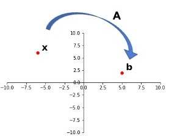
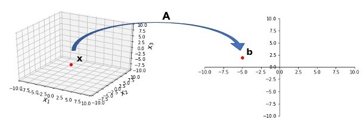
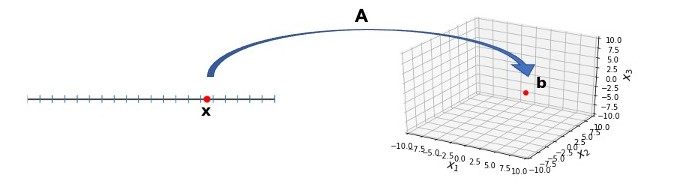
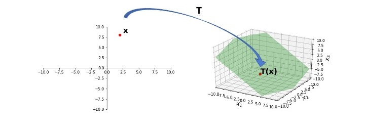

## Learning Objectives

:::{style="font-size: .8em"}
Today we will look at matrix-vector multiplication from a different perspective. Geometrically, a matrix $A$ "transforms" a vector $\bf v$ into a new vector $A \bf v.$ We will show that matrix-vector multiplication satisfies an algebraic property called linearity.

:::{.fragment}
In addition, we will visualize linear transformations of the plane $\mathbb{R}^2$.
:::
:::

## Matrices as Functions

:::{style="font-size: .8em"}
So far we've been treating the matrix equation $A \bf x = \bf b$ as simply another way of writing the vector equation $x_1{\bf a_1} + \dots + x_n{\bf a_n} = {\bf b}.$

However, $A({\bf x}) = {\bf b}$ can be viewed in a different way: we can think of $A$ as a function that is "acting on" the vector $\bf x$ to create a new vector $\bf b$.

:::{.center-text}


:::
:::

## Matrices as Functions

:::{style="font-size: .7em"}
For example, consider $A = \left[\begin{array}{rrr}2&1&1\\3&1&-1\end{array}\right].$ We find: $A \left[\begin{array}{r}1\\-4\\-3\end{array}\right] = \left[\begin{array}{r}-5\\2\end{array}\right]$


:::{.fragment}
In other words, if ${\bf x} = \left[\begin{array}{r}1\\-4\\-3\end{array}\right]$ and ${\bf b} = \left[\begin{array}{r}-5\\2\end{array}\right]$, then $A$ _transforms_ ${\bf x}$ into ${\bf b}$.


:::{.center-text}


:::
:::
:::

## Matrices as Functions

:::{style="font-size: .8em;"}
$A$ took a vector in $\mathbb{R}^3$ and transformed it into a vector in $\mathbb{R}^2.$

<div style="margin-bottom: 0.5em;"> </div> 

<div style="margin-bottom: 0.5em;"> </div> 


```{python}
from IPython.core.display import HTML

def generate_html():
    return r"""
    <div class="blue-box">
        <p>
        How does this fact relate to the shape of \(A\)?
        </p>
    </div>
    """
html_content = generate_html()
display(HTML(html_content))
```

<br>


:::{.fragment}
$A$ is $2 \times 3$ -- that is, $A \in \mathbb{R}^{2 \times 3}.$

This gives a **new** way of thinking about solving $A \bf x = \bf b.$

When we solve $A \bf x = \bf b$, we are finding the vector(s) $\bf x$ in $\mathbb{R}^3$ that are transformed into $\bf b$ in $\mathbb{R}^2$ under the "action" of $A.$
:::
:::

## Matrices as Functions

:::{style="font-size: .8em;"}

For a different $A$, the mapping might be from $\mathbb{R}^1$ to $\mathbb{R}^3$:

:::{.center-text}


:::

:::{.fragment}
```{python}
from IPython.core.display import HTML

def generate_html():
    return r"""
    <div class="blue-box">
        <p>
        What would be the shape of \(A\) be in this case?
        </p>
    </div>
    """
html_content = generate_html()
display(HTML(html_content))
```
:::

:::{.fragment}
Since $A$ maps from $\mathbb{R}^1$ to $\mathbb{R}^3$, $A \in \mathbb{R}^{3\times 1}$.  
:::
:::

## Matrices as Functions

:::{.center-text}


:::

:::{style="font-size:.8em"}
```{python}
from IPython.core.display import HTML

def generate_html():
    return r"""
    <div class="blue-box">
        <p>
        What would be the shape of \(A\) be in the situation above?
        </p>
    </div>
    """
html_content = generate_html()
display(HTML(html_content))
```

:::{.fragment}
$A$ is $2 \times 2.$
:::
:::

## Transformations

:::{style="font-size:.7em"}
```{python}
from IPython.core.display import HTML

def generate_html():
    return r"""
    <div class="purple-box">
        <p>
        A <btransformation</b> <b>function</b> (or <b>mapping</b>) \(T\) from \(\mathbb{R}^n\) to \(\mathbb{R}^m\) is a rule that assigns to each vector \({\bf x}\) in \(\mathbb{R}^n\) a vector \(T({\bf x})\) in \(\mathbb{R}^m\).<br>
        The set \(\mathbb{R}^n\) is called the <b>domain</b> of \(T\), and \(\mathbb{R}^m\) is called the <b>codomain</b> of \(T\).  
        </p>
    </div>
    """
html_content = generate_html()
display(HTML(html_content))
```


$T: \mathbb{R}^n \rightarrow \mathbb{R}^m$ indicates $T$'s domain is $\mathbb{R}^n$ and the codomain is $\mathbb{R}^m$.


:::{.fragment}
```{python}
from IPython.core.display import HTML

def generate_html():
    return r"""
    <div class="purple-box">
        <p>
         For \(\bf x\) in \(\mathbb{R}^n,\) the vector \(T({\bf x})\) is called the <b>image</b> of \(\bf x\) (under \(T\)). 
        </p>
    </div>
    """
html_content = generate_html()
display(HTML(html_content))
```

We sometimes write that $T$ maps ${\bf x}$ as ${\bf x} \mapsto T({\bf x})$.
:::

:::{.fragment}
```{python}
from IPython.core.display import HTML

def generate_html():
    return r"""
    <div class="purple-box">
        <p>
         The set of all images \(T({\bf x})\) is called the <b>range</b> of \(T\).
        </p>
    </div>
    """
html_content = generate_html()
display(HTML(html_content))
```
:::
:::

## Matrices as Functions

:::{.center-text}


:::

:::{style="font-size: .8em"}
The green plane is the set of all possible outputs of $T$ for some input $\bf x$.

<div style="margin-bottom: 0.5em;"> </div> 

$T$'s domain is $\mathbb{R}^2$, its codomain is $\mathbb{R}^3$, and its range is the green plane.

:::

## Visualizing Transformations

:::{style="font-size: .8em"}
Consider four points in $\mathbb{R}^2$:
$\left[\begin{array}{r}0\\1\end{array}\right],\left[\begin{array}{r}1\\1\end{array}\right],\left[\begin{array}{r}1\\0\end{array}\right],\left[\begin{array}{r}0\\0\end{array}\right].$

:::{.fragment}
<!-- Is it ok to just have the graph cutoff at the bottom? -->
These points form a square with side length 1 in 2-dimensional space.

:::{.center-text}
```{python}
import demoUtilities as dm
import numpy as np

square = np.array([[0, 1, 1, 0],
                   [1, 1, 0, 0]])
dm.plotSmallSetup()
# print(square)
dm.plotSquare(square)
```
:::
:::
:::

## Visualizing Transformations
:::{style="font-size: .8em"}

Let's transform each of these points according to the following rule.  Consider the following matrix, which is called a __shear matrix__:

$$ A = \left[\begin{array}{rr}1&1.5\\0&1\end{array}\right]. $$

We define $T({\bf x}) = A{\bf x}$.  Then we have $T: \mathbb{R}^2 \rightarrow \mathbb{R}^2.$

What is the image of each of these points under $T$?

$$ A\left[\begin{array}{r}0\\1\end{array}\right] = \left[\begin{array}{r}1.5\\1\end{array}\right],  A\left[\begin{array}{r}1\\1\end{array}\right] = \left[\begin{array}{r}2.5\\1\end{array}\right],$$


$$ A\left[\begin{array}{r}1\\0\end{array}\right] = \left[\begin{array}{r}1\\0\end{array}\right], A\left[\begin{array}{r}0\\0\end{array}\right] = \left[\begin{array}{r}0\\0\end{array}\right].$$

:::

## Visualizing Transformations

:::{.center-text}
```{python}
#
ax = dm.plotSetup()
# print("square = "); print(square)
dm.plotSquare(square)
#
# create the A matrix
A = np.array([[1.0, 1.5],[0.0,1.0]])
# print("A matrix = "); print(A)
#
# apply the shear matrix to the square
ssquare = np.zeros(np.shape(square))
for i in range(4):
    ssquare[:,i] = dm.AxVS(A,square[:,i])
# print("sheared square = "); print(ssquare)
dm.plotSquare(ssquare,'r')
```
:::

<!-- :::{style="font-size: .7em"}
This is called a **shear** transformation, because the points are succesively slid sideways.
::: -->

## Linearity

:::{style="font-size: .8em"}
```{python}
from IPython.core.display import HTML

def generate_html():
    return r"""
    <div class="purple-box">
        <p>
         A transformation \(T\) is <b>linear</b> if:
         <ol start="1">
<li>\(T({\bf u} + {\bf v}) = T({\bf u}) + T({\bf v}) \;\) for all \(\bf u, \) in the domain of \(T\); and</li>
<li>\(T(c{\bf u}) = cT({\bf u}) \;\) for all scalars \(c\) and all \(\bf u\) in the domain of \(T\).</li>
        </p>
    </div>
    """
html_content = generate_html()
display(HTML(html_content))
```

Here, $T$ is a general function, not just matrix-vector multiplication.

This definition captures many transformations that are not matrix-vector multiplication, such as

$$
T(f) = \int_0^1 f(t) \,dt. 
$$

:::

## Linearity

:::{style="font-size:.8em"}
It is also possible to check if a transformation is linear using

$$
T(c\mathbf{u} + d\mathbf{v}) = cT(\mathbf{u}) + dT(\mathbf{v}).
$$

:::{.fragment}
If a transformation satisfies this equation for all $\mathbf{u}, \mathbf{v}$ and $c, d,$ it must be a linear transformation.
:::

:::{.fragment}
It is also important to note that if $T$ is a linear transformation, then

$$
T({\mathbf 0}) = T({\mathbf 0}) + T({\mathbf 0}), \quad \text{so} \quad T({\mathbf 0}) = {\mathbf 0}.
$$
:::
:::

## Linearity

:::{style="font-size: .8em"}
Given a scalar $r$, define $T: \mathbb{R}^2 \rightarrow \mathbb{R}^2$ by $T(\mathbf{x}) = r\mathbf{x}$. $T$ is called a __contraction__ when $0\leq r \leq 1$ and a __dilation__ when $r > 1$.

Consider $r = 3$, and let us show that $T$ is a linear transformation.

:::{.fragment}
Let $\mathbf{u}, \mathbf{v}$ be in $\mathbb{R}^2$ and let $c, d$ be scalars.   Then

$$
\begin{align}
T(c\mathbf{u} + d\mathbf{v}) &= 3(c\mathbf{u} + d\mathbf{v}) \\
&= 3c\mathbf{u} + 3d\mathbf{v} \\
&= c(3\mathbf{u}) + d(3\mathbf{v}) \\
&= cT(\mathbf{u}) + dT(\mathbf{v})
\end{align}
$$
:::

:::{.fragment}
Thus, $T$ is a linear transformation because $T(c\mathbf{u} + d\mathbf{v}) = cT(\mathbf{u}) + dT(\mathbf{v}).$
:::
:::

## Linearity

:::{style="font-size: .8em"}
Let $T(\mathbf{x}) = \mathbf{x} + \mathbf{b}$ for some $\mathbf{b} \neq 0$. For example,  $T(\mathbf{x}) = \mathbf{x} + \begin{bmatrix}1 \\ 2\end{bmatrix}.$

When $T$ is applied, the entire 2-dimensional plane $\mathbb{R}^2$ is shifted one unit right and two units up.

:::{.fragment}

```{python}
from IPython.core.display import HTML

def generate_html():
    return r"""
    <div class="blue-box">
        <p>
        Is \(T\) a linear transformation?
        </p>
    </div>
    """
html_content = generate_html()
display(HTML(html_content))
```
:::

:::{.fragment}
<div style="margin-bottom: 0.5em;"> </div> 
No! To see why, we only need to compare 

$$
\begin{align*}
&T(\mathbf{u} + \mathbf{v}) = \mathbf{u} + \mathbf{v} + \mathbf{b} \\
&T(\mathbf{u}) + T(\mathbf{v}) = (\mathbf{u} + \mathbf{b}) + (\mathbf{v} + \mathbf{b}) = \mathbf{u} + \mathbf{v} + 2 \mathbf{b}.
\end{align*}
$$
:::

:::{.fragment}
If $\mathbf{b} \neq 0$, those two expressions are not equal, so $T$ is _not_ a linear transformation.
:::
:::

## Matrix of a Linear Transformation{.smaller-title}

:::{style="font-size: .8em"}
```{python}
from IPython.core.display import HTML

def generate_html():
    return r"""
    <div class="purple-box">
        <p>
        Let \(T: \mathbb{R}^n \rightarrow \mathbb{R}^m\) be a linear transformation.   Then there is a unique matrix \(A\) such that:<br>
        &emsp;&emsp;&emsp;&emsp;&emsp;&emsp;&emsp;&emsp;&emsp;&emsp;\(T({\bf x}) = A{\bf x} \;\;\; \mbox{for all}\; {\bf x} \in \mathbb{R}^n.\)
        </p>
    </div>
    """
html_content = generate_html()
display(HTML(html_content))
```

:::{.fragment}
Let ${\bf e_j}$ denote the $j$th column of $I$ in $\mathbb{R}^n$. Then ${\bf e_j}$ is a __standard basis vector__.

:::{.center-text}
```{python}
ax = dm.plotSetup(-3,3,-1,3,size=(6,6))
ax.plot([0],[1],'ro',markersize=8)
ax.arrow(0, 0, 1, 0, head_width=0.2, head_length=0.2, length_includes_head = True)
ax.arrow(0, 0, 0, 1, head_width=0.2, head_length=0.2, length_includes_head = True)
ax.text(0.25,1,'(0,1)',size=20)
ax.plot([1],[0],'ro',markersize=8)
ax.text(1.25,0.25,'(1,0)',size=20);
```
:::
:::
:::

## Matrix of a Linear Transformation{.smaller-title}

:::{style="font-size: .8em"}
```{python}
from IPython.core.display import HTML

def generate_html():
    return r"""
    <div class="purple-box">
        <p>
        The <b>standard matrix</b> of \(T\) is the \(m \times n\) matrix whose \(j\)th column is the vector \(T({\bf e_j})\).<br>
        If we denote it by \(A\), then \(A = \left[T({\bf e_1}) \dots T({\bf e_n})\right].\)
        </p>
    </div>
    """
html_content = generate_html()
display(HTML(html_content))
```

:::{.fragment}
__Proof.__ 

$$
{\bf x} = I{\bf x} = \left[{\bf e_1} \dots {\bf e_n}\right]{\bf x}
$$
:::

:::{.fragment}

Because $T$ is linear:

$$
\begin{align}
T({\bf x}) &= T(x_1{\bf e_1} + \dots + x_n{\bf e_n})
\\
&=x_1T({\bf e_1}) + \dots + x_nT({\bf e_n})
\\
\end{align}
$$

:::

:::{.fragment}
$$
\textcolor{white}{T({\bf x}) ===} = \left[T({\bf e_1}) \dots T({\bf e_n})\right] \, \left[\begin{array}{c}x_1\\ \vdots \\ x_n\end{array}\right] = A{\bf x}.
$$
:::
:::

## Rotations

:::{style="font-size:.8em"}

It follows that to find the standard matrix of a linear transformation, we should ask what the transformation does to the columns of $I.$

:::{.fragment}
Let us apply this to counterclockwise rotations about the origin.

:::{.center-text}
```{python}
import matplotlib.pyplot as plt

#
u = np.array([1.5, 0.75])
v = np.array([0.25, 1])
diamond = np.array([[0,0], u,  u+v, v]).T
ax = dm.plotSetup()
plt.plot(u[0], u[1], 'go')
plt.plot(v[0], v[1], 'yo')
ax.text(u[0]+.25,u[1],r'$\bf{u}$',size=20)
ax.text(v[0],v[1]-.35,r'$\bf{v}$',size=20)
rotation = np.array([[0, -1],[1, 0]])
up = rotation @ u
vp = rotation @ v
plt.plot(up[0], up[1], 'go')
plt.plot(vp[0], vp[1], 'yo')
plt.ylim(bottom=-2)
ax.text(up[0]-1,up[1],r'$T(\mathbf{u})$',size=20)
ax.text(vp[0]-.9,vp[1]+.15,r'$T(\mathbf{v})$',size=20)
ax.text(0.75, 1.75, r'$\theta$', size = 20)
ax.text(-.5, 0.25, r'$\theta$', size = 20)
ax.annotate("",
            xy=((up)[0]+.1, (up)[1]+.1), xycoords='data',
            xytext=((u)[0]-.1, (u)[1]+.1), textcoords='data',
            size=20, va="center", ha="center",
            arrowprops=dict(arrowstyle="simple",
                            connectionstyle="arc3,rad=0.3"),
            )
ax.annotate("",
            xy=((vp)[0]+.1, (vp)[1]+.1), xycoords='data',
            xytext=((v)[0]-.1, (v)[1]), textcoords='data',
            size=20, va="center", ha="center",
            arrowprops=dict(arrowstyle="simple",
                            connectionstyle="arc3,rad=0.3"),
            );
```
:::
:::
:::

## Rotations

:::{style="font-size: .8em"}

Note that rotations are linear transformations.

:::{.center-text}
```{python}
#
u = np.array([1.5, 0.75])
v = np.array([0.25, 1])
diamond = np.array([[0,0], u,  u+v, v]).T
ax = dm.plotSetup()
dm.plotSquare(diamond)
ax.text(u[0]+.25,u[1],r'$\bf{u}$',size=20)
ax.text(v[0],v[1]+.25,r'$\bf{v}$',size=20)
ax.text(u[0]+v[0]+.25,u[1]+v[1],r'$\bf{u + v}$',size=20)
rotation = np.array([[0, -1],[1, 0]])
up = rotation @ u
vp = rotation @ v
diamond = np.array([[0,0], up,  up+vp, vp]).T
dm.plotSquare(diamond)
ax.text(0.75, 2.4, r'$\theta$', size = 20)
ax.annotate("",
            xy=((up+vp)[0]+.1, (up+vp)[1]+.1), xycoords='data',
            xytext=((u+v)[0]-.1, (u+v)[1]+.1), textcoords='data',
            size=20, va="center", ha="center",
            arrowprops=dict(arrowstyle="simple",
                            connectionstyle="arc3,rad=0.3"),
            );
```
:::
:::

## Rotations

:::{style="font-size:.8em"}
Let $T: \mathbb{R}^2 \rightarrow \mathbb{R}^2$ be the transformation that rotates each point in $\mathbb{R}^2$ about the origin through an angle $\theta$, with counterclockwise rotation for a positive angle.  

Let's find this transformation's standard matrix $A$.

:::{.fragment}
```{python}
from IPython.core.display import HTML

def generate_html():
    return r"""
    <div class="blue-box">
        <p>
        The columns of \(I\) are \({\bf e_1} = \left[\begin{array}{r}1\\0\end{array}\right]\) and \({\bf e_2} = \left[\begin{array}{r}0\\1\end{array}\right].\) Where does \(T\) map the standard basis vectors?
        </p>
    </div>
    """
html_content = generate_html()
display(HTML(html_content))
```
:::

:::

## Rotations

:::{style="font-size:.8em"}

Referring to the diagram below, we can see that $\left[\begin{array}{r}1\\0\end{array}\right]$ rotates into $\left[\begin{array}{r}\cos\theta\\\sin\theta\end{array}\right],$ and $\left[\begin{array}{r}0\\1\end{array}\right]$ rotates into $\left[\begin{array}{r}-\sin\theta\\\cos\theta\end{array}\right].$

:::{.center-text}
```{python}
#
import matplotlib.patches as patches
ax = dm.plotSetup(-1.2, 1.2, -0.5, 1.2)
# red circle portion
arc = patches.Arc((0, 0), width=2, height=2, angle=0, 
                  theta1=340, theta2=200, linewidth=2, color='r', linestyle='-.')

# Add arc to the plot
ax.add_patch(arc)
#
# labels
ax.text(1.1, 0.1, r'$\mathbf{e}_1 = (1, 0)$', size = 20)
ax.text(0.1, 1.1, r'$\mathbf{e}_2 = (0, 1)$', size = 20)
#
# angle of rotation and rotated points
theta = np.pi / 6
e1t = [np.cos(theta), np.sin(theta)]
e2t = [-np.sin(theta), np.cos(theta)]
#
# theta labels
ax.text(0.5, 0.08, r'$\theta$', size = 20)
ax.text(-0.25, 0.5, r'$\theta$', size = 20)
#
# arrows from origin
ax.arrow(0, 0, e1t[0], e1t[1],
        length_includes_head = True,
        width = .02)
ax.arrow(0, 0, e2t[0], e2t[1],
        length_includes_head = True,
        width = .02)
#
# new point labels
ax.text(e1t[0]+.05, e1t[1]+.05, r'$[\cos\; \theta, \sin \;\theta]$', size = 20)
ax.text(e2t[0]-1.1, e2t[1]+.05, r'$[-\sin\; \theta, \cos \;\theta]$', size = 20)
#
# curved arrows showing rotation
ax.annotate("",
            xytext=(0.7, 0), xycoords='data',
            xy=(0.7*e1t[0], 0.7*e1t[1]), textcoords='data',
            size=10, va="center", ha="center",
            arrowprops=dict(arrowstyle="simple",
                            connectionstyle="arc3,rad=0.3"),
            )
ax.annotate("",
            xytext=(0, 0.7), xycoords='data',
            xy=(0.7*e2t[0], 0.7*e2t[1]), textcoords='data',
            size=10, va="center", ha="center",
            arrowprops=dict(arrowstyle="simple",
                            connectionstyle="arc3,rad=0.3"),
            )
#
# new points
plt.plot([e1t[0], e2t[0]], [e1t[1], e2t[1]], 'bo', markersize = 10)
plt.plot([0, 1], [1, 0], 'go', markersize = 10);
```
<!-- Yet another beautiful plot.. humbled. -->
:::
:::

## Rotations

:::{style="font-size: .8em"}
By the theorem above,

$$
A = \left[\begin{array}{rr}\cos\theta&-\sin\theta\\\sin\theta&\cos\theta\end{array}\right].
$$

:::{.fragment}
In particular, a 90 degree counterclockwise rotation corresponds to the matrix
$$
\left[\begin{array}{rr}0&-1\\1&0\end{array}\right].
$$
:::

:::

## Rotations

:::{style="font-size: .8em"}
Let's use a rotation matrix to rotate the following `note`. It is constructed using an array of 26 vectors in $\mathbb{R}^2$. In other words, it is a 2 $\times$ 26 matrix.

```{python}
#| echo: true
note = np.array(
        [[193,47],
        [140,204],
        [123,193],
        [99,189],
        [74,196],
        [58,213],
        [49,237],
        [52,261],
        [65,279],
        [86,292],
        [113,295],
        [135,282],
        [152,258],
        [201,95],
        [212,127],
        [218,150],
        [213,168],
        [201,185],
        [192,200],
        [203,214],
        [219,205],
        [233,191],
        [242,170],
        [244,149],
        [242,131],
        [233,111]])
note = note.T/150.0    # now a 2 x 26 matrix
```
:::


## Rotations

:::{.center-text}
```{python}
dm.plotSetup()
dm.plotShape(note)
```
:::

:::{style="font-size: .75em"}
To rotate `note` we need to multiply each column of `note` by the rotation matrix $A$.
:::

## Rotations

:::{style="font-size:.8em"}
```{python}
#| echo: true
angle = 90
theta = (angle/180) * np.pi
A = np.array(
    [[np.cos(theta), -np.sin(theta)],
     [np.sin(theta), np.cos(theta)]])
rnote = A @ note
```
:::

:::{.center-text}

```{python}
dm.plotSmallSetup()
dm.plotShape(rnote)
```

:::

## Visualizing Linear Transformations of $\mathbb{R}^2${.really-smaller-title}
<!-- 
In two dimensions, the standard basis is given by ${\bf e_1} = \left[\begin{array}{r}1\\0\end{array}\right]$ and ${\bf e_2} = \left[\begin{array}{r}0\\1\end{array}\right].$ -->

```{python}
from IPython.core.display import HTML

def generate_html():
    return r"""
    <div class="purple-box">
        <p>
        Where does \(A \mathbf{x} = r \mathbf{x}\) with \(r=2.5\) map the standard basis vectors?
        </p>
    </div>
    """
html_content = generate_html()
display(HTML(html_content))
```

:::{.fragment}
Under the action of $A$, $\mathbf{e_1}$ goes to $\left[\begin{array}{c}2.5\\0\end{array}\right]$ and $\mathbf{e_2}$ goes to $\left[\begin{array}{c}0\\2.5\end{array}\right]$.

<br>

So the matrix $A$ must be $\left[\begin{array}{cc}2.5&0\\0&2.5\end{array}\right]$.
:::

<br>

:::{.fragment}
This transformation is a _dilation_.
:::

## Visualizing Linear Transformations of $\mathbb{R}^2${.really-smaller-title}

<br>

:::{.columns .center-text}

:::{.column width="50%"}
```{python}
square = np.array(
    [[0,1,1,0],
     [1,1,0,0]])
A = np.array(
    [[2.5, 0],
     [0, 2.5]])
# display(Latex(rf"$A = {ltx_array_fmt(A, '{:1.1f}')}$"))
dm.plotSetup()
dm.plotSquare(square)
dm.plotSquare(A @ square,'r')
```
:::

:::{.column width="50%"}
```{python}
dm.plotSetup(-7,7,-7, 7)
dm.plotShape(note)
dm.plotShape(A @ note,'r')
```
:::
:::

## Visualizing Linear Transformations of $\mathbb{R}^2${.really-smaller-title}

```{python}
from IPython.core.display import HTML

def generate_html():
    return r"""
    <div class="blue-box">
        <p>
        What is the standard matrix for reflection through the \(x_1\) axis?
        </p>
    </div>
    """
html_content = generate_html()
display(HTML(html_content))
```


:::{.columns .center-text}

:::{.column width="50%"}
```{python}
A = np.array(
    [[1,  0],
     [0, -1]])
dm.plotSmallSetup()
dm.plotSquare(square)
dm.plotSquare(A @ square,'r')
```
:::

:::{.column width="50%"}
```{python}
dm.plotSmallSetup()
dm.plotShape(note)
dm.plotShape(A @ note,'r')
```
:::
:::

:::{.fragment}
$A=\begin{bmatrix} 1 & 0 \\ 0 & -1 \end{bmatrix}$ corresponds to this reflection.
:::

## Visualizing Linear Transformations of $\mathbb{R}^2${.really-smaller-title}

```{python}
from IPython.core.display import HTML

def generate_html():
    return r"""
    <div class="blue-box">
        <p>
        What is the standard matrix for reflection through the \(x_2\) axis?
        </p>
    </div>
    """
html_content = generate_html()
display(HTML(html_content))
```

:::{.columns .center-text}

:::{.column width="50%"}
```{python}
A = np.array(
    [[-1,0],
     [0, 1]])
dm.plotSmallSetup()
dm.plotSquare(square)
dm.plotSquare(A @ square,'r')
``` 
:::

:::{.column width="50%"}

```{python}
dm.plotSmallSetup()
dm.plotShape(note)
dm.plotShape(A @ note,'r')
```
:::
:::

:::{.fragment}
$A=\begin{bmatrix} - 1 & 0 \\ 0 & 1 \end{bmatrix}$ \
:::

## Visualizing Linear Transformations of $\mathbb{R}^2${.really-smaller-title}

```{python}
from IPython.core.display import HTML

def generate_html():
    return r"""
    <div class="blue-box">
        <p>
        What about reflection through the line \(x_1=x_2\)?
        </p>
    </div>
    """
html_content = generate_html()
display(HTML(html_content))
```

:::{.columns .center-text}

:::{.column width="50%"}
```{python}
A = np.array(
    [[0,1],
     [1,0]])
dm.plotSmallSetup()
dm.plotSquare(square)
dm.plotSquare(A @ square,'r')
plt.plot([-2,2],[-2,2],'b--');
``` 
:::

:::{.column width="50%"}

```{python}
dm.plotSmallSetup()
dm.plotShape(note)
dm.plotShape(A @ note,'r')
```
:::
:::

:::{.fragment}
$A=\begin{bmatrix} 0 & 1 \\ 1 & 0 \end{bmatrix}$ \
:::

## Visualizing Linear Transformations of $\mathbb{R}^2${.really-smaller-title}

```{python}
from IPython.core.display import HTML

def generate_html():
    return r"""
    <div class="blue-box">
        <p>
        What about reflection through the line \(x_1=-x_2\)?
        </p>
    </div>
    """
html_content = generate_html()
display(HTML(html_content))
```

:::{.columns .center-text}

:::{.column width="50%"}
```{python}
A = np.array(
    [[ 0,-1],
     [-1, 0]])
dm.plotSmallSetup()
dm.plotSquare(square)
dm.plotSquare(A @ square,'r')
plt.plot([-2,2],[2,-2],'b--');
``` 
:::

:::{.column width="50%"}

```{python}
dm.plotSmallSetup()
dm.plotShape(note)
dm.plotShape(A @ note,'r')
```
:::
:::

:::{.fragment}
$A=\begin{bmatrix} 0 & -1 \\ -1 & 0 \end{bmatrix}$ \
:::

## Visualizing Linear Transformations of $\mathbb{R}^2${.really-smaller-title}

:::{style="font-size: 1.0em"}
```{python}
from IPython.core.display import HTML

def generate_html():
    return r"""
    <div class="blue-box">
        <p>
        What about 180-degree rotation through the origin?

        </p>
    </div>
    """
html_content = generate_html()
display(HTML(html_content))
```

<!-- We can use our rotation formula, but let's instead just think about how this transformation affects ${\bf e_1}$ and ${\bf e_2}$. -->

:::{.columns .center-text .fragment}

:::{.column width="50%"}
```{python}
A = np.array(
    [[-1, 0],
     [ 0,-1]])
dm.plotSmallSetup()
dm.plotSquare(square)
dm.plotSquare(A @ square,'r')
``` 
:::

:::{.column width="50%"}

```{python}
dm.plotSmallSetup()
dm.plotShape(note)
dm.plotShape(A @ note,'r')
```
:::
:::

:::{.fragment}
$A=\begin{bmatrix} -1 & 0 \\ 0 & -1 \end{bmatrix}$
:::
:::

## Visualizing Linear Transformations of $\mathbb{R}^2${.really-smaller-title}

:::{style="font-size:.87em"}

```{python}
from IPython.core.display import HTML

def generate_html():
    return r"""
    <div class="blue-box">
        <p>
        If we want to contract the \(x_1\) dimension by a ratio of \(r = 0.45\), but leave the \(x_2\) axis unchanged, what matrix performs this operation?
        </p>
    </div>
    """
html_content = generate_html()
display(HTML(html_content))
```


:::{.columns .center-text}

:::{.column width="50%"}
```{python}
A = np.array(
    [[0.45, 0],
     [0,    1]])
ax = dm.plotSmallSetup()
dm.plotSquare(square)
dm.plotSquare(A @ square,'r')
ax.arrow(1.0,1.5,-1.0,0,head_width=0.15, head_length=0.1, length_includes_head=True)
``` 
:::

:::{.column width="50%"}

```{python}
dm.plotSmallSetup()
dm.plotShape(note)
dm.plotShape(A @ note,'r')
```
:::
:::

:::{.fragment}
$A=\begin{bmatrix} 0.45 & 0 \\ 0 & 1 \end{bmatrix}$
:::
:::

## Visualizing Linear Transformations of $\mathbb{R}^2${.really-smaller-title}

Let us look at a vertical shear with $A=\begin{bmatrix}1 & 0 \\ -1.5 & 1 \end{bmatrix}$.


:::{.columns .center-text .fragment}

:::{.column width="50%"}
```{python}
A = np.array(
    [[   1, 0],
     [-1.5, 1]])
dm.plotSetup()
dm.plotSquare(square)
dm.plotSquare(A @ square,'r')
``` 
:::

:::{.column width="50%"}

```{python}
dm.plotSetup()
dm.plotShape(note)
dm.plotShape(A @ note,'r')
```
:::
:::

## Visualizing Linear Transformations of $\mathbb{R}^2${.really-smaller-title}

Another type of transformation is **projection**. Imagine we took any given point and 'dropped' it onto the $x_1$-axis.
This time $A=\begin{bmatrix} 1 & 0 \\ 0 & 0 \end{bmatrix}.$


:::{.columns .center-text .fragment}

:::{.column width="50%"}
```{python}
A = np.array(
    [[   1, 0],
     [0, 0]])
dm.plotSmallSetup()
dm.plotSquare(square)
dm.plotSquare(A @ square,'r')
``` 
:::

:::{.column width="50%"}

```{python}
dm.plotSmallSetup()
dm.plotShape(note)
dm.plotShape(A @ note,'r')
```
:::
:::

## Composing Transformations

:::{style="font-size: .8em"}
We interpret matrix-vector multiplication as a linear transformation over $\mathbb{R}^n.$
What does the product of two matrices mean, geometrically?

:::{.fragment}
We determined that the matrix $C = \left[\begin{array}{rr}-1&0\\0&-1\end{array}\right]$ implements a 180 degree rotation about the origin.
:::

:::{.fragment .center-text}
```{python}
note = dm.mnote()
C = np.array(
    [[-1, 0],
     [ 0,-1]])

dm.plotSmallerSetup()
dm.plotShape(note)
dm.plotShape(C @ note,'r')
```
:::
:::

## Composing Transformations

:::{style="font-size: .7em" .incremental}
Another approach is to reflect through the $x_1$ axis, via multiplication by $B = \left[\begin{array}{rr}1&0\\0&-1\end{array}\right].$ Then reflect throuh the $x_2$ axis, via multiplication by $A = \left[\begin{array}{rr}-1&0\\0&1\end{array}\right].$

:::{.center-text .fragment}
```{python}
B = np.array(
    [[ 1, 0],
     [ 0,-1]])
A = np.array(
    [[-1, 0],
     [ 0, 1]])
#print("A ="); print(A)
#print("B ="); print(B)
dm.plotSmallSetup()
dm.plotShape(note)
dm.plotShape(B @ note,'g')
dm.plotShape(A @ (B @ note),'r')
```
:::
:::

## Composing Transformations

:::{style="font-size: .8em"}
Another way to reflect point ${\bf u}$ through the origin is:

* ${\bf v} = B{\bf u}$
* Followed by ${\bf w} = A{\bf v}.$

:::{.fragment}
Hence, ${\bf w} = A(B{\bf u}) = C {\bf u}$.
Therefore, _multiplication of matrices_ corresponds to _composition of linear transformations._

That is: $C$ is the result of applying  a transformation from $B$, and then transformation $A$.

$$
\underbrace{\left[\begin{array}{rr}-1&0\\0&1\end{array}\right]}_{\large A}
\underbrace{\left[\begin{array}{rr}1&0\\0&-1\end{array}\right]}_{\large B} =
\underbrace{\left[\begin{array}{rr}-1&0\\0&-1\end{array}\right]}_{\large C}.
$$
:::

:::{.fragment}
The order matters, and we read them __from right to left__!
:::
:::

## Key Ideas

:::{style="font-size: .8em" .incremental}

- A transformation $T$ from $\mathbb{R}^n$ to $\mathbb{R}^m$ takes each vector ${\bf x}$ in $\mathbb{R}^n$ to $T({\bf x})$ in $\mathbb{R}^m$.

- $T$ is linear if $T({\bf u} + {\bf v})$ = $T({\bf u}) + T({\bf v})$ and $T(c {\bf u} ) = cT( {\bf u} ).$

- A linear transformation can be written as $T( {\bf u}) = A{\bf u}.$ $A$ is called the standard matrix of $T.$ To find $A,$ we look at what $T$ does to the columns of $I.$
:::